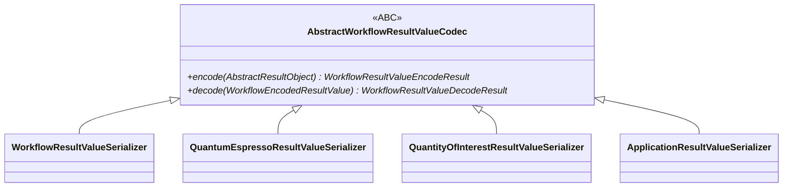

# `AbstractWorkflowResultValueCodec` schematic

```mermaid
classDiagram
    class AbstractWorkflowResultValueCodec {
        <<ABC>>
        +encode(AbstractResultObject) WorkflowResultValueEncodeResult*
        +decode(WorkflowEncodedResultValue) WorkflowResultValueDecodeResult*
    }
    class WorkflowResultValueSerializer
    class QuantumEspressoResultValueSerializer
    class QuantityOfInterestResultValueSerializer
    class ApplicationResultValueSerializer

    AbstractWorkflowResultValueCodec <|-- WorkflowResultValueSerializer
    AbstractWorkflowResultValueCodec <|-- QuantumEspressoResultValueSerializer
    AbstractWorkflowResultValueCodec <|-- QuantityOfInterestResultValueSerializer
    AbstractWorkflowResultValueCodec <|-- ApplicationResultValueSerializer
```
