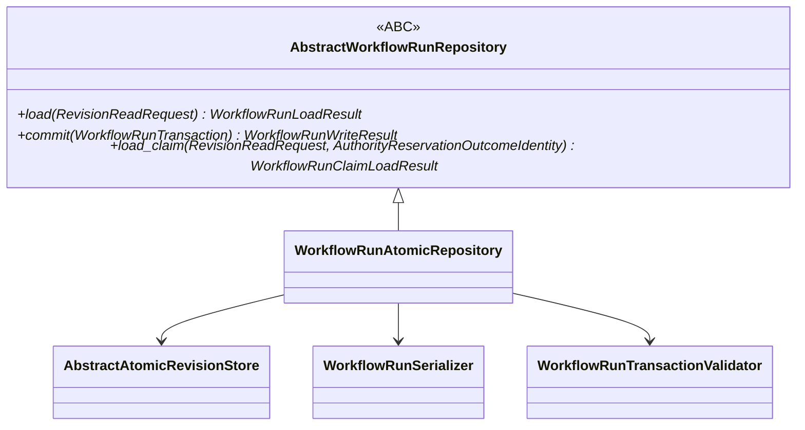

# `AbstractWorkflowRunRepository` schematic

```mermaid
classDiagram
    class AbstractWorkflowRunRepository {
        <<ABC>>
        +load(RevisionReadRequest) WorkflowRunLoadResult*
        +commit(WorkflowRunTransaction) WorkflowRunWriteResult*
        +load_claim(RevisionReadRequest, AuthorityReservationOutcomeIdentity) WorkflowRunClaimLoadResult*
    }
    class WorkflowRunAtomicRepository
    class AbstractAtomicRevisionStore
    class WorkflowRunSerializer
    class WorkflowRunTransactionValidator

    AbstractWorkflowRunRepository <|-- WorkflowRunAtomicRepository
    WorkflowRunAtomicRepository --> AbstractAtomicRevisionStore
    WorkflowRunAtomicRepository --> WorkflowRunSerializer
    WorkflowRunAtomicRepository --> WorkflowRunTransactionValidator
```
