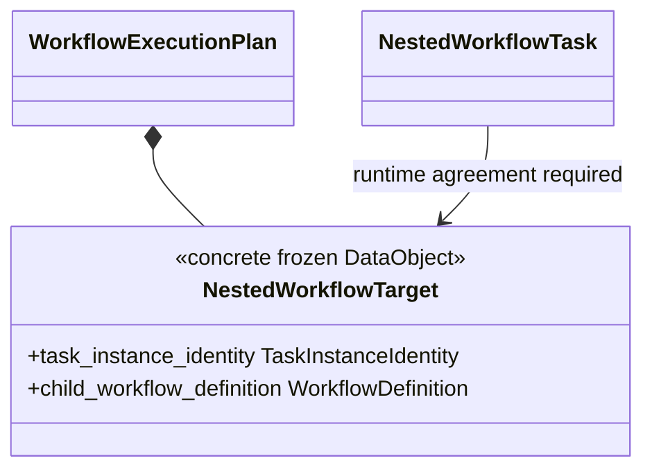

# `NestedWorkflowTarget` schematic

```mermaid
classDiagram
    class NestedWorkflowTarget {
        <<concrete frozen DataObject>>
        +task_instance_identity TaskInstanceIdentity
        +child_workflow_definition WorkflowDefinition
    }
    class WorkflowExecutionPlan
    class NestedWorkflowTask

    WorkflowExecutionPlan *-- NestedWorkflowTarget
    NestedWorkflowTask --> NestedWorkflowTarget : runtime agreement required
```

The plan target is declarative. Runtime binding verifies that the concrete nested Task
exposes the same child Workflow definition.
