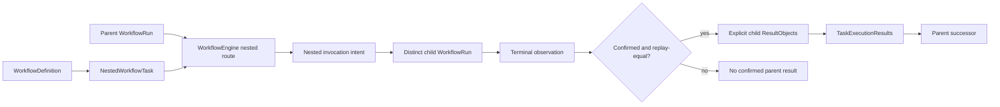

# `NestedWorkflowTask` schematic

```mermaid
flowchart LR
    parent[Parent WorkflowRun] --> engine[WorkflowEngine nested route]
    task[NestedWorkflowTask] --> engine
    child_definition[WorkflowDefinition] --> task
    engine --> intent[Nested invocation intent]
    intent --> child[Distinct child WorkflowRun]
    child --> terminal[Terminal observation]
    terminal --> confirmed{Confirmed and replay-equal?}
    confirmed -->|yes| export[Explicit child ResultObjects]
    export --> results[TaskExecutionResults]
    results --> successor[Parent successor]
    confirmed -->|no| none[No confirmed parent result]
```

Child creation and parent advancement are separate identity-correlated operations. No
child member receives the parent Task's execution context.
