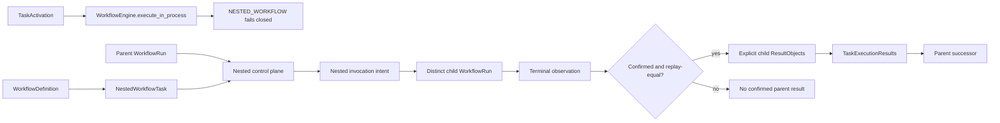

# `NestedWorkflowTask` schematic

Only the nested control plane creates or observes the child run. In-process engine
invocation fails closed before child creation. Child creation and parent advancement
are separate identity-correlated operations, and no child member receives the parent
Task's execution context.
