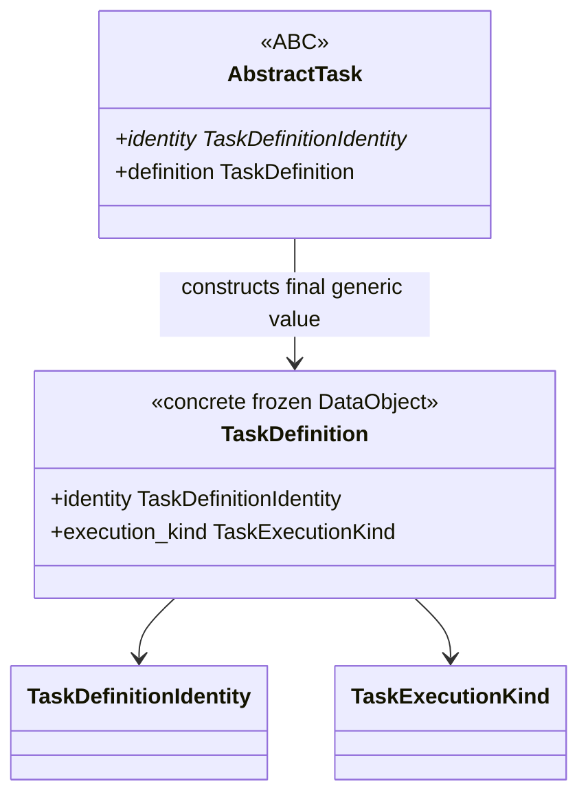

# `TaskDefinition` schematic

One generic definition type serves every operation. Scientific and calculator-specific
configuration remains with its domain owner rather than producing Task-definition
subclasses.
