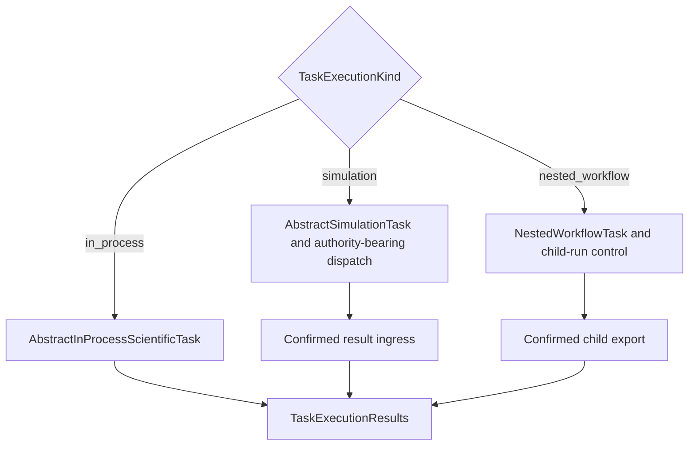

# `TaskExecutionKind` schematic

The route-root ABC supplies the kind. Plan compilation verifies the immutable snapshot,
and the engine switches on that snapshot rather than ordered `isinstance` checks.
