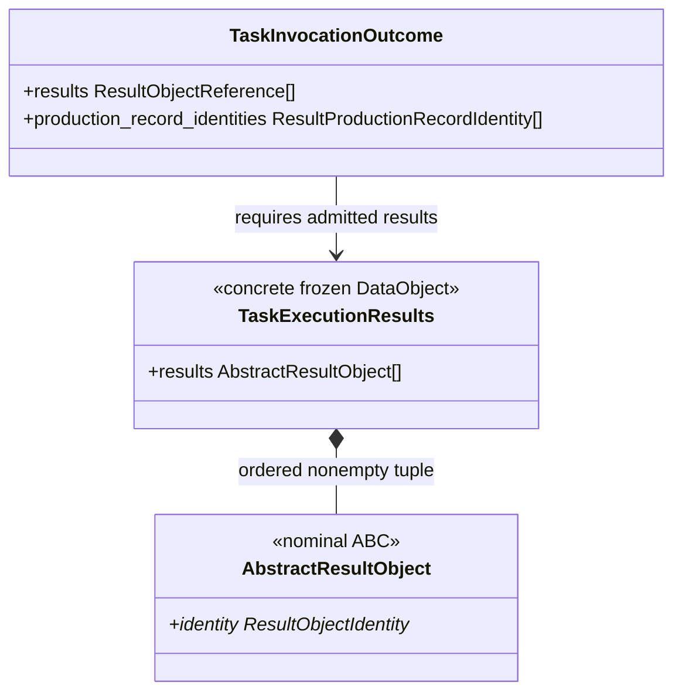
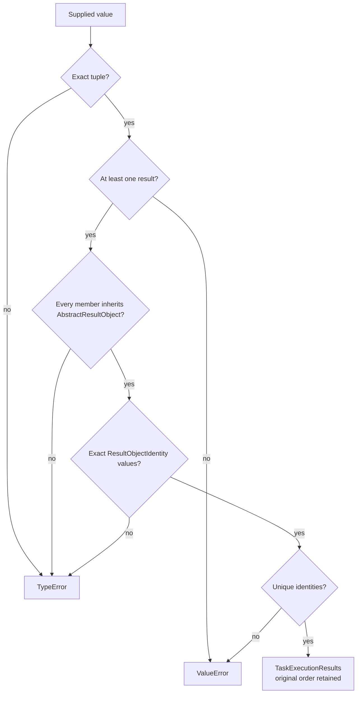
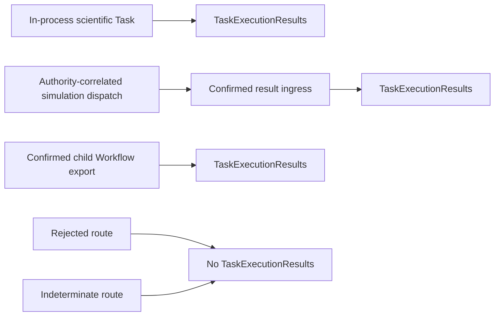
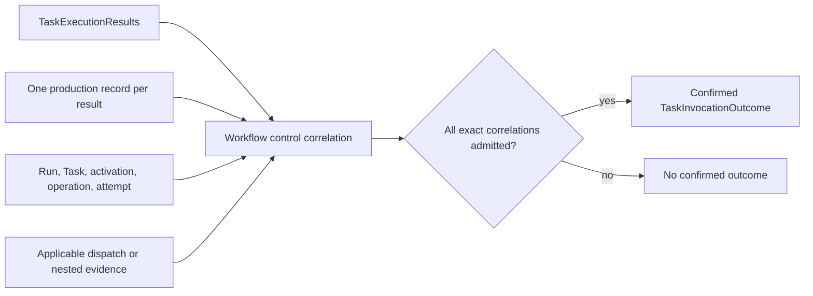
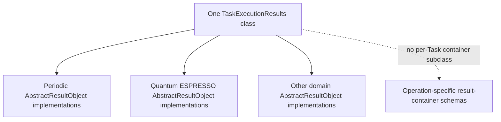

# `TaskExecutionResults` schematic

## Status

**Implemented architectural schematic; local software-verification evidence passes.**

## Type boundary

`TaskExecutionResults` has no subclasses. Variation belongs to the contained concrete
`AbstractResultObject` instances. The relation to `TaskInvocationOutcome` is a construction
prerequisite, not inheritance, persistence embedding, or proof of confirmation.

## Intrinsic construction

These checks establish only local result shape and identity uniqueness.

## Successful route convergence

The three successful routes share the same result-shape value without sharing their
execution, authority, dispatch, child-run, or admission mechanics.

## Durable confirmation

`TaskExecutionResults` alone never reaches the confirmed branch. Workflow control must
retain positional agreement among contained results, result references, and production
records.

## Schema boundary

The common container remains one Workflow-control DataObject. Domain-specific result
schemas remain with the concrete `AbstractResultObject` owners; durable Workflow formats retain
outcome and result references rather than a duplicate container schema.
