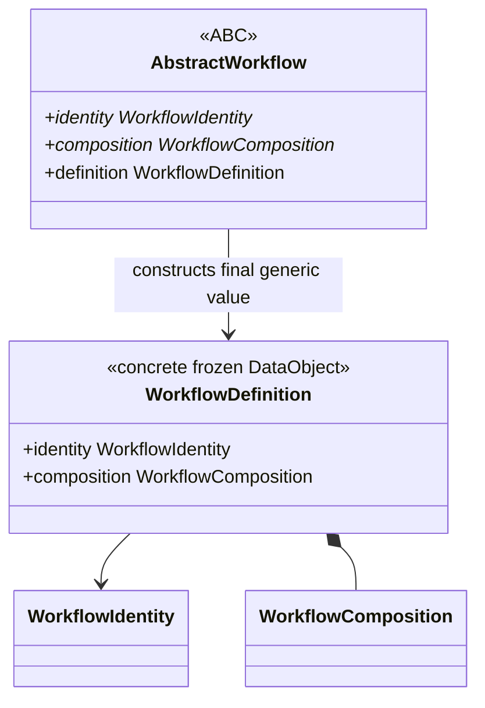

# `WorkflowDefinition` schematic

```mermaid
classDiagram
    class WorkflowIdentity
    class WorkflowComposition
    class WorkflowDefinition {
        <<concrete frozen DataObject>>
        +identity WorkflowIdentity
        +composition WorkflowComposition
    }
    class AbstractWorkflow {
        <<ABC>>
        +identity WorkflowIdentity*
        +composition WorkflowComposition*
        +definition WorkflowDefinition
    }

    WorkflowDefinition --> WorkflowIdentity
    WorkflowDefinition *-- WorkflowComposition
    AbstractWorkflow --> WorkflowDefinition : constructs final generic value
```

The definition is a reusable immutable value. It contains no runtime adapter or
represented WorkflowRun.
