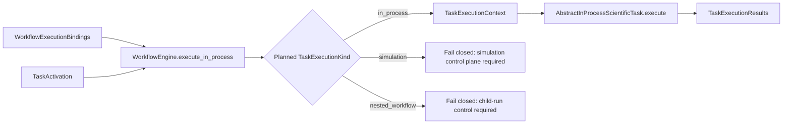

# `WorkflowEngine` schematic

```mermaid
flowchart LR
    bindings[WorkflowExecutionBindings] --> engine[WorkflowEngine.execute_in_process]
    activation[TaskActivation] --> engine
    engine --> kind{Planned TaskExecutionKind}
    kind -->|in_process| context[TaskExecutionContext]
    context --> task[AbstractInProcessScientificTask.execute]
    task --> results[TaskExecutionResults]
    kind -->|simulation| simulation[Fail closed: simulation control plane required]
    kind -->|nested_workflow| nested[Fail closed: child-run control required]
```

The migration preserves specialized route ownership rather than hiding unlike durable
control lifecycles behind one return union.
