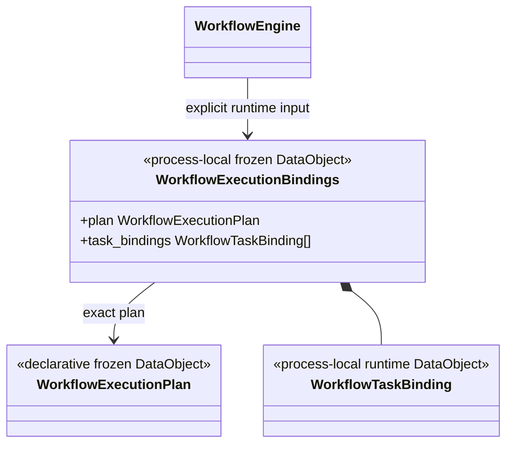

# `WorkflowExecutionBindings` schematic

```mermaid
classDiagram
    class WorkflowExecutionPlan {
        <<declarative frozen DataObject>>
    }
    class WorkflowTaskBinding {
        <<process-local runtime DataObject>>
    }
    class WorkflowExecutionBindings {
        <<process-local frozen DataObject>>
        +plan WorkflowExecutionPlan
        +task_bindings WorkflowTaskBinding[]
    }
    class WorkflowEngine

    WorkflowExecutionBindings --> WorkflowExecutionPlan : exact plan
    WorkflowExecutionBindings *-- WorkflowTaskBinding
    WorkflowEngine --> WorkflowExecutionBindings : explicit runtime input
```

Runtime adapters cannot alter plan equality or represented declarative content.
