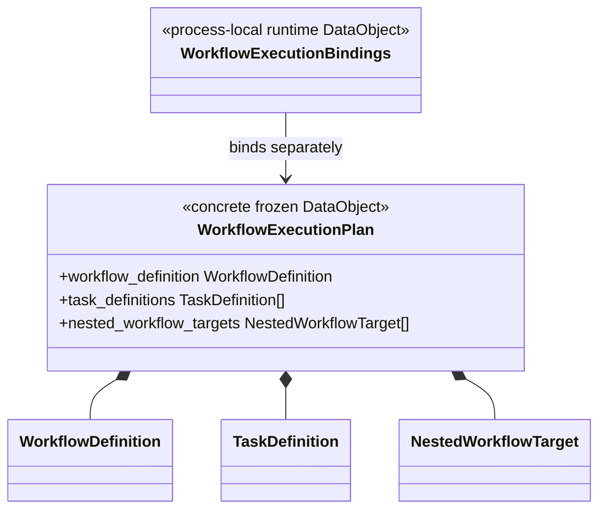

# `WorkflowExecutionPlan` schematic

```mermaid
classDiagram
    class WorkflowDefinition
    class TaskDefinition
    class NestedWorkflowTarget
    class WorkflowExecutionPlan {
        <<concrete frozen DataObject>>
        +workflow_definition WorkflowDefinition
        +task_definitions TaskDefinition[]
        +nested_workflow_targets NestedWorkflowTarget[]
    }
    class WorkflowExecutionBindings {
        <<process-local runtime DataObject>>
    }

    WorkflowExecutionPlan *-- WorkflowDefinition
    WorkflowExecutionPlan *-- TaskDefinition
    WorkflowExecutionPlan *-- NestedWorkflowTarget
    WorkflowExecutionBindings --> WorkflowExecutionPlan : binds separately
```

The plan contains declarative frozen values only. Runtime Tasks and effect adapters are
owned by the separate bindings object.
