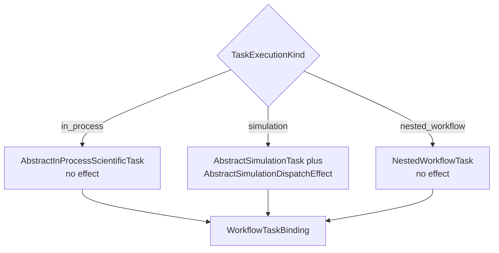

# `WorkflowTaskBinding` schematic

```mermaid
flowchart TB
    definition{TaskExecutionKind}
    definition -->|in_process| local[AbstractInProcessScientificTask<br/>no effect]
    definition -->|simulation| simulation[AbstractSimulationTask plus<br/>AbstractSimulationDispatchEffect]
    definition -->|nested_workflow| nested[NestedWorkflowTask<br/>no effect]
    local --> binding[WorkflowTaskBinding]
    simulation --> binding
    nested --> binding
```

The route shape is closed and exact. The binding freezes runtime association but is not
a declarative plan or durable record.
