# Scientific workflow control plane

## Responsibility

The workflow control plane owns Workflow selection and advancement, run-scoped Task instances, Workflow-owned `TaskStartGateSet` policy, discriminated TaskActivation, exact execution authority, result correlation, dispatch/reconciliation, and analysis readiness. It does not activate or complete a development `HarnessTask`, and it owns no scientific-conclusion or acceptance state.

## Control flow

```mermaid
flowchart LR
    response["Explicit verbatim response"] --> trusted_boundary["Application-owned trusted boundary<br/>direct source + authority context"]
    trusted_boundary --> recorder["ScientificDecisionRecorder"]
    decision_request["Exact predecessor/revision + request<br/>identified transition/binding inputs"] --> recorder
    recorder --> decision_map["Effect-free adapter maps supplied resolution"]
    decision_map --> decision_fire["Pure generic firing"]
    decision_fire --> decision_record["Decision-origin transition + complete successor"]
    decision_record --> decision_commit["WorkflowRunAtomicRepository<br/>validate + bind + commit candidate"]
    decision_commit --> recorded_resolution["Return recorded resolution"]
    run["WorkflowRun + predecessor marking"] --> adapter["ColoredPetriNetWorkflowAdapter"]
    adapter --> enable["ColoredPetriNetTransitionEnabler"]
    enable --> select["ColoredPetriNetBindingSelector"]
    directive["Permitted identified directive"] -.-> select
    direct["Direct activation when caller invokes zero-gate instance"] -.-> interpret["Adapter constructs direct/any_of/all_of activation"]
    select --> interpret
    interpret --> activation["TaskActivation"]
    authority["Exact unused grant + verified authority snapshot"] --> authorize["SimulationExecutionAuthorizer"]
    activation --> authorize
    inputs["Already-bound ResultObjects + explicit operation context"] --> authorize
    authorize --> authorization_result["Closed SimulationExecutionAuthorizationResult"]
    authorization_result --> prepare["Prepare request/attempt/successor intent<br/>grant reservation + dispatch obligation"]
    prepare --> commit["WorkflowRunAtomicRepository<br/>validate + bind + commit candidate"]
    commit --> executor_check["Independent executor-boundary authorization"]
    executor_check --> claim["CAS reserved → claimed<br/>exact obligation + expected revision"]
    claim --> task["Selected effectful Task instance"]
    task --> results["New immutable ResultObjects"]
    results --> map["Adapter maps results to generic external-output values"]
    map --> firing_input["ColoredPetriNetFiringInput"]
    firing_input --> fire["ColoredPetriNetTransitionFirer<br/>pure successor + audit facts"]
    fire --> workflow_records["Workflow transition and successor unit"]
    workflow_records --> ingress_commit["WorkflowRunAtomicRepository<br/>validate + bind result/obligation candidate"]
    ingress_commit --> reconcile["Explicit extraction and analysis paths"]
```

`ScientificExecutionAuthoritySnapshot` is an immutable verified view of one trusted authority source. It identifies source and issuer, trust configuration, content and authentication verification, predecessor and revocation closure, validity and freshness bounds, and resolver version. `SimulationExecutionAuthorizer` consumes that snapshot, an exact operation-phase discriminant, and the exact grant and dispatch inputs and returns one immutable `SimulationExecutionAuthorizationResult`: `authorized` binds every checked identity and the exact valid, unrevoked grant state required by that phase—`unused` before reservation or `reserved` to the same unclaimed obligation before claim; `denied` records an established stale, revoked, consumed, already claimed, out-of-scope, phase-incompatible, or mismatched condition; and `error` records that authorization or denial could not be established. Only `authorized` may proceed, and the result itself performs no reservation or effect.

The exact internal preparation sequence may preserve the accepted request-transition and obligation contracts, but the semantic owners remain fixed: the generic layer returns one identity-closed enablement and selection result and fires pure values; on the task-origin path the effect-free adapter applies `any_of`/`all_of` composition or direct activation, maps the intended choice through canonical generic selection or an exact definition-permitted directive, creates TaskActivation referencing that generic selection result, and maps only confirmed invocation ResultObjects plus the same selection identities into `ColoredPetriNetFiringInput`; workflow control invokes ordinary Tasks and owns closed generic invocation outcomes; each nested Workflow owns a distinct correlated child WorkflowRun; `SimulationDispatchAdapter` owns specialized dispatch orchestration; and workflow control constructs complete candidate successor units. `WorkflowRunAtomicRepository` invokes its bound validator on the exact candidate, serializes that same validated candidate, verifies candidate/bytes/content/revision identity binding, and submits the opaque commit only after those checks succeed.

Human-response processing is deterministic. `ScientificDecisionRecorder` is the sole named scientific-decision ActionObject and is invoked only through an application-owned trusted boundary. From the exact predecessor run/revision, request, verbatim response, direct response-source and authority-context identities, any actually available boundary receipt reference, and request-identified transition/binding inputs, it rejects ambiguity, no match, identity mismatch, or stale correction; constructs the typed `ScientificDecisionResolution` with closed `RepresentedScientificDecisionIngressProducer` provenance; uses the effect-free adapter to map that supplied value through one generic enablement and selection result, with an exact definition-permitted directive when the request-identified selection is not canonical, and obtains pure generic firing; constructs the complete scientific-decision-origin transition and successor transaction; and submits it. The recorder validates trusted-boundary identity correlation but does not authenticate raw transport messages. No Task, TaskActivation, attempt, standalone response snapshot, verifier, registry, or receipt subsystem exists on this ingress path. Initial ingress replaces unresolved state with one effective resolution token; correction atomically consumes the exact effective predecessor and produces its superseding token. Only successful atomic commit returns the recorded resolution; firing or persistence failure produces no resolution. The unresolved request itself pauses only its affected branch. See [human decisions](../../human-decisions.md).

## Invariants

- `any_of` gates use stable priority, stable gate identity, canonical transition identity, and canonical binding order, with no fairness guarantee.
- `all_of` enables only when every member has a compatible binding and selects the canonical compatible tuple; no/empty gate sets provide no automatic activation, while direct invocation records no gate identities.
- Every firing binds one exact generic enablement result, selection result, and permitted identified directive or explicit absence; a permitted directive is the only selection override.
- Existing TaskActivation or scientific-decision origin records retain the domain reason for the same generic selection without a second Workflow selection-derivation result.
- Selection and generic firing create no execution authority.
- Each Task invocation creates one identified direct, any_of, or all_of TaskActivation and one effective generic confirmed, rejected, or indeterminate outcome for the exact operation and attempt.
- Confirmed alone contains ResultObjects and permits result firing; rejected and indeterminate contain no results and record no successful firing.
- Each nested Workflow has a distinct child WorkflowRun and marking. The parent records exact correlation, admits only explicit exports from a replay-equal terminal child revision, and reconciles uncertainty by exact child/idempotency identities without automatic duplicate creation.
- Start-gate policy and Task input contract are distinct; already-bound inputs must satisfy both.
- One grant authorizes one exact dispatch. The request transaction atomically reserves it to one obligation; immediately before the effect, one expected-revision compare-and-swap changes that reservation from `reserved` to `claimed`, and only the successful claimant proceeds.
- A claimed grant is consumed for authorization purposes. A duplicate, stale, losing, or indeterminate claimant performs no effect; retry or a new execution uses new activation, operation, request, attempt, obligation, and grant identities.
- Workflow control and the executor independently run `SimulationExecutionAuthorizer` over the same immutable grant, verified authority snapshot, and effect inputs. Denied, erroneous, stale, revoked, consumed, or mismatched input causes no reservation, claim, or execution as applicable.
- Confirmed, rejected, and indeterminate outcomes remain distinct; indeterminate contains no invented result, retains the original reservation/claim identities, and is reconciled without automatic redispatch.
- After reconciliation, workflow control constructs the candidate generic outcome from the exact specialized dispatch outcome. For confirmed work, `TaskResultIngester` validates the envelope/outcome correlation and atomically admits the concrete ResultObject, exact native-output manifest references, generic outcome, result transition, and `ObligationDisposition`. Explicit extraction occurs afterward without copying or publishing the native files.
- An absent, ambiguous, unmatched, or conflicting decision response creates no resolution or token and leaves only the affected branch blocked.
- Successful decision recording commits one scientific-decision-origin transition with exact request/resolution, direct trusted-boundary identities, closed no-Task producer provenance, and no TaskActivation/attempt.
- Exactly one decision-state token exists for the request at its ingress boundary. Downstream transitions read it; correction consumes the exact effective predecessor and produces one superseding token atomically. Stale or competing correction fails.
- Replay consumes the same ordered records without prompting or reauthentication. It preserves historical reads and corrections; correction changes future effective state but does not erase or compensate earlier work.
- Terminal marking, process success, and analyzer output do not establish scientific acceptance.

## Repository and human authority

`WorkflowRunRepository` does not inspect the complete marking to schedule work, choose a gate, invoke a Task, enable/select/fire a generic transition, reconcile effects, interpret a human response, create a decision, construct either transition origin, build candidate successor meaning, or create authority. `WorkflowRunTransactionValidator` owns candidate validation rules. `WorkflowRunAtomicRepository` owns invoking that validator, serializing the same accepted candidate, and verifying transaction/candidate/bytes/content/revision identity binding before it calls `AtomicRevisionStore`; validation or binding failure causes no store commit. The shared store alone owns opaque single-stream compare-and-swap, idempotency, and durable commit.

Protected execution remains human-owned where policy requires it. Execution authority does not establish scientific acceptance. `WorkflowRun` stores only the externally issued grant/snapshot references, closed authorization results, and append-only reservation/claim/outcome history needed for one dispatch; it never issues or broadens a grant. This documentation grants no protected execution authority.

## Deferred implementation details

- Exact serialized activation, grant, authority-snapshot, authorization-result, reservation/claim, obligation, and reconciliation records.
- Cancellation, nested child-run compensation, and operator-interruption semantics.
- Multi-run scheduling outside one deterministic Workflow selection.
