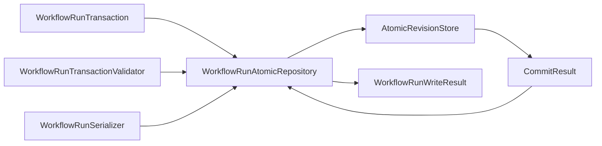

# Scientific workflow persistence

## Purpose

Workflow persistence stores one complete `WorkflowRun` aggregate revision independently of development state. It owns revision consistency and recovery, not Workflow meaning, transition computation, scientific authority, or external effects. The shared storage boundary is defined by [shared revision persistence](../persistence/index.md).

## Domain contract

The authoritative aggregate remains defined by [WorkflowRun](workflow-run.md). This page does not restate its complete record closure.

| Object | Responsibility |
|---|---|
| `WorkflowRunIdentity` | Stable logical run identity |
| `WorkflowRunSnapshot` | One consistently selected complete run revision |
| `WorkflowRunTransaction` | Expected revision plus one complete candidate atomic successor unit and binding identities |
| `WorkflowRunWriteResult` | Domain outcome mapped from the closed generic commit result without weakening aggregate closure |
| `WorkflowRunSerializer` | Aggregate to or from the domain's versioned wire representation |
| `WorkflowRunTransactionValidator` | Validate the exact transaction, candidate identity, revision, and aggregate closure |
| `WorkflowRunRepository` | Domain-owned structural repository protocol |
| `WorkflowRunAtomicRepository` | Concrete repository composed with the shared store, serializer, and validator |

```text
load explicit run and optional revision → WorkflowRunSnapshot or absence
commit exact candidate transaction → repository validation and binding → WorkflowRunWriteResult
```

## Composed repository



`WorkflowRunAtomicRepository` is not a passive DAO. It receives the exact candidate transaction, invokes its bound `WorkflowRunTransactionValidator` on that same candidate, serializes that same validated candidate with its bound `WorkflowRunSerializer`, and verifies the transaction, candidate, bytes, content, stream, revision, expected-revision, schema, and idempotency identity binding. Only then does it submit the `Commit` containing the complete opaque revision to `AtomicRevisionStore`. Validation or binding failure returns the applicable domain failure without a store commit; detached validation cannot validate different bytes or another candidate. The validator owns the domain validation rules, while the repository owns invoking and binding that validator at the commit boundary.

Every successor record and obligation in one domain transaction serializes into that one aggregate revision. The shared store commits that unit atomically in one stream; it does not normalize WorkflowRun records into domain rows or provide cross-stream atomicity. The repository preserves the aggregate-specific transaction closure described by the WorkflowRun and control-plane pages.

The shared `AtomicRevisionStore` owns compare-and-swap, idempotency, durable identity/content closure, atomic single-stream commit, consistent reads, and the generic closed committed/conflict/indeterminate/error outcome. The domain repository maps that result without guessing an indeterminate outcome or silently merging a conflict.

The repository does not enable, select, or fire transitions; reconcile effects; authorize or execute Tasks; interpret observations or human responses; create decision records; evaluate analysis readiness; or create dispositions or conclusions. External process and artifact-transfer effects remain outside the transaction, bridged by stable identities and committed obligations.

## Storage selection and separation

The initial concrete store is prospective `SQLiteAtomicRevisionStore`, implemented with Python standard-library `sqlite3` and explicit constructor configuration. There is no `WorkflowRunSQLiteRepository`; the domain repository composes the shared store structurally.

The scientific WorkflowRun store/database is separate by default from the development HarnessState store/database. Shared implementation does not imply shared physical storage. Co-location and cross-stream transactions require a later explicit decision. Scientific artifact publication remains a separate obligation-driven effect; ordinary shared SQLite revision storage does not become artifact or publication persistence.

## Integrity and unresolved replay ownership

`WorkflowRunTransactionValidator` owns the structural validation rules for the candidate domain transaction, including represented record, identity, link, reference, and canonical-order closure required by the WorkflowRun contract. `WorkflowRunAtomicRepository` owns invoking that validator on the exact candidate and binding the accepted candidate to serialization and commit. This persistence selection assigns neither transition computation nor replay-equality computation to the repository or validator.

Replay-computation ownership remains unresolved: reapplying stored generic firing inputs is computation, while `WorkflowRunRepository` is prohibited from firing transitions. No `WorkflowRunIntegrityVerifier` is introduced, and this selection does not resolve the colored-Petri-net selection-identity retention gap.

## Deferred issues

- Exact WorkflowRun bytes and wire schema, including canonical-byte policy.
- Exact SQLite schema, connection lifetime, locking/isolation/busy behavior, and failure encoding.
- Backup, recovery, retention, compaction, and maximum aggregate size.
- Replay-computation ownership and colored-Petri-net selection-identity retention.
- Exact idempotency identity representation and retention.

No migration class, integrity-verifier class, public SQLite configuration/initializer hierarchy, domain SQLite subclass, or extra persistence module split is selected. This prospective contract claims no implementation, software or numerical verification, scientific validation, protected execution, or human acceptance.
