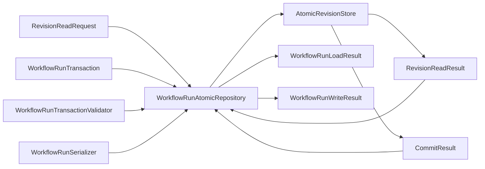

# Scientific workflow persistence

## Purpose

Workflow persistence stores one complete `WorkflowRun` aggregate revision independently of development state. It owns revision consistency and recovery, not Workflow meaning, transition computation, scientific authority, or external effects. The shared storage boundary is defined by [shared revision persistence](../persistence/index.md).

## Domain contract

The authoritative aggregate remains defined by [WorkflowRun](workflow-run.md). This page does not restate its complete record closure.

| Object | Responsibility |
|---|---|
| `WorkflowRunIdentity` | Stable logical run identity |
| `WorkflowRunSnapshot` | One consistently selected, reconstructed, domain-validated complete run revision |
| `WorkflowRunLoadResult` | Closed `loaded`/`absent`/`mismatch`/`incompatible`/`corrupt`/`indeterminate`/`error` domain read outcome; only `loaded` contains a snapshot |
| `WorkflowRunTransaction` | Expected revision plus one complete candidate atomic successor unit and binding identities |
| `WorkflowRunWriteResult` | Domain outcome mapped from the closed generic commit result without weakening aggregate closure |
| `WorkflowRunSerializer` | Aggregate to or from the domain's versioned wire representation |
| `WorkflowRunTransactionValidator` | Validate the exact transaction, candidate identity, revision, and aggregate closure |
| `WorkflowRunRepository` | Domain-owned structural repository protocol |
| `WorkflowRunAtomicRepository` | Concrete repository composed with the shared store, serializer, and validator |

The implementation is a package rather than one aggregate source module. Immutable
operation records live in ``workflows/persistence/records.py``; transaction validation
and repository composition live in ``validation.py`` and ``repository.py``. Wire
mechanics live under ``workflows/persistence/serialization/``. The public
``WorkflowRunSerializer`` remains the sole supported aggregate serializer and
preserves schema-v1 bytes, while private, closed serializer facets own the aggregate,
authority, dispatch, history/provenance, Petri-net, and Task value families. The
facets are a static implementation decomposition: they are not a plugin registry,
do not widen the supported type closure, and do not change the public import route.

```text
read explicit run and latest-or-revision selector → closed WorkflowRunLoadResult
commit exact candidate transaction → repository validation and binding → WorkflowRunWriteResult
```

## Composed repository



`WorkflowRunAtomicRepository` is not a passive DAO. It receives the exact candidate transaction, invokes its bound `WorkflowRunTransactionValidator` on that same candidate, serializes that same validated candidate with its bound `WorkflowRunSerializer`, and verifies the transaction, candidate, bytes, content, stream, revision, expected-revision, schema, and idempotency identity binding. Only then does it submit the `Commit` containing the complete opaque revision to `AtomicRevisionStore`. Validation or binding failure returns the applicable domain failure without a store commit; detached validation cannot validate different bytes or another candidate. The validator owns the domain validation rules, while the repository owns invoking and binding that validator at the commit boundary.

For reads, `WorkflowRunAtomicRepository` submits one explicit latest-or-revision `RevisionReadRequest` and maps every shared result without guessing. On `found`, it verifies the revision envelope and any requested reconciliation identities, deserializes through `WorkflowRunSerializer`, validates reconstructed aggregate identity and domain closure, and returns `loaded`. Reconciliation-identity mismatch, shared or domain incompatibility, content corruption, deserialization failure, validation failure, indeterminate observation, and operational error remain distinct represented outcomes; no non-`loaded` result contains a snapshot.

Every successor record and obligation in one domain transaction serializes into that one aggregate revision. The shared store commits that unit atomically in one stream; it does not normalize WorkflowRun records into domain rows or provide cross-stream atomicity. The repository preserves the aggregate-specific transaction closure described by the WorkflowRun and control-plane pages.

The [shared persistence contract](../persistence/index.md) owns compare-and-swap, idempotency, generic read/commit outcomes, and single-stream atomicity. This domain repository maps those outcomes without guessing or weakening them.

The repository does not enable, select, or fire transitions; reconcile effects; authorize or execute Tasks; interpret observations or human responses; create decision records; evaluate analysis readiness; or create dispositions or conclusions. External process and artifact-transfer effects remain outside the transaction, bridged by stable identities and committed obligations.

## Storage selection and separation

The initial concrete store and its dependency boundary are selected by the [shared persistence contract](../persistence/index.md). There is no `WorkflowRunSQLiteRepository`; the domain repository composes the shared store structurally.

The scientific WorkflowRun store/database is separate by default from the development HarnessState store/database. Shared implementation does not imply shared physical storage. Co-location and cross-stream transactions require a later explicit decision. Calculator-produced native files remain in their exact execution workspace or configured external output location; ordinary shared SQLite revision storage stores only WorkflowRun records and does not become native-file storage. Explicit extraction reads those files without copying or publishing them.

## Structural integrity and replay boundary

`WorkflowRunTransactionValidator` owns the structural validation rules for the candidate domain transaction, including represented record, identity, link, reference, and canonical-order closure required by the WorkflowRun contract. `WorkflowRunAtomicRepository` owns invoking that validator on the exact candidate and binding the accepted candidate to serialization and commit. This persistence selection assigns neither transition computation nor replay-equality computation to the repository or validator.

Workflow-owned `WorkflowRunReplayer` performs deterministic replay outside persistence from one exact run revision and explicit immutable `WorkflowRuntimeBundle`. A repository load returns a structurally reconstructed snapshot without claiming replay equality. The workflow service requires an `equal` `WorkflowRunReplayResult` before using that snapshot for advancement and before submitting an exact proposed successor. `unequal`, `unsupported_version`, or `error` blocks advancement or candidate submission. No repository-owned `WorkflowRunIntegrityVerifier` or mandatory durable replay attestation is introduced.

## Selected concrete result-value boundary

The human decision recorded in `harness/intake/v2-execution-path-authorization.md`
selects an explicitly injected `WorkflowResultValueCodec`, supplied by outward
owners through application composition. Workflow persistence must not import QE or
analysis implementations inward. There is no registry, dynamic import, reflection,
or promise that arbitrary implementations of `ResultObject` can be serialized.
Unknown concrete schemas/versions are incompatible, not successful identity-only
substitutes. Every supported occurrence retains complete concrete content and nested
provenance, not just a nominal identity.

The independently reviewed implementation plan selects these seven exact families:

| Owning codec | Required concrete coverage | Implementation status |
|---|---|---|
| `WorkflowResultValueSerializer` | `ScientificDecisionResolution`, `NormalizedObservationSet` | Implemented provisional two-family wire only |
| `QuantumEspressoResultValueSerializer` | `QuantumEspressoPwResult`, `QuantumEspressoBandsResult`, `QuantumEspressoExtractedObservationResult` | Implemented provisional three-family wire only |
| `QuantityOfInterestResultValueSerializer` | `ScalarQuantityOfInterestValue`, `ScalarQuantityOfInterestEvaluationFailure` | Implemented provisional scalar wire only |

The implemented normalized observation codec receives one explicit source codec;
the QE owner reconstructs exact parser/document/policy provenance and delegates
neutral schema-1 bytes to the existing neutral serializer without changing its
tolerance. The minimal `ApplicationResultValueSerializer` has three named immutable
concrete dependencies and explicit seven-family branches, not a registration table.
Its Workflow source dependency must be an exact QE serializer; equivalent stateless
instances are allowed without making Python identity a wire requirement. This is not
the separate application composition root. No codec reads native files or executes tools.

The implemented scalar codec uses `qoi-result-value:1`: canonical ASCII JSON with
sorted keys, compact separators and no newline; explicit `{type, fields}` records,
nominal and enum tags; every declared field including null state; ordered arrays;
and tagged finite `float.hex()` values preserving binary64 signed zero. Raw numeric
tokens, duplicate/extra/missing members and noncanonical bytes are rejected. The
complete definition and evaluator/source-result correlations survive reconstruction;
labels do not claim that an evaluator is installed or executable. SHA-256 of the
complete canonical payload defines its `qoi-result-value:1:sha256:<digest>` content
identity. Historical opaque owning content labels in other domains must not be
reinterpreted as hashes.

`WorkflowEncodedResultValue` separately binds exact immutable payload bytes with a
lowercase SHA-256 digest, nominal result/type/domain/content identities and schema.
The immutable encode/decode results carry a complete envelope/value only on success
and structured failure evidence otherwise. These foundations, seven concrete value
families, minimal application codec and complete aggregate traversal are **partial
Task implementation**. The repository and historical receipt integration now exist
with independent prepared/claimed wires and bounded real-SQLite fault evidence.
Durable entry integration now exists with bounded local race and crash evidence.
The same-v1 nested-history correction now integrates immutable intent and
first-terminal observations into the aggregate, structural/introduction checks and
serializer. Bounded real-SQLite evidence covers separate and actual combined pending
intent sources, all three terminal kinds, reopen and exact historical retention.
Complete Task gates and independent implemented-correction review remain required.

The Workflow codec uses `workflow-result:1` and the same explicit canonical record
and nominal grammar. All decision and producer fields are included; Unicode response
text is preserved verbatim. Opaque decision content labels are compared exactly,
not reinterpreted as hashes. Sets retain complete ordered source envelopes, whose
exact payload bytes use strict canonical base64. Set content identities are
`workflow-result:1:sha256:<digest>` over the complete canonical payload. Source
constructor invariants and decode/re-encode agreement preserve neutral provenance
and every nested envelope field. Nested incompatible/error statuses and complete
failure diagnostics propagate; invalid encoding maps to corrupt on decode. Known
malformed representations never reconstruct a partial source set. Actual seven-family
routing tests retain independent literal wires and nested/standalone repeated-identity
agreement. Cross-occurrence conflict rejection in a whole run remains an aggregate
codec obligation, not an ambient identity cache in these stateless value codecs.

The implemented QE codec uses `qe-result-value:1` with explicit complete records,
nominal/enum tags, tagged canonical signed hexadecimal integers and ordered tuples.
PW/bands and execution-input versions are exactly `qe-pw-result:1`,
`qe-bands-result:1` and `qe-execution-input:1`. It preserves all operation evidence
and native artifact references (not native bytes), or the complete extracted
observation with exact parser/document/policy identities and neutral provenance.
Parser/policy versions are `1`; unknown owning versions are incompatible. The
neutral schema-1 JSON remains a nested exact string produced by the existing owner
with unchanged `1.0e-12` tolerance, including its final newline and numeric grammar.
A fresh neutral serializer is used per operation, not a mutable retained dependency.
Complete canonical QE bytes define `qe-result-value:1:sha256:<digest>` content
identity. Independent literal wires, fixed variant fragments, nested-identity and
corruption oracles verify software representation only. Independent implementation
review and bounded Task software gates are complete, not human acceptance or
scientific validation.

## Intrinsic aggregate record implementation status

`WorkflowEncodedRun`, `WorkflowRunEncodeResult`, `WorkflowRunDecodeResult`,
`WorkflowRunTransaction`, `WorkflowRunSnapshot`, `WorkflowRunLoadResult`,
`WorkflowRunWriteResult` and `WorkflowRunClaimLoadResult` now exist as immutable
record boundaries only. They check exact field types, intrinsic nonempty labels,
variant closure and (for encoded bytes) schema-plus-SHA-256 binding. They do not
serialize a run, validate structural history or independently correlate records.

Transactions retain one commit binding and expose its operation/key labels through
properties. Snapshots retain complete run/binding/shared revision inputs. Loads
retain complete requests and shared results; only loaded carries a snapshot and
requires shared found evidence. Absence requires shared absence evidence. Writes
retain the transaction, complete shared result when present, optional predecessor
load and domain failure; committed alone has snapshot/claim receipts. Conflict
requires shared conflict evidence. Invalid/incompatible pre-store rejection
prohibits a shared commit result. Claim-load results retain the exact selector and
request and complete shared read result, containing snapshot/receipt only for loaded. No record alone
proves stored presence, matched expectations, historical receipt derivation or
permission to advance or enter an effect.

Focused record tests use independent full genesis inputs, fixed byte/digest oracles
and actual supported claim records from isolated SQLite lifecycles. Repository-owned
tests separately verify deterministic historical receipt derivation. These do not
provide every rich aggregate variant oracle. `WorkflowRunSerializer` now implements complete explicit
traversal with initial independently authored genesis/nonempty bytes and
malformed/version/canonicality tests. Its explicit literal record/nominal and enum
branches cover the reachable closed source inventory, while concrete result
occurrences use the injected port. Repeated envelopes and reference metadata must
agree, including nested normalized sources. Constructor-derived identities are
recomputed and compared. The local agreement map is not a registry or retained cache.
No structural validator, replay, store operation or scientific algorithm is invoked.
Independent rich CPN literals now cover recursive guards and every comparison
operator, all input-inscription modes, output templates, external bindings,
nonempty firing audits and structured nested enablement failure. Named corrupt
variants reject malformed guard arity, negative audit ordinals and Boolean tagged
integers. These are representation fixtures, not successful computed firing or
closed Workflow history. Independent authority literals also cover both phases,
all grant states and authorization outcomes, separately varied verification checks,
UTC microsecond year boundaries and leap-day values, and malformed timestamps and
intrinsic records. A dispatch literal covers all runtime outcome, observation,
final outcome and disposition kinds, preserving ordered multiplicity, concrete
scalar values, structured failures and the three retryability values. Malformed
variants reject missing evidence, invalid discriminators and untyped retryability.
Mixed Task/decision literals now cover all attempt states and generic outcomes,
retry/child/failure links, ordinary/dispatched transition correlations and initial
and corrected no-Task decisions. They retain append order, lexical resolution
storage and full verbatim responses. Malformed cases include incomplete pairs,
invalid sequence/version fields, invented Task lineage in decision transitions and
invalid corrections with updated payload digests. Missing activation, production
and membership closure is explicit; no replay claim follows.
Nested, membership/dependency and all six producer variants now have independent
literal facets, including production/native-admission fields and malformed local
records. Their evidence remains representation-only, not authentic provenance,
child replay or cross-run atomicity. Task-model ordering/selection variants and
returned codec failures, response types, recheck disagreement and recursion errors
also have bounded evidence. Independent whole-Task review identified a durable
nested-history lifecycle gap; its same-v1 correction now has bounded lifecycle
evidence, and independent correction recheck found no blocking findings. These
codec fixtures do not establish exhaustive
authority/dispatch history, authentication, replay equality or effect permission.

`WorkflowRunValidationResult` and `WorkflowRunTransactionValidator` are now implemented.
The validator receives the explicit immutable serializer and validates the same
transaction/candidate against an explicitly supplied historical predecessor snapshot
(None only for genesis). Success retains the exact transaction, predecessor and
validated bytes; invalid/incompatible/error retain structured failures only. Snapshot
address, binding and exact payload must agree before immutable extension is checked.
The private `_WorkflowRunStructureValidator` is inside `workflows/runs/replay.py` and
exposes `execute` to both callers; there is no extra structural module. It checks
retained correlations, contiguous transition indexes, invocation-selection links and
retained marking links, without firing or reevaluating authorization. The existing
replayer retains computed firing, concrete-value and authorization comparisons.
Complete result agreement belongs to the codec; structural links compare result
identities/metadata rather than array-bearing dataclass values.

Predecessor comparison serializes an explicit historical projection of the candidate
under the predecessor binding. Identity-ordered collections extend by identity;
attempts and transitions preserve sequence prefixes. Initial marking and exact
Workflow/definition/runtime/schema/adapter identities cannot drift. Byte comparison
avoids NumPy dataclass equality. A fixed independently authored closed Task history
and named mutations establish bounded structural evidence, not full variant coverage,
computed replay equality, stored presence or receipt recovery.

The transaction validator also binds each new dispatch entry to the actual
non-null predecessor and candidate revision. Genesis entries reject; historical
entries retain their original revision labels and exact bytes. Direct validator
and real-SQLite repository cases cover detached entry revisions and stale
predecessors, invalid/no-store-submission outcomes, and positive historical
extension/reload and original-transaction replay after a later head. These are
software-verification claims, not entry permission or completed effects.

## Selected aggregate binding and historical reconciliation

The implemented version-one serializer uses canonical ASCII JSON
with root members `schema`, `run`, and `commit_binding`; schema identity is
`ksdft2effmass.workflow-run:1`. The binding contains exactly `transaction_identity`,
`commit_idempotency_identity`, and `persistence_implementation_identity`. Its
immutable intrinsic record is now included in complete serialized payload bytes;
this does not execute a store commit.
The writer identity is `ksdft2effmass.workflows.WorkflowRunAtomicRepository:1`;
unknown historical writers must be incompatible, never replaced by the reader.
Changing a transaction label must change aggregate bytes/content. Missing binding
is malformed v1, not a legacy receipt inferred from memory.

The complete aggregate content identity is the schema label plus `:sha256:` and
SHA-256 of the canonical bytes. Integer fields use canonical tagged signed
hexadecimal strings, finite floats use tagged `float.hex()`, bytes use strict
canonical base64, and timestamps use UTC ISO-8601 with six fractional digits and
`+00:00`. Canonical bytes have sorted keys, compact separators and no newline.
Duplicate/extra/missing members, raw JSON numbers and noncanonical representations
are rejected before successful reconstruction. Allocation/recursion and operational
failures remain represented errors without partial values.
Constructor-derived identities must be recomputed and compared, never overwritten.
Repeated result identities must retain exactly the same complete envelopes. The
aggregate schema does not independently serialize runtime bundles or replay results.

The implemented `load_claim` requires one explicit historical revision request with the
**complete** predecessor/schema/content/idempotency expectation group, a correlated
shared `FOUND` result and `expectations_matched is True`. It also verifies the exact
payload binding, run and selected CLAIMED record and its authorization links. Latest
or incomplete requests must reject before a read. A historical claim copied into a
later revision cannot issue a receipt for that later revision. An ordinary load can
observe a payload key but cannot claim comparison with the stored commit key.

For deterministic receipt derivation, let `J` be ASCII bytes of compact JSON of the
following exact string/null sequences, without a newline. Let `B` be the persisted
binding and `R` the verified revision. The operation identity is
`wfr-operation-v1:sha256:` plus SHA-256 of
`J(["wfr-operation-v1", B.transaction_identity, B.persistence_implementation_identity,
R.stream_id, R.revision_id, R.predecessor_revision_id, R.schema_id, R.content_id,
B.commit_idempotency_identity])`. The receipt identity is
`wfr-claim-receipt-v1:sha256:` plus SHA-256 of
`J(["wfr-claim-receipt-v1", operation_identity, claim.identity.value,
claim.authorization_result_identity.value])`. Neither fresh shared result UUIDs nor
current-reader implementation identity participate. Acknowledged writes and exact
historical loads must use the same derivation and retain every historical field.
Represented labels and digests are consistency evidence, not authentication.

Historical reconciliation alone never permits advancement or effect entry. The
implemented `WorkflowRunDispatchEntryCommitter(repository=..., serializer=...,
runtime_bundle=...)` receives the structural repository port and explicit serializer
used by repository/validator composition; it does not inspect private repository
configuration. It compares every receipt field, separately requires the exact current
head/envelope/binding and equal replay before and after candidate preparation, and
submits one invocation-local candidate with fresh entry receipt and commit-key UUIDs.
Only a newly acknowledged exact candidate yields `entered`. Existing entry means
`already_entered`, never recovered permission. Uncertain/lost acknowledgement must
return no receipt and must not retry that entry Commit. The design intentionally
permits unresolved execution after durable entry and before effect; it promises no
exactly-once completion. The R1 repository seam now has implementation and bounded
real-SQLite/independent-literal evidence. The entry service has bounded synthetic
race, reopen, stale/forged receipt, detached read, acknowledgement substitution/loss
and crash-before-effect checks. The same-v1 nested-history correction is implemented
with bounded lifecycle evidence. The bounded persistence Task's software gates
and independent correction recheck are complete;
historical reconciliation itself is never effect-entry permission.

## Implemented atomic repository boundary

`WorkflowRunAtomicRepository(store=..., serializer=..., validator=...)` requires
explicit dependencies and the same serializer instance on the validator. No default
database selection or hidden mutable cache is introduced. Each load performs one
shared read; wrong response request/stream/selector/address or absent confirmation
is a represented error, not successful domain evidence. Supported envelope schema,
SHA-256 payload content, complete decoded run/revision/predecessor/key agreement and
structural closure precede loaded. Shared failures retain their complete records.

Each successor commit loads the exact historical predecessor, validates the same
candidate and checks serialized bytes against validation before one shared Commit.
Absent/mismatched/corrupt predecessors map to invalid, while incompatible,
indeterminate and error preserve their meaning and full read evidence. No failure
causes a commit retry. Acknowledgements must match the exact key and complete candidate;
substitution returns error without receipts. Newly appended claims are determined
relative to the candidate's predecessor, not latest; their owning revision must be
the candidate itself before submission. Replaying that exact Commit after a later
head reconstructs the same receipts through the common derivation above.

Independent literal prepared/claimed payloads and receipt preimages support real
SQLite reopen, stale CAS, exact replay, lost claim acknowledgement, copied claim,
wrong stored key versus payload key, substitution, schema/closure and failure cases.
The fixtures label retained history as synthetic; their represented authorization
labels are not authority authentication or recomputation. Ordinary load followed by
separate complete claim reconciliation supports receipt-loss recovery without an
in-memory transaction. Historical commitment remains distinct from replay equality
and from the separate newly won effect-entry gate.

## Same-v1 nested extension

Both empty new tuples are omitted from the original 34-field wire. Either nonempty
requires both `nested_invocation_intents` and `nested_terminal_observations` in the
36-field v1 representation. Single-key, unknown-field and explicitly both-empty
extensions are corrupt. Nominal links distinguish new intents from actual retained
combined pending records; no intent is synthesized and no stored bytes are rewritten.
Historical projection filters both new collections under the original binding.
New observations require a source in the actual predecessor and a new terminal
attempt/outcome group in the committing revision. Combined terminal records retain
their existing behavior and cannot receive another terminal observation.

## Deferred issues

- Remaining correction verification and independent implemented-correction review.
- Exact SQLite mechanics are owned by the implemented shared store, not this domain.
- Backup, recovery, retention, compaction, and maximum aggregate size.
- Exact `WorkflowRunLoadResult`, `WorkflowRuntimeBundle`, and `WorkflowRunReplayResult` wire representations.
- Exact idempotency identity representation and retention; replay-versus-collision semantics are selected.

No migration class, integrity-verifier class, public SQLite configuration/initializer hierarchy, domain SQLite subclass, or extra persistence module split is selected.
