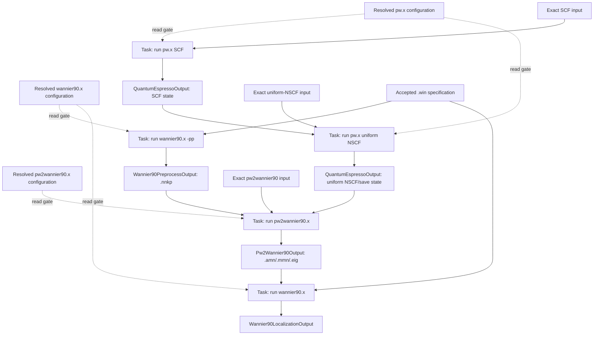

# QE--Wannier90 CPN workflow

## Purpose and status

This page defines the prospective Architecture v2 orchestration boundary for the
project-relevant Quantum ESPRESSO and Wannier90 path. A colored Petri net (CPN)
owns dependency state, concurrency, joins, and pure successor firing. Concrete
Tasks, executor protocols, integration implementations, immutable results, and
scientific interpretation remain with their domain owners.

The selected executable path is limited to:

- Quantum ESPRESSO `pw.x` for SCF and uniform NSCF calculations;
- Wannier90 `wannier90.x -pp` for neighbor-list preprocessing;
- Quantum ESPRESSO `pw2wannier90.x` for the QE--Wannier90 interface; and
- Wannier90 `wannier90.x` for disentanglement and localization.

Quantum ESPRESSO `ph.x` and phonon workflows are outside this project scope. This
architecture authorizes no external or scientific execution and establishes no
numerical verification, scientific validation, uncertainty quantification, or
human acceptance of a calculated result.

## Executable roles

The executables do not form a calculator-family hierarchy.

| Executable | Role | Owning software boundary |
|---|---|---|
| `pw.x` | Produce the Kohn--Sham SCF or uniform-NSCF state and native QE outputs | Calculator-owned input/output and executor protocol; Quantum ESPRESSO integration owns concrete staging, invocation, capture, and native parsing |
| `wannier90.x -pp` | Read the accepted `.win` specification and produce `.nnkp` neighbor data | Wannier90 preprocessing operation using the same Wannier90 executable identity as localization |
| `pw2wannier90.x` | Combine the QE uniform-NSCF state with `.nnkp` and produce Wannier90 interface artifacts | QE--Wannier90 integration operation, not a Kohn--Sham calculator or localization operation |
| `wannier90.x` | Consume the accepted `.win` and interface artifacts and produce localization/disentanglement outputs | Wannier90 input/output and executor protocol; a concrete integration owns the external effect |

`pw2wannier90.x` commonly produces `.amn`, `.mmn`, and `.eig`; explicitly
requested optional interface artifacts remain identified separately. Interface
success does not establish localization, interpolation accuracy, gauge
suitability, or scientific acceptance.

## Executable configuration contract

Exact executable classification replaces a calculator-family identity:

```python
class ExecutableProgram(StrEnum):
    QUANTUM_ESPRESSO_PW = "quantum_espresso.pw"
    QUANTUM_ESPRESSO_PW2WANNIER90 = "quantum_espresso.pw2wannier90"
    WANNIER90 = "wannier90.wannier90"


@dataclass(frozen=True, slots=True)
class ExecutableConfiguration:
    program: ExecutableProgram
    absolute_path: str
    expected_version: str


@dataclass(frozen=True, slots=True)
class ExecutableIdentity:
    program: ExecutableProgram
    reported_version: str


@dataclass(frozen=True, slots=True)
class ExecutableObservation:
    identity: ExecutableIdentity
    resolved_path: str
    build_information: str | None
```

One explicit TOML source declares the machine-specific executable configuration.
The application receives its path explicitly; Architecture v2 selects no ambient
search path or implicit `PATH` discovery.

```toml
schema_version = 1

[executables.quantum_espresso_pw]
path = "/opt/qe/bin/pw.x"
expected_version = "7.2"

[executables.quantum_espresso_pw2wannier90]
path = "/opt/qe/bin/pw2wannier90.x"
expected_version = "7.2"

[executables.wannier90]
path = "/opt/wannier90/bin/wannier90.x"
expected_version = "3.1.0"
```

The active machine-specific file is local configuration and is not committed.
Version-controlled examples may contain only portable placeholders. The
application configuration loader parses the explicit TOML source with Python's
standard-library `tomllib`, constructs immutable `ExecutableConfiguration`
values, and returns one identified resolved configuration snapshot. Calculator
and integration contracts validate the entries they consume; application
composition supplies those exact values to Tasks and executors.

Configuration declares an expected program, absolute path, and reported-version
contract. It does not claim that the path exists, that the file is executable, or
that the selected program reports the expected version. `ExecutableObservation`
records those runtime or preflight facts separately. An
`ExecutableConfigurationValidator` compares one declaration with one observation;
a missing program, path mismatch, version mismatch, or indeterminate observation
produces no executable configuration eligible for dispatch.

The identity records the selected program and its reported version; it does not
claim byte identity or build equivalence. Accepted execution records separately
retain the observed installation path and the applicable compiler, build options,
linked libraries, environment, resources, and invocation facts when available. A
binary checksum may be retained as provenance for one observed installation, but
it is neither mandatory nor part of program/version equality because executable
bytes depend on the build.

The CPN and `WorkflowRun` reference the identified resolved configuration
snapshot; they do not retain or rediscover the TOML path. Each execution request
binds the exact applicable immutable configuration and observation. No runtime
plugin registry, universal calculator base class, or shared
`ksdft2effmass.contracts` package is introduced.

## Operation contracts

The project-facing operation contracts are:

| Operation | Immutable input | Immutable returned result | Consumer protocol or Task |
|---|---|---|---|
| QE SCF or uniform NSCF | `QuantumEspressoInput` | `QuantumEspressoOutput` | `QuantumEspressoExecutor`; concrete SCF and uniform-NSCF Tasks |
| Wannier90 preprocessing | `Wannier90PreprocessInput` | `Wannier90PreprocessOutput` containing `.nnkp` | `Wannier90Preprocessor` and `Wannier90PreprocessTask` |
| QE--Wannier90 conversion | `Pw2Wannier90Input` | `Pw2Wannier90Output` containing `.amn`, `.mmn`, and `.eig` | `Pw2Wannier90Executor` and `Pw2Wannier90ConversionTask` |
| Wannier localization | `Wannier90LocalizationInput` | `Wannier90LocalizationOutput` | `Wannier90Localizer` and `Wannier90LocalizationTask` |

Inputs reference exact native bytes and required artifact identities. Outputs
retain mechanical process observations and exact native artifact references.
They do not contain convergence, localization-quality, physical-validation, or
human-acceptance conclusions. `wannier90.x -pp` and localization share one
`ExecutableIdentity` but use separate operation inputs and outputs so that
mode-specific invalid states cannot be constructed.

Exact public fields, wire schemas, failure codes, and module paths remain subject
to the one-contract-at-a-time calculator migration. The roles and ownership on
this page constrain those later choices.

## CPN topology

The CPN represents artifact availability rather than a shell-command sequence.
Wannier90 preprocessing may proceed independently of the QE SCF/NSCF branch once
the `.win` specification is frozen. The interface transition is the explicit
join.



The `pw2wannier90.x` activation uses `all_of` policy over the admitted uniform
NSCF result and `.nnkp` result. Localization likewise requires the admitted
interface result and the exact accepted `.win` input. Same labels, seed names,
paths, or settings do not establish artifact identity or compatibility.

## Workflow and CPN execution semantics

The generic `ksdft2effmass.petrinet.colored` package remains effect-free and
calculator-independent. It owns colors, places, transitions, markings,
enablement, deterministic selection, and pure firing. It imports no calculator,
integration, Workflow, QE, or Wannier90 types.

Workflow control performs the domain composition:

1. inspect the current marking through the effect-free Workflow adapter;
2. construct the exact `TaskActivation` selected by direct, `any_of`, or
   `all_of` policy;
3. obtain the required execution authorization and atomically commit the request,
   attempt, grant reservation, and dispatch obligation;
4. dispatch the concrete Task through its injected executor after the independent
   executor-boundary authority check and one successful grant claim;
5. reconcile the result as confirmed, rejected, or indeterminate;
6. admit a confirmed immutable `ResultObject` and its native artifact references;
   and
7. map only that admitted result into the generic external-output-value binding
   used for pure CPN firing and successor marking.

The CPN never invokes an executable directly. Executable classes never inspect a
marking or choose their successor. A Task consumes explicitly bound inputs and
returns a new immutable result; Workflow control owns durable invocation and
transition records.

## Failure and retry behavior

A confirmed invocation admits its concrete result and may advance the CPN
marking. Rejected and indeterminate invocations produce no success token and do
not advance the dependent branch.

```text
confirmed     -> admit exact ResultObject -> pure firing may advance
rejected      -> record failure           -> no success token
indeterminate -> retain correlations      -> no success token
```

No automatic retry follows rejection or indeterminacy. A retry requires a new
Task activation, operation, attempt, request, dispatch obligation, and execution
grant. Reconciliation preserves the original identities and never fabricates an
output artifact.

## Scientific boundary

Mechanical process success and artifact presence do not establish:

- SCF or NSCF convergence;
- QE--Wannier90 semantic compatibility beyond the declared interface checks;
- successful or acceptable disentanglement/localization;
- suitable projections, windows, rank, gauge, or symmetry constraints;
- interpolation accuracy;
- a validated Wannier Hamiltonian; or
- human acceptance.

Explicit parsers and adapters may construct mechanically faithful native records
after confirmed result ingress. Deterministic analysis owns declared numerical
criteria. Scientific decisions about projections, windows, localization,
interpolation, and candidate selection remain human-owned and outside CPN state.

## Related architecture

- [Workflow overview](index.md)
- [Simulation Task model](simulation-task-model.md)
- [Task and colored-Petri-net adapter](task-and-colored-petri-net-adapter.md)
- [Quantum ESPRESSO calculator contract](../calculators/quantum-espresso.md)
- [Quantum ESPRESSO integration](../integration/quantumespresso/index.md)
- [Generic colored Petri net](../petrinet/colored/index.md)
- [Artifact and provenance model](artifact-and-provenance-model.md)
