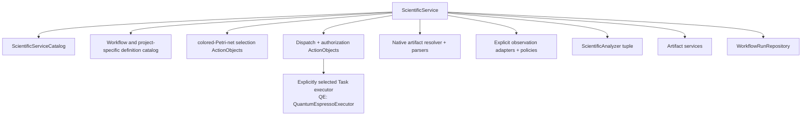

# Scientific service model

## Purpose

`ScientificService` is the application-facing ActionObject for one cohesive scientific operation family. It composes workflow contracts without owning calculator-specific implementation or scientific-analysis algorithms.

## Objects

| Object | Responsibility |
|---|---|
| `ScientificServiceIdentity` | Stable service and version identity |
| `ScientificIntent` | Explicit requested scientific operation and intended use |
| `ScientificServiceEntry` | Accepted inputs, result family, capabilities, effects, and authority needs |
| `ScientificServiceCatalog` | Immutable service entries available in one application composition |
| `ScientificServiceRequest` | Intent, authority, Workflow selection, and explicit configuration references |
| `ScientificServiceResult` | Run identity, terminal represented status, analyses, findings, limitations, and provenance references |

## Composition

All dependencies are explicit and immutable for one service operation. Catalog membership describes capability; it does not authorize effects.

## Operation

The service validates the request, resolves one Workflow definition, initializes or loads a run, and composes target-first workflow ActionObjects. Workflow control owns each generic `TaskInvocationOutcome`: ordinary in-process invocation closes directly as confirmed, rejected, or indeterminate; nested Workflow invocation creates one exact distinct child `WorkflowRun` and later admits only explicit exports from a replay-equal terminal child revision; simulation retains its specialized dispatch lifecycle, and after reconciliation workflow control constructs the correlated candidate generic outcome for atomic result ingress. Application composition supplies the exact immutable `WorkflowRuntimeBundle`. A loaded repository snapshot is not advancement-eligible until workflow-owned `WorkflowRunReplayer` returns `equal` for that exact revision and bundle; `unequal`, `unsupported_version`, or `error` blocks advancement. Every proposed WorkflowRun successor likewise requires an exact `equal` replay result before the service submits it for commit. The repository neither invokes the replayer nor treats structural loading as a replay-integrity claim. `ColoredPetriNetTransitionEnabler` returns the complete canonically ordered enablement set, `ColoredPetriNetBindingSelector` returns one identified definition-policy selection without a fairness guarantee, and `ColoredPetriNetTransitionFirer` consumes immutable `ColoredPetriNetFiringInput` and returns its generic validated firing result with successor marking and audit facts. `ColoredPetriNetWorkflowAdapter` applies `TaskStartGateSet` policy, constructs a discriminated `TaskActivation`, maps returned ResultObjects into the generic external-output-value binding, and workflow control constructs the transition record separately. Workflow control first runs `SimulationExecutionAuthorizer` over the exact unused grant, verified `ScientificExecutionAuthoritySnapshot`, and proposed immutable dispatch inputs. Only its closed `authorized` `SimulationExecutionAuthorizationResult` may continue; `denied` or `error` causes no reservation or effect. `SimulationExecutionRequest` binds the exact Task instance, TaskActivation, attempt, executor, already-bound ResultObject inputs, grant, authorization result, and obligation scope; it does not embed generic `Simulation`. `SimulationDispatchPreparer` constructs one validated atomic unit containing request creation, attempt creation, the request successor, reservation of that exact grant, and the dispatch obligation. `SimulationDispatchAdapter` consumes the committed obligation and explicit request/context, independently reruns `SimulationExecutionAuthorizer` over the same exact grant, verified snapshot, and inputs, and submits one expected-revision compare-and-swap claim from `reserved` to `claimed`. Only the successful exact claimant invokes the explicitly selected executor; and `SimulationDispatchReconciler` preserves confirmed, rejected, or indeterminate `SimulationDispatchOutcome` envelopes. Confirmed contains the concrete returned ResultObject and exact correlation identities, not a second scientific result object. After reconciliation, workflow control constructs the correlated candidate generic outcome. For confirmed work, `TaskResultIngester` validates the envelope/outcome correlation, admits the returned ResultObject and exact native-output manifest references, and constructs a single validated successor unit containing the generic outcome, result transition, and `ObligationDisposition`. Repositories commit that unit atomically; no artifact publication effect follows. Only after reconciliation confirms the envelope and ingress admits and commits the concrete result does the service pass it through the explicitly supplied integration-owned native artifact resolver, `QuantumEspressoOutputParser` and/or `QuantumEspressoXsdDocumentParser`, and `QuantumEspressoObservationAdapter` under explicit normalization policy/version, followed by the workflow-owned `NormalizedObservationSet` and `ScientificAnalyzer`; no stage is bypassed. It returns represented results with explicit findings, limitations, provenance, and claim boundaries. Scientific conclusions remain in human-reviewed research records and are not workflow state.

The repository atomically commits the complete supplied request/attempt/successor/exact-authorization-result/grant-reservation/obligation unit and does not authorize or construct transitions; after commit there is no unreserved grant for that request/attempt. Workflow control uses `SimulationExecutionAuthorizer` before preparation, and the executor boundary independently uses it immediately before the calculator process effect, with the same exact reserved grant, verified authority snapshot, request/context, and immutable dispatch inputs. The claim commit is the authoritative one-dispatch use boundary: a claimed grant never returns to unused, and a duplicate, stale, losing, denied, erroneous, or mismatched claimant performs no external effect. A retry or new attempt requires new activation, operation, and attempt identities and, for simulation, a new grant; indeterminate reconciliation retains the original generic invocation outcome and all applicable child-run/grant/TaskActivation/request/attempt/executor/claim/obligation identities and cannot reinvoke or redispatch automatically. The service does not silently select another calculator, discover a parser/adapter/analyzer ambiently, infer scientific acceptance, mutate development state, or hide retry policy. This contract grants no protected execution authority.

## Deferred implementation details

- Whether the public service method is synchronous, asynchronous, or both.
- Service cancellation and resumability contract, including nested child-run cancellation and compensation.
- Exact Workflow-selection contract when multiple definitions satisfy an intent.
- Whether service results include read models or only stable references.
- Resource-ceiling negotiation between service, Workflow, and executor.
