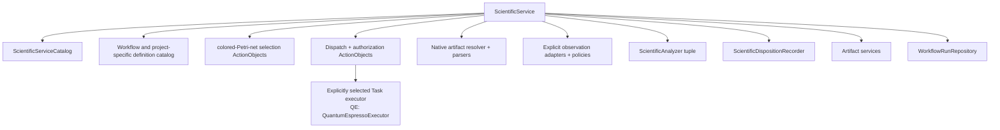

# Scientific service model

## Purpose

`ScientificService` is the application-facing ActionObject for one cohesive scientific operation family. It composes workflow contracts without owning calculator-specific implementation or scientific-analysis algorithms.

## Objects

| Object | Responsibility |
|---|---|
| `ScientificServiceIdentity` | Stable service and version identity |
| `ScientificIntent` | Explicit requested scientific operation and intended use |
| `ScientificServiceEntry` | Accepted inputs, result family, capabilities, effects, and authority needs |
| `ScientificServiceCatalog` | Immutable service entries available in one application composition |
| `ScientificServiceRequest` | Intent, authority, Workflow selection, and explicit configuration references |
| `ScientificServiceResult` | Run identity, terminal represented status, analyses, and disposition references |

## Composition

All dependencies are explicit and immutable for one service operation. Catalog membership describes capability; it does not authorize effects.

## Operation

The service validates the request, resolves one Workflow definition, initializes or loads a run, and composes target-first workflow ActionObjects. `ColoredPetriNetTransitionEnabler` returns the complete canonically ordered enablement set, `ColoredPetriNetBindingSelector` returns one identified definition-policy selection without a fairness guarantee, and `ColoredPetriNetTransitionFirer` consumes immutable `ColoredPetriNetFiringInput` and returns its generic validated firing result with successor marking and audit facts. `ColoredPetriNetWorkflowAdapter` applies `TaskStartGateSet` policy, constructs a discriminated `TaskActivation`, maps returned ResultObjects into the generic external-output-value binding, and workflow control constructs the transition record separately. Workflow control first authorizes the exact unused grant and proposed immutable dispatch inputs. `SimulationExecutionRequest` binds the exact Task instance, TaskActivation, attempt, executor, already-bound ResultObject inputs, grant, and obligation scope; it does not embed generic `Simulation`. `SimulationDispatchPreparer` constructs one validated atomic unit containing request creation, attempt creation, the request successor, reservation of that exact grant, and the dispatch obligation; `SimulationDispatchAdapter` consumes the committed obligation and explicit request/context and invokes the explicitly selected executor; and `SimulationDispatchReconciler` preserves confirmed, rejected, or indeterminate `SimulationDispatchOutcome` envelopes. Confirmed contains the concrete returned ResultObject and exact correlation identities, not a second scientific result object. `TaskResultIngester` validates that envelope and admits the returned ResultObject. Ingress constructs a single validated successor unit containing the result transition, obligation disposition, and all required publication obligations or explicit no-publication disposition; repositories commit that unit atomically before publication. Only after reconciliation confirms the envelope and ingress admits and commits the concrete result does the service pass it through the explicitly supplied integration-owned native artifact resolver, `QuantumEspressoOutputParser` and/or `QexsdDocumentParser`, and `QuantumEspressoObservationAdapter` under explicit normalization policy/version, followed by the workflow-owned `NormalizedObservationSet` and `ScientificAnalyzer`; no stage is bypassed. It returns represented results. `ScientificDispositionRecorder` is invoked separately with exact analyses, intended use, proposed conclusion, disposition grant/snapshot, predecessor state, and expected run revision.

The repository atomically commits the complete supplied request/attempt/successor/exact-grant-reservation/obligation unit and does not authorize or construct transitions; after commit there is no unreserved grant for that request/attempt. Workflow control uses `SimulationExecutionAuthorizer` before preparation, and the executor boundary independently uses it immediately before the calculator process effect, with the same exact reserved grant, authority snapshot, request/context, and immutable dispatch inputs. A retry or new attempt requires a new grant; indeterminate reconciliation retains the original grant/TaskActivation/request/attempt/executor/obligation identities. The service does not silently select another calculator, discover a parser/adapter/analyzer ambiently, infer scientific disposition, mutate development state, or hide retry policy. This contract grants no protected execution authority.

## Unresolved issues

- Whether the public service method is synchronous, asynchronous, or both.
- Service cancellation and resumability contract.
- Exact Workflow-selection contract when multiple definitions satisfy an intent.
- Whether service results include read models or only stable references.
- Resource-ceiling negotiation between service, Workflow, and executor.
