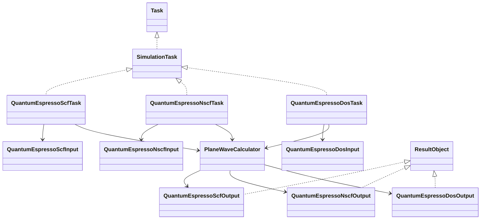
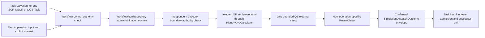

# Simulation Task model

## Structural protocols

`Simulation` is a structural `Protocol`, not an intent DataObject and not a required nominal base class. `SimulationTask` implements or extends `Task` and returns immutable `ResultObject` instances.

The canonical `ksdft2effmass.integration.quantum_espresso` surface now implements the
initial local executor, execution input, and `pw.x`/`bands.x` result contracts while
satisfying the backend-neutral `ksdft2effmass.calculators.dft.pw` port. The accepted
[QE task-contract boundary decision](../calculators/quantum-espresso-task-contract-boundary-decision.md)
selects four operation-specific public Task contracts for later implementation:

- `QuantumEspressoScfTask` consumes one exact SCF input and returns a `QuantumEspressoPwResult` containing identified mechanical execution evidence and native continuation state;
- `QuantumEspressoNscfTask` consumes one exact NSCF input plus the admitted SCF result and exact staged continuation-state identity, and returns a new `QuantumEspressoPwResult` and native-state identity;
- `QuantumEspressoBandPathTask` consumes one exact band-path input plus its admitted predecessor state and returns a `QuantumEspressoPwResult`; and
- `QuantumEspressoBandsExtractionTask` consumes one exact bands-extraction input plus an admitted band-path result and returns a `QuantumEspressoBandsResult`.

These selected Task adapters remain unimplemented pending separate activation. DOS is
deferred until its executable and result boundary exists; the older prospective DOS
role in the diagram below is not an accepted initial public class.
`PlaneWaveCalculator` is the implemented generic
public port; `QuantumEspressoExecutionInput`, `QuantumEspressoPwResult`,
`QuantumEspressoBandsResult`, and `LocalQuantumEspressoExecutor` are implemented public
in-memory QE contracts. A future reusable DOS Workflow composes Task instances of the
operation definitions rather than collapsing them into one shell-sequence operation.

## Quantum ESPRESSO roles

The implemented immutable `QuantumEspressoExecutionInput` contains or references exact
native QE input bytes and exact pseudopotential and predecessor-artifact identities.
It does not own the grouping, variable, or scientific policy used to form input text.
The integration-owned `QePwInputFile` preserves upstream-selected groups and
`QePwInputFileWriter` writes their native text without a provenance schema; workflow
composition may supply those exact retained bytes to an execution input. Future
SCF/NSCF/DOS-specific Task inputs may refine this envelope without changing artifact
identity or scientific-policy ownership. Existing QE inputs and pseudopotentials
remain usable exact artifacts without rendering, conversion, registration, rerun, or
evidence reclassification.

The backend-neutral plane-wave executor port is owned by `ksdft2effmass.calculators.dft.pw`. Its injected `ksdft2effmass.integration.quantum_espresso` implementation consumes one exact QE operation-specific input and only the accepted explicit execution context after workflow authority and dispatch gates. It returns a new operation-specific QE integration ResultObject satisfying the generic port; it does not mutate output state onto the input or Task.

Each operation-specific output is an immutable `ResultObject` carrying mechanical
process outputs, calculator-reported and diagnostic observations, and
artifact/provenance identities. It may preserve an exact calculator-reported
completion, convergence, or failure statement, but it makes no independent
convergence, numerical-acceptance, scientific-acceptance, or human-disposition claim.
The new output is correlated in that Task instance's `WorkflowRun` result state.

SCF, NSCF, and DOS definitions may be reused in multiple Workflows by constructing new run-scoped Task instances with different exact inputs. Reuse never means sharing a mutable `prefix`/`outdir`: a downstream Task receives an immutable predecessor result and stages the identified native state into its own isolated workspace, then produces a new state or DOS artifact identity. No generic indirection layer or runtime plugin registry lies between a Task and its explicitly injected executor.

## Task activation and authority

The Workflow adapter creates a discriminated `TaskActivation`: direct invocation has no gate-set or selected-gate identity, `any_of` identifies one deterministically selected gate/binding, and `all_of` identifies the canonical complete member gate/binding tuple. `SimulationExecutionRequest` then binds one exact operation-specific Task instance, TaskActivation, attempt, concrete executor selected through `PlaneWaveCalculator`, already-bound ResultObject inputs, grant, closed `SimulationExecutionAuthorizationResult`, and obligation scope; it does not embed generic `Simulation` or a multi-stage command list. Workflow control obtains one exact `authorized` result for the unused execution grant, verified authority snapshot, and immutable dispatch inputs before committing request, attempt, successor, grant reservation, and dispatch obligation as one supplied atomic unit. Immediately before the external process effect, the executor boundary independently obtains an exact `authorized` result for the same reserved grant, verified authority snapshot, activation/request/context, input artifacts, executable configuration, and resource limits, then performs one expected-revision compare-and-swap claim from `reserved` to `claimed`. Only the successful claimant proceeds.

One grant authorizes one exact dispatch bound to request, Task instance, TaskActivation, attempt, executor, authorization-result, claim, and obligation identities. SCF, NSCF, and DOS therefore require three distinct activations, attempts, grants, process observations, result ingresses, and CPN firings even when one human checkpoint authorizes the bounded workflow. A claimed grant is consumed for authority purposes even when the external outcome is indeterminate. A retry or new execution requires new operation, activation, request, attempt, obligation, and grant identities. `SimulationDispatchOutcome` is the specialized dispatch envelope: confirmed contains the exact returned operation-specific ResultObject and correlation identities, rejected contains failure and no output, and indeterminate contains no invented output and is not automatically redispatched. The envelope is not a second scientific result object. After reconciliation, workflow control constructs the corresponding candidate generic `TaskInvocationOutcome`; confirmed references the exact confirmed envelope and concrete output, while rejected or indeterminate references the matching dispatch without inventing results. For confirmed work, `TaskResultIngester` validates that correlation and atomically admits the output together with the generic outcome and result transition.

## Failure recovery and retry

A calculator-reported failure whose effect and output capture are determinate may be a
typed ResultObject inside confirmed dispatch. Confirmation establishes effect and
capture certainty, not successful calculator completion. Application composition maps
operation-specific result facts into generic CPN values; only a result satisfying its
explicit continuation-admission contract can satisfy a downstream Task gate.

Retry control is represented by the Workflow-owned CPN composition. A failure or
unresolved-diagnostic value leads to an explicit recovery-required state. An admitted
resolution may enable either reevaluation of the retained result or a retry-intent
transition. The generic CPN enabler, selector, and firer remain effect-free: they do
not invoke a calculator, modify inputs, wait, or reuse authority. Workflow control
performs any newly enabled effect only after constructing new activation, operation,
attempt, request, obligation, and grant identities and completing the applicable
fresh authorization and dispatch sequence.

The failed attempt, its diagnostic result, and its resolution dependency remain in
ordered Workflow history. A retry never mutates or replaces them. A diagnostic
reclassification may make an otherwise completed retained result admissible without a
new scientific effect; a changed input, execution context, executable configuration,
or scientific setting requires a new exact execution attempt. Every retry topology
has an explicit abandon or bounded-exhaustion path and no direct automatic
failure-to-execution edge. The accepted QE-specific ownership and diagnostic mapping
are recorded in the
[QE diagnostic outcome and retry decision](../calculators/quantum-espresso-diagnostic-outcome-decision.md).

## Exact artifacts and non-equivalence

Same labels, methods, cutoff values, pseudopotential families or assets, or settings across implementations do not establish equivalence. PAW, ultrasoft, and norm-conserving assets; valence/core choices; generation settings; exchange-correlation compatibility; relativistic treatment; projector construction; recommended cutoffs; and formats remain exact represented inputs. Equivalence would require a separately authorized evidence-bearing comparison or validation claim.

External, imported retained, human-authored, and bounded legacy ResultObjects and artifacts retain their actual producer-provenance variant. They may enter a Workflow without fabricated Task lineage or recalculation.

## Normalization path

After `TaskResultIngester` validates the confirmed envelope and candidate generic outcome, admits the returned operation-specific ResultObject, and atomically commits the outcome, result transition, and result ingress, explicitly composed native parsers and adapters may map retained native records to `NormalizedObservationSet`, followed by deterministic scientific analysis. Any diagnostic classification required to construct the operation-specific QE result occurs at the integration boundary before that result is returned; richer native parsing and neutral normalization remain post-ingress operations. Human-reviewed conclusions remain external research records. Mechanical execution success does not imply convergence or scientific acceptance.

The project-relevant multi-executable composition is defined by the
[QE--Wannier90 CPN workflow](qe-wannier90-cpn-workflow.md). That CPN owns
artifact-availability dependencies and joins without moving executable behavior
or scientific policy into the generic Petri-net package.

## Package boundary and status

Backend-neutral plane-wave DFT specification, binding, and executor-port contracts belong under `ksdft2effmass.calculators.dft.pw`. QE Task, Simulation, native input/output, configuration, process and diagnostic observations, serialization, staging, workspace/process invocation, native parsing, artifact discovery, failure mapping, and observation adaptation belong to `ksdft2effmass.integration.quantum_espresso`. Application composition injects that concrete implementation; calculators and workflows never import it.

The bounded private fields selected by the
[DFT simulation CPN service decision](dft-simulation-cpn-service-decision.md) apply
only to its retained-result architecture probe. The private
`ksdft2effmass.workflows._dft_scf_nscf_dos` slice implements only the effect-free
composition of three distinct reusable Task-definition identities and their CPN
transitions. Private `QuantumEspressoNscfInput`, `QuantumEspressoDosInput`, and their
mechanical result variants now preserve the bounded exact identities required by the
probe. Neither private slice implements the prospective QE Task classes, native-state
handoff, or result ingress described on this page. The canonical QE package separately
implements the initial public in-memory execution fields, local executor, and Workflow
dispatch effect; its terminal and workspace-snapshot wires remain integration-private.
Durable public wire contracts, asynchronous interfaces, scheduler adapters, the
SCF/NSCF/DOS Task adapters, and supported real-QE operation policy remain deferred.
