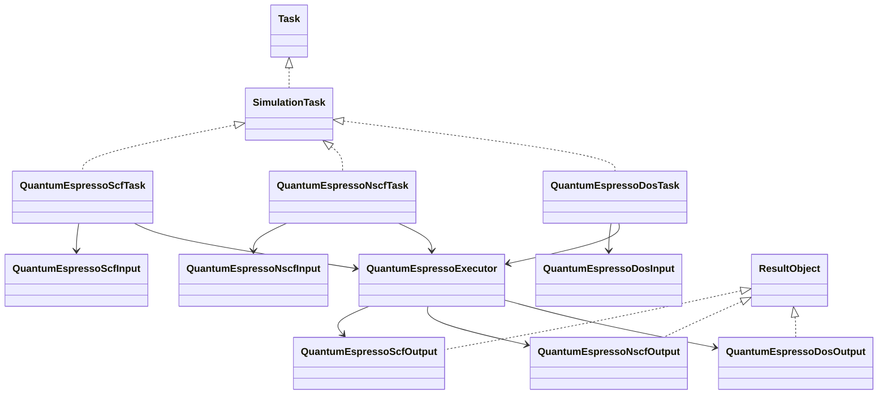
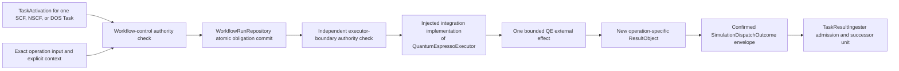

# Simulation Task model

## Structural protocols

`Simulation` is a structural `Protocol`, not an intent DataObject and not a required nominal base class. `SimulationTask` implements or extends `Task` and returns immutable `ResultObject` instances.

Quantum ESPRESSO operations use separate concrete Task contracts under the prospective `ksdft2effmass.calculators` surface. In particular, SCF, NSCF, and DOS are three independently activatable and reusable Tasks rather than modes of one workflow-specific Task:

- `QuantumEspressoScfTask` consumes one exact SCF input and returns one SCF result containing an identified native continuation-state artifact;
- `QuantumEspressoNscfTask` consumes one exact NSCF input plus the admitted SCF result and exact staged continuation-state identity, and returns a new NSCF result and native-state identity; and
- `QuantumEspressoDosTask` consumes one exact DOS input plus the admitted NSCF result and exact staged native-state identity, and returns a DOS result.

The names are prospective roles rather than accepted public exports. A reusable DOS Workflow composes Task instances of those operation definitions. It does not collapse them into one shell-sequence operation.

## Quantum ESPRESSO roles

Each operation-specific input is a prospective immutable execution-envelope DataObject that contains or references exact native QE input bytes and exact pseudopotential and predecessor-artifact identities with their actual provenance. It does not own the grouping, variable, or scientific policy used to form input text. The implemented integration-owned `QePwInputFile` preserves upstream-selected groups and `QePwInputFileWriter` writes their native text without a provenance schema; a future execution envelope may consume that output. Existing QE inputs and pseudopotentials remain usable exact artifacts without rendering, conversion, registration, rerun, or evidence reclassification.

`QuantumEspressoExecutor` is a calculator-owned consumer structural protocol for a target-first external-effect ActionObject. Its injected `ksdft2effmass.integration.quantumespresso` implementation consumes one exact operation-specific input and only the accepted explicit execution context after workflow authority and dispatch gates. It returns a new operation-specific calculator ResultObject; it does not mutate output state onto the input or Task.

Each operation-specific output is an immutable `ResultObject` carrying mechanical process outputs and artifact/provenance identities. It records no convergence, numerical acceptance, scientific acceptance, or human disposition claim. The new output is correlated in that Task instance's `WorkflowRun` result state.

SCF, NSCF, and DOS definitions may be reused in multiple Workflows by constructing new run-scoped Task instances with different exact inputs. Reuse never means sharing a mutable `prefix`/`outdir`: a downstream Task receives an immutable predecessor result and stages the identified native state into its own isolated workspace, then produces a new state or DOS artifact identity. No generic indirection layer or runtime plugin registry lies between a Task and its explicitly injected executor.

## Task activation and authority

The Workflow adapter creates a discriminated `TaskActivation`: direct invocation has no gate-set or selected-gate identity, `any_of` identifies one deterministically selected gate/binding, and `all_of` identifies the canonical complete member gate/binding tuple. `SimulationExecutionRequest` then binds one exact operation-specific Task instance, TaskActivation, attempt, `QuantumEspressoExecutor`, already-bound ResultObject inputs, grant, closed `SimulationExecutionAuthorizationResult`, and obligation scope; it does not embed generic `Simulation` or a multi-stage command list. Workflow control obtains one exact `authorized` result for the unused execution grant, verified authority snapshot, and immutable dispatch inputs before committing request, attempt, successor, grant reservation, and dispatch obligation as one supplied atomic unit. Immediately before the external process effect, the executor boundary independently obtains an exact `authorized` result for the same reserved grant, verified authority snapshot, activation/request/context, input artifacts, executable configuration, and resource limits, then performs one expected-revision compare-and-swap claim from `reserved` to `claimed`. Only the successful claimant proceeds.

One grant authorizes one exact dispatch bound to request, Task instance, TaskActivation, attempt, executor, authorization-result, claim, and obligation identities. SCF, NSCF, and DOS therefore require three distinct activations, attempts, grants, process observations, result ingresses, and CPN firings even when one human checkpoint authorizes the bounded workflow. A claimed grant is consumed for authority purposes even when the external outcome is indeterminate. A retry or new execution requires new operation, activation, request, attempt, obligation, and grant identities. `SimulationDispatchOutcome` is the specialized dispatch envelope: confirmed contains the exact returned operation-specific ResultObject and correlation identities, rejected contains failure and no output, and indeterminate contains no invented output and is not automatically redispatched. The envelope is not a second scientific result object. After reconciliation, workflow control constructs the corresponding candidate generic `TaskInvocationOutcome`; confirmed references the exact confirmed envelope and concrete output, while rejected or indeterminate references the matching dispatch without inventing results. For confirmed work, `TaskResultIngester` validates that correlation and atomically admits the output together with the generic outcome and result transition.

## Exact artifacts and non-equivalence

Same labels, methods, cutoff values, pseudopotential families or assets, or settings across implementations do not establish equivalence. PAW, ultrasoft, and norm-conserving assets; valence/core choices; generation settings; exchange-correlation compatibility; relativistic treatment; projector construction; recommended cutoffs; and formats remain exact represented inputs. Equivalence would require a separately authorized evidence-bearing comparison or validation claim.

External, imported retained, human-authored, and bounded legacy ResultObjects and artifacts retain their actual producer-provenance variant. They may enter a Workflow without fabricated Task lineage or recalculation.

## Normalization path

After `TaskResultIngester` validates the confirmed envelope and candidate generic outcome, admits the returned operation-specific ResultObject, and atomically commits the outcome, result transition, and result ingress, explicitly composed native parsers and adapters may map native records to `NormalizedObservationSet`, followed by deterministic scientific analysis. Human-reviewed conclusions remain external research records. Mechanical execution success does not imply convergence or scientific acceptance.

The project-relevant multi-executable composition is defined by the
[QE--Wannier90 CPN workflow](qe-wannier90-cpn-workflow.md). That CPN owns
artifact-availability dependencies and joins without moving executable behavior
or scientific policy into the generic Petri-net package.

## Package boundary and status

Project-facing QE Task, Simulation, input/output, configuration, process-record, and executor-protocol types remain under `ksdft2effmass.calculators`. Concrete QE serialization, staging, workspace/process invocation, native parsing, artifact discovery, failure mapping, and observation adaptation belong to `ksdft2effmass.integration.quantumespresso`. Application composition injects that concrete implementation; calculators and workflows never import it. This prospective ownership correction does not itself move or create source.

The bounded private fields selected by the
[DFT simulation CPN service decision](dft-simulation-cpn-service-decision.md) apply
only to its retained-result architecture probe. The private
`ksdft2effmass.workflows._dft_scf_nscf_dos` slice implements only the effect-free
composition of three distinct reusable Task-definition identities and their CPN
transitions. Private `QuantumEspressoNscfInput`, `QuantumEspressoDosInput`, and their
mechanical result variants now preserve the bounded exact identities required by the
probe. Neither private slice implements the prospective QE Task classes, executor,
dispatch, native-state handoff, or result ingress on this page. Stable public field
and wire contracts, asynchronous interfaces, scheduler adapters, and supported QE
operation policy remain deferred.
