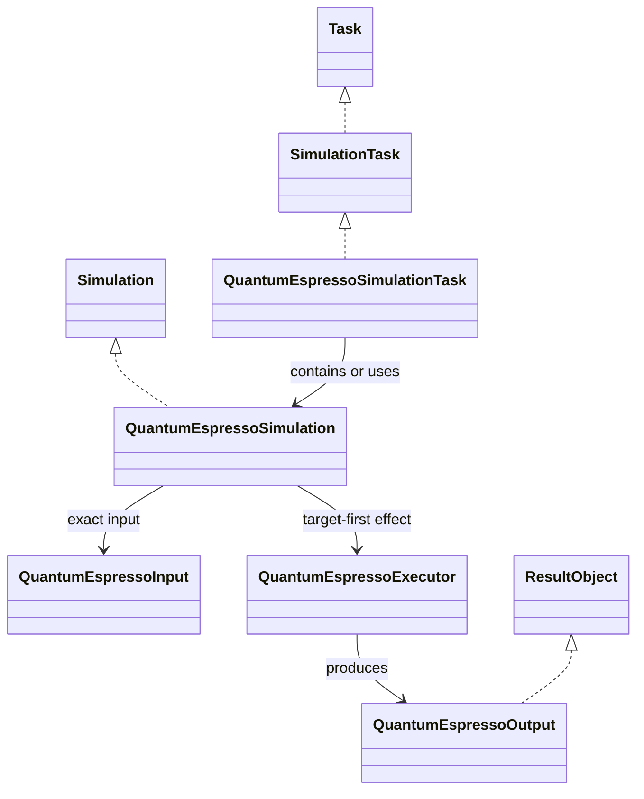
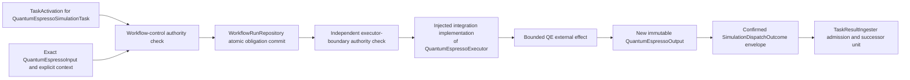

# Simulation Task model

## Structural protocols

`Simulation` is a structural `Protocol`, not an intent DataObject and not a required nominal base class. `SimulationTask` implements or extends `Task` and returns immutable `ResultObject` instances.

`QuantumEspressoSimulationTask` is the concrete Quantum ESPRESSO Task under the prospective `ksdft2effmass.calculators` surface. It contains or uses `QuantumEspressoSimulation`. `QuantumEspressoSimulation` structurally satisfies `Simulation` and is the concrete composite whose roles and properties are:

- `QuantumEspressoInput`;
- `QuantumEspressoExecutor`; and
- the produced `QuantumEspressoOutput`.

## Quantum ESPRESSO roles

`QuantumEspressoInput` is an immutable DataObject that contains or references exact native QE input bytes and exact pseudopotential and artifact identities with their actual provenance. Existing QE inputs and pseudopotentials remain usable exact artifacts without rendering, conversion, registration, rerun, or evidence reclassification.

`QuantumEspressoExecutor` is a calculator-owned consumer structural protocol for a target-first external-effect ActionObject. Its injected `ksdft2effmass.integration.quantumespresso` implementation consumes the exact `QuantumEspressoInput` and only the accepted explicit execution context after workflow authority and dispatch gates. It returns a new calculator-owned `QuantumEspressoOutput`; it does not mutate output state onto the input, Task, or pre-execution simulation composite.

`QuantumEspressoOutput` is an immutable `ResultObject` carrying mechanical process outputs and artifact/provenance identities. It records no convergence, numerical acceptance, scientific acceptance, or human disposition claim. The new output is correlated in `WorkflowRun` Task result state.

`QuantumEspressoSimulation` remains the selected input/executor/output composite. No generic indirection layer or runtime plugin registry lies between the composite and the explicitly composed Task.

## Task activation and authority

The Workflow adapter creates a discriminated `TaskActivation`: direct invocation has no gate-set or selected-gate identity, `any_of` identifies one deterministically selected gate/binding, and `all_of` identifies the canonical complete member gate/binding tuple. `SimulationExecutionRequest` then binds the exact `QuantumEspressoSimulationTask` instance, TaskActivation, attempt, `QuantumEspressoExecutor`, already-bound ResultObject inputs, grant, closed `SimulationExecutionAuthorizationResult`, and obligation scope; it does not embed generic `Simulation`. Workflow control obtains one exact `authorized` result for the unused execution grant, verified authority snapshot, and immutable dispatch inputs before committing request, attempt, successor, grant reservation, and dispatch obligation as one supplied atomic unit. Immediately before the external process effect, the executor boundary independently obtains an exact `authorized` result for the same reserved grant, verified authority snapshot, activation/request/context, input artifacts, executable configuration, and resource limits, then performs one expected-revision compare-and-swap claim from `reserved` to `claimed`. Only the successful claimant proceeds.

One grant authorizes one exact dispatch bound to request, Task instance, TaskActivation, attempt, executor, authorization-result, claim, and obligation identities. A claimed grant is consumed for authority purposes even when the external outcome is indeterminate. A retry or new execution requires new operation, activation, request, attempt, obligation, and grant identities. `SimulationDispatchOutcome` is the specialized dispatch envelope: confirmed contains the exact returned `QuantumEspressoOutput` and correlation identities, rejected contains failure and no output, and indeterminate contains no invented output and is not automatically redispatched. The envelope is not a second scientific result object. After reconciliation, workflow control constructs the corresponding candidate generic `TaskInvocationOutcome`; confirmed references the exact confirmed envelope and concrete output, while rejected or indeterminate references the matching dispatch without inventing results. For confirmed work, `TaskResultIngester` validates that correlation and atomically admits the output together with the generic outcome and result transition.

## Exact artifacts and non-equivalence

Same labels, methods, cutoff values, pseudopotential families or assets, or settings across implementations do not establish equivalence. PAW, ultrasoft, and norm-conserving assets; valence/core choices; generation settings; exchange-correlation compatibility; relativistic treatment; projector construction; recommended cutoffs; and formats remain exact represented inputs. Equivalence would require a separately authorized evidence-bearing comparison or validation claim.

External, imported retained, human-authored, and bounded legacy ResultObjects and artifacts retain their actual producer-provenance variant. They may enter a Workflow without fabricated Task lineage or recalculation.

## Normalization path

After `TaskResultIngester` validates the confirmed envelope and candidate generic outcome, admits the returned `QuantumEspressoOutput`, and atomically commits the outcome, result transition, and result ingress, explicitly composed native parsers and adapters may map native records to `NormalizedObservationSet`, followed by deterministic scientific analysis and separately authorized disposition. Mechanical execution success does not imply convergence or scientific acceptance.

## Package boundary and status

Project-facing QE Task, Simulation, input/output, configuration, process-record, and executor-protocol types remain under `ksdft2effmass.calculators`. Concrete QE serialization, staging, workspace/process invocation, native parsing, artifact discovery, failure mapping, and observation adaptation belong to `ksdft2effmass.integration.quantumespresso`. Application composition injects that concrete implementation; calculators and workflows never import it. This prospective ownership correction does not itself move or create source.

Exact field and wire contracts, asynchronous interfaces, scheduler adapters, and supported QE operation policy remain deferred. This is prospective documentation only and grants no external execution. It claims no implementation, software verification, numerical verification, scientific validation, uncertainty quantification, equivalence, recalculation, or human software acceptance.
