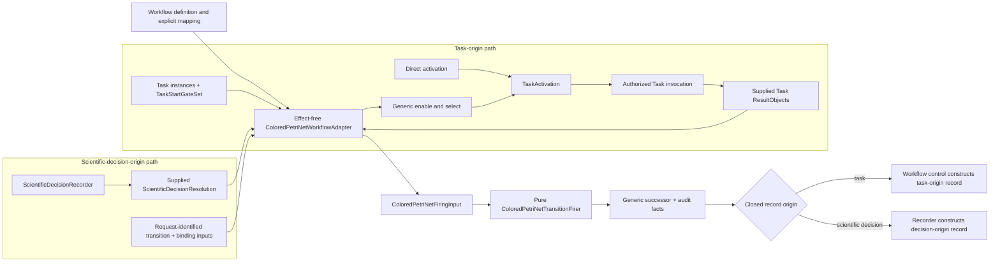

# Task, Workflow, and colored-Petri-net adapter

## ResultObject and Task

`ResultObject` is an immutable workflow-facing result protocol or category. A concrete scientific domain owns each concrete result type and its intrinsic invariants. Result instances, not producer operations, are workflow inputs and prerequisites.

`Task` is a structural operation `Protocol` and ActionObject. It consumes already-bound `ResultObject` instances plus explicit operation context and returns one or more `ResultObject` instances. It does not schedule work, inspect a complete marking, discover prerequisites, mutate its inputs, or own workflow gate policy.

A `Workflow` is a reusable composite ActionObject and structural `Protocol` that implements `Task`. A Workflow can therefore be nested and invoked wherever a Task is accepted. Project-specific campaign definitions may supply composition data, but they are not the generic Workflow or control aggregate.

## Task instances and start gates

A reusable Task definition and a run-scoped Task instance are distinct. A Task instance has zero or one immutable Workflow-owned `TaskStartGateSet`. The set has exactly one composition mode, `any_of` or `all_of`, and zero or more member gates. Each member gate binds zero, one, or many result-valued tokens. Component order in storage is not selection order.

Zero member gates mean no colored-Petri-net automatic activation. An enclosing caller may invoke that Task instance directly under the accepted workflow authority boundary; the resulting activation is `direct` and carries no gate-set or selected-gate identity. Direct invocation still binds the exact Task instance, input ResultObjects, Workflow/run, operation, and attempt identities.

For `any_of`, each enabled member gate contributes its compatible transition binding. Selection applies stable definition-owned gate priority and then stable gate identity before canonical transition and binding order. The activation records the exact gate-set identity and exactly one deterministically selected enabled gate/binding. For `all_of`, the set is enabled only when every member has a mutually compatible binding. The selector chooses the canonical compatible tuple deterministically and the activation records the exact gate-set identity and every member gate/binding as one canonically ordered collective selection. An empty `any_of` or `all_of` set has no automatic activation.

The Task input contract defines values accepted by `execute`; start-gate policy defines when a Workflow permits automatic activation. Gates may be stricter than the Task input contract, but cannot omit an intrinsically required input or supply an incompatible value. Start gates are Workflow composition policy, not intrinsic Task prerequisites.

`TaskActivation` is immutable and identifies the run-scoped Task instance, already-bound `ResultObject` inputs, Workflow and WorkflowRun correlation, intended operation identity, attempt identity, and exactly one discriminated activation selection:

| Selection | Required identities | Prohibited identities |
|---|---|---|
| `direct` | Direct-activation discriminant | Gate-set and selected-gate identities |
| `any_of` | Exact gate-set identity and one selected member gate/transition/binding | Collective bindings |
| `all_of` | Exact gate-set identity and the canonical complete member gate/transition/binding tuple | Singular selected-gate field |

Every activation that crosses the effect boundary is identified. A retry or new execution uses a new activation, attempt, and operation identity under the accepted authority rules.

## ColoredPetriNetWorkflowAdapter

`ColoredPetriNetWorkflowAdapter` is the effect-free ActionObject that adapts an explicit `Workflow` definition and supplied workflow values to `ksdft2effmass.petrinet.colored`; it is not the Task-effect invoker or a decision recorder.

For Task-origin work, the adapter maps Workflow-owned gates and `ResultObject` token values to generic colored-Petri-net inputs. It applies the `TaskStartGateSet` mode to generic enablement: deterministic singular selection for `any_of`, or deterministic canonical compatible-tuple selection for `all_of`. It constructs the corresponding discriminated `TaskActivation`, or a `direct` activation when an enclosing caller invokes a zero-gate Task instance. The adapter is effect-free: workflow control and, for dispatched calculator work, `SimulationDispatchAdapter` invoke the selected Task or executor through the accepted authority boundary.

The Workflow definition maps each activation selection to one exact generic activation transition and selected binding. For `all_of`, the canonical complete member tuple produces one combined binding for that transition; the adapter does not perform multiple effectful or generic firings. After workflow control supplies the Task's returned concrete ResultObjects, the adapter maps their values into an immutable generic external-output-value binding and supplies it as part of `ColoredPetriNetFiringInput`.

For scientific-decision ingress, the Workflow definition and `ScientificDecisionRequest` instead identify one exact decision-ingress transition, its selected binding inputs, and the resolution-to-generic-value mapping. `ScientificDecisionRecorder` supplies the exact `ScientificDecisionResolution` and those request-identified inputs to the adapter. The adapter maps only that supplied value, forms the generic external-output-value binding, and requests pure firing. It creates no TaskActivation or attempt for this path. It does not prompt, correlate or interpret a human response, record or authorize a decision, construct a `WorkflowTransitionRecord`, or submit persistence.

For both origins, the pure firer evaluates output inscriptions against the selected binding extended only by explicit supplied values. Workflow control constructs task-origin workflow records; `ScientificDecisionRecorder` constructs scientific-decision-origin workflow records. The generic package never constructs either record, invokes a Task, or performs effects.

Simultaneous `any_of` choices use stable gate priority, stable gate identity, canonical transition identity, and canonical binding order, with no fairness guarantee. `all_of` uses the canonical compatible tuple across every member. A definition-permitted identified directive is the only allowed override where the versioned Workflow policy permits it. Selection itself grants no execution authority.

## Result flow and provenance

Producer Task-instance identity is provenance only when a represented Task produced a result. External, imported retained, human-authored, or bounded legacy ResultObjects retain their actual producer-provenance variant and may enter a Workflow without rerun or fabricated workflow lineage.

Parent/child Workflow membership and ResultObject dependency are orthogonal run-level relations. A child Task instance may consume a ResultObject produced outside its parent Workflow. Parent membership is not prerequisite closure, and a cross-parent dependency is not forced through ownership.

## Persistence boundary

Workflow repositories atomically commit supplied, already validated `WorkflowRun` successor units and obligations. They do not enable or select generic transitions, choose start gates, invoke Tasks, calculate generic firing, interpret responses, create decisions or authority, or construct workflow successor policy. Workflow control owns task-origin transformations; `ScientificDecisionRecorder` owns scientific-decision-origin construction while using the adapter and pure generic firer as explicit dependencies.

## Unresolved issues

- Exact public Task, Workflow, gate-value, activation, and adapter wire fields beyond the selected modes and discriminants.
- Token-value and ResultObject mapping wire formats.
- Nested-Workflow cancellation and compensation policy.
- Persistence representation for Workflow definitions and Task instances.

This prospective contract is documentation-only. It claims no implementation, verification, scientific validation, equivalence, execution authority, or human software acceptance.
