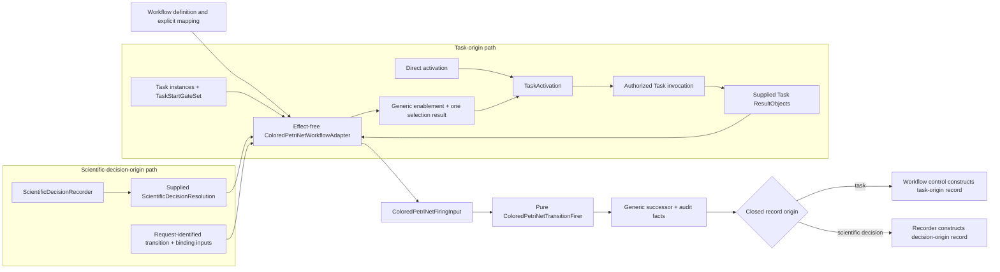

# Task, Workflow, and colored-Petri-net adapter

## ResultObject and Task

`ResultObject` is an immutable workflow-facing result protocol or category. A concrete scientific domain owns each concrete result type and its intrinsic invariants. Result instances, not producer operations, are workflow inputs and prerequisites.

`Task` is a structural operation `Protocol` and ActionObject. It consumes already-bound `ResultObject` instances plus explicit operation context and, when its operation completes, returns one or more `ResultObject` instances. It does not schedule work, inspect a complete marking, discover prerequisites, mutate its inputs, own workflow gate policy, or construct its durable invocation outcome.

`TaskInvocationOutcome` is the immutable workflow-owned envelope for one exact TaskActivation, operation, and attempt. It is closed as `confirmed`, `rejected`, or `indeterminate`. Confirmed contains the returned concrete ResultObjects and their production identities; rejected contains one structured failure and no results; indeterminate contains no results and preserves the exact identities required for reconciliation. The envelope is workflow control state, not another scientific result.

A `Workflow` is a reusable composite ActionObject and structural `Protocol` that implements `Task`. A Workflow can therefore be nested and invoked wherever a Task is accepted. Each nested invocation receives a distinct child `WorkflowRun`; it does not embed a child marking or transition history in the parent run. Project-specific campaign definitions may supply composition data, but they are not the generic Workflow or control aggregate.

## Task instances and start gates

A reusable Task definition and a run-scoped Task instance are distinct. A Task instance has zero or one immutable Workflow-owned `TaskStartGateSet`. The set has exactly one composition mode, `any_of` or `all_of`, and zero or more member gates. Each member gate binds zero, one, or many result-valued tokens. Component order in storage is not selection order.

Zero member gates mean no colored-Petri-net automatic activation. An enclosing caller may invoke that Task instance directly under the accepted workflow authority boundary; the resulting activation is `direct` and carries no gate-set or selected-gate identity. Direct invocation still binds the exact Task instance, input ResultObjects, Workflow/run, operation, and attempt identities.

For `any_of`, each enabled member gate contributes its compatible transition binding. Selection applies stable definition-owned gate priority and then stable gate identity before canonical transition and binding order. The activation records the exact gate-set identity and exactly one deterministically selected enabled gate/binding. For `all_of`, the set is enabled only when every member has a mutually compatible binding. The selector chooses the canonical compatible tuple deterministically and the activation records the exact gate-set identity and every member gate/binding as one canonically ordered collective selection. An empty `any_of` or `all_of` set has no automatic activation.

The Task input contract defines values accepted by `execute`; start-gate policy defines when a Workflow permits automatic activation. Gates may be stricter than the Task input contract, but cannot omit an intrinsically required input or supply an incompatible value. Start gates are Workflow composition policy, not intrinsic Task prerequisites.

`TaskActivation` is immutable and identifies the run-scoped Task instance, already-bound `ResultObject` inputs, Workflow and WorkflowRun correlation, intended operation identity, attempt identity, and exactly one discriminated activation selection:

| Selection | Required identities | Prohibited identities |
|---|---|---|
| `direct` | Direct-activation discriminant and exact generic selection-result identity | Gate-set and selected-gate identities |
| `any_of` | Exact gate-set identity, one selected member gate/transition/binding, and exact generic selection-result identity | Collective bindings |
| `all_of` | Exact gate-set identity, canonical complete member gate/transition/binding tuple, and exact generic selection-result identity | Singular selected-gate field |

Every activation that crosses the effect boundary is identified. A retry or new execution uses a new activation, attempt, and operation identity under the accepted authority rules.

## ColoredPetriNetWorkflowAdapter

`ColoredPetriNetWorkflowAdapter` is the effect-free ActionObject that adapts an explicit `Workflow` definition and supplied workflow values to `ksdft2effmass.petrinet.colored`; it is not the Task-effect invoker or a decision recorder.

For Task-origin work, the adapter maps Workflow-owned gates and `ResultObject` token values to generic colored-Petri-net inputs. It applies the `TaskStartGateSet` mode to determine the intended singular `any_of` gate/binding or canonical compatible `all_of` tuple, maps that domain choice to one exact generic transition and binding, and obtains the generic `ColoredPetriNetEnablementResult` and `ColoredPetriNetSelectionResult`. When the intended domain choice is not the generic canonical choice, the adapter supplies the exact definition-permitted `ColoredPetriNetSelectionDirective`; no other override exists. It constructs the corresponding discriminated `TaskActivation`, or a `direct` activation when an enclosing caller invokes a zero-gate Task instance, and that existing activation record references the exact generic selection result. The adapter is effect-free: workflow control and, for dispatched calculator work, `SimulationDispatchAdapter` invoke the selected Task or executor through the accepted authority boundary.

The Workflow definition maps each activation selection to one exact generic activation transition and selected binding. For `all_of`, the canonical complete member tuple produces one combined binding for that transition; the adapter does not perform multiple effectful or generic firings. Direct invocation likewise maps its exact caller-identified operation to one generic selection, using a definition-permitted directive when it is not canonical. After workflow control supplies one exact confirmed `TaskInvocationOutcome`, the adapter maps its returned concrete ResultObjects into an immutable generic external-output-value binding and supplies it with the exact enablement, selection, and optional-directive identities in `ColoredPetriNetFiringInput`. Rejected or indeterminate invocation outcomes never supply an output binding and never produce a successful firing.

For scientific-decision ingress, the Workflow definition and `ScientificDecisionRequest` instead identify one exact decision-ingress transition, its selected binding inputs, and the resolution-to-generic-value mapping. `ScientificDecisionRecorder` supplies the exact `ScientificDecisionResolution` and those request-identified inputs to the adapter. Initial ingress maps unresolved decision state to the effective resolution token; correction supplies the exact effective predecessor token as a consumed binding and the superseding resolution as the one produced value. The adapter maps only those supplied values, obtains one generic enablement and selection result, uses an exact definition-permitted directive when the request-identified selection is not canonical, forms the generic external-output-value binding, and requests pure firing. The existing request, resolution, and transition-origin records retain why that generic selection was requested; no separate Workflow selection-derivation result is introduced. The adapter creates no TaskActivation or attempt for this path. It does not prompt, authenticate, correlate or interpret a human response, record or authorize a decision, construct a `WorkflowTransitionRecord`, or submit persistence.

For both origins, the pure firer first verifies the identity-closed enablement, selection, optional directive, and firing-input chain, then evaluates output inscriptions against the selected binding extended only by explicit supplied values. Workflow control constructs task-origin workflow records; `ScientificDecisionRecorder` constructs scientific-decision-origin workflow records. Those existing origin records retain their TaskActivation or request/resolution provenance and reference the same generic selection result, without a second derivation record. The generic package never constructs either record, invokes a Task, or performs effects.

Simultaneous `any_of` choices use stable gate priority, stable gate identity, canonical transition identity, and canonical binding order, with no fairness guarantee. `all_of` uses the canonical compatible tuple across every member. A definition-permitted identified directive is the only allowed override where the versioned Workflow policy permits it. Selection itself grants no execution authority.

## Ordinary and nested invocation

Workflow control invokes an ordinary in-process Task under the exact activation and constructs its `TaskInvocationOutcome`. A normal return is confirmed. A caught operation failure is rejected. Indeterminate is reserved for a phase where the accepted runtime or persistence contract cannot establish whether the identified operation or result commit completed; it is not a generic substitute for an exception. A duplicate exact invocation reconciles by the same complete operation, activation, attempt, and idempotency identities and does not call the Task again. A retry requires new activation, operation, and attempt identities and retains the predecessor outcome.

For a nested Workflow, the parent first durably records one exact `NestedWorkflowInvocation` correlation binding the parent run/revision, parent Task instance, activation, operation, attempt, intended child Workflow definition, child `WorkflowRunIdentity`, input ResultObjects, and child-creation idempotency identity. The child Workflow owns its initial/current marking, Task instances, ordered transitions, failures, replay, and revisions in its own `WorkflowRun`. Child creation and parent advancement are separate single-stream commits; no cross-run atomicity is claimed.

A confirmed nested outcome references one exact replay-equal terminal child revision and the explicit exported ResultObjects admitted to the parent. A rejected outcome records the exact child failure or pre-child invocation failure and exports nothing. An indeterminate outcome preserves the child-run and creation/observation identities and exports nothing. An indeterminate child creation is reconciled through the exact child identity and idempotency-bound revision read; it is never answered by creating another child automatically. Only a confirmed outcome may provide the parent firing's external output binding. Parent and child histories remain immutable and independently replayable.

The simulation path is a specialization rather than a competing generic invoker. `SimulationDispatchOutcome` retains its selected confirmed/rejected/indeterminate dispatch semantics. After reconciliation, workflow control constructs the correlated candidate `TaskInvocationOutcome`: confirmed only with the exact confirmed envelope and its concrete result, rejected from the exact rejected dispatch, or indeterminate from the exact indeterminate dispatch. For confirmed work, `TaskResultIngester` validates the envelope/outcome correlation, admits the concrete calculator ResultObject and exact native-output manifest references, and includes the generic outcome, result transition, and `ObligationDisposition` in one atomic successor unit. The generic outcome becomes effective with that commit; it does not wrap, reinterpret, or duplicate the scientific ResultObject.

## Result flow and provenance

Producer Task-instance identity is provenance only when a represented Task produced a result. A nested Workflow export preserves its child WorkflowRun, producing child Task, activation, attempt, and result-production identities while the parent records its separate admission dependency. A no-Task `ScientificDecisionResolution` instead uses the closed `RepresentedScientificDecisionIngressProducer` variant with its exact Workflow/run/request/decision-transition/recorder/result identities and direct trusted-boundary response-source and authority-context identities. External, imported retained, human-authored, or bounded legacy ResultObjects retain their actual producer-provenance variant and may enter a Workflow without rerun or fabricated workflow lineage.

Parent/child Workflow membership and ResultObject dependency are orthogonal cross-run relations. A child Task instance may consume a ResultObject produced outside its parent Workflow. Parent membership is not prerequisite closure, and a cross-parent dependency is not forced through ownership.

## Persistence boundary

`WorkflowRunAtomicRepository` receives supplied candidate successor units and obligations, invokes its bound transaction validator and serializer on that exact candidate, binds the candidate bytes and identities, and only then submits the atomic commit. It does not enable or select generic transitions, choose start gates, invoke Tasks, calculate generic firing, interpret responses, create decisions or authority, or construct workflow successor policy. Workflow control owns task-origin transformations; `ScientificDecisionRecorder` owns scientific-decision-origin construction while using the adapter and pure generic firer as explicit dependencies.

## Deferred implementation details

- Exact public Task, Workflow, gate-value, activation, and adapter wire fields beyond the selected modes and discriminants.
- Token-value and ResultObject mapping wire formats.
- Nested-Workflow cancellation and compensation policy.
- Exact terminal-state and exported-result wire forms for nested Workflow invocation.
- Persistence representation for Workflow definitions and Task instances.
