# WorkflowRun object model

## Aggregate

`WorkflowRun` is the immutable snapshot-plus-ordered-transition-record aggregate for one represented Workflow execution. It stores exact initial and current immutable `ColoredPetriNetMarking` values, or content-addressed resolvable references that include exact content and identities. It also records run-scoped Task instances, nested membership, ResultObject identities and provenance, independent result-dependency edges, discriminated TaskActivations, attempts, requests, outcomes, failures, authority state, obligations, transitions, analyses, and separately authorized dispositions. It contains no runtime engine or mutable calculator client.

```mermaid
classDiagram
    class WorkflowRun
    class WorkflowDefinitionReference
    class WorkflowMembership
    class TaskInstance
    class TaskStartGateSet
    class TaskActivation
    class ResultObjectReference
    class ResultDependency
    class WorkflowMarkingRecord
    class WorkflowTransitionRecord
    class TaskAttempt
    class SimulationExecutionRequestCorrelation
    class TaskFailureRecord
    class ResultProductionRecord
    class AuthorityReservationOutcome
    class DispatchOutcomeRecord
    class ScientificExecutionAuthorityReference
    class SimulationDispatchObligation
    class ScientificArtifactPublicationObligation
    class ObligationDisposition
    class ScientificDecisionRequest
    class ScientificDecisionResolution

    WorkflowRun --> WorkflowDefinitionReference : executes
    WorkflowRun *-- TaskInstance : contains run-scoped instances
    WorkflowRun *-- WorkflowMembership : records nesting
    WorkflowMembership --> TaskInstance : parent or child
    TaskInstance --> TaskStartGateSet : zero or one
    WorkflowRun *-- ResultObjectReference : correlates results
    WorkflowRun *-- ResultDependency : records consumption
    ResultDependency --> ResultObjectReference : consumed value
    ResultDependency --> TaskInstance : consumer
    WorkflowRun *-- TaskActivation : identifies task-origin firings
    TaskActivation --> TaskInstance : invokes
    TaskActivation --> ResultObjectReference : binds inputs
    TaskActivation --> ScientificExecutionAuthorityReference : when effectful
    WorkflowRun *-- WorkflowMarkingRecord : initial and current snapshots
    WorkflowRun *-- WorkflowTransitionRecord : canonical ordered history
    WorkflowRun *-- TaskAttempt : records
    WorkflowRun *-- SimulationExecutionRequestCorrelation : correlates dispatch
    WorkflowRun *-- TaskFailureRecord : retains failures
    WorkflowRun *-- ResultProductionRecord : records returned results
    WorkflowRun *-- AuthorityReservationOutcome : records authority state
    WorkflowRun *-- DispatchOutcomeRecord : records dispatch envelope
    WorkflowRun *-- SimulationDispatchObligation : commits
    WorkflowRun *-- ScientificArtifactPublicationObligation : commits when required
    WorkflowRun *-- ObligationDisposition : records
    WorkflowRun *-- ScientificDecisionRequest : pauses affected branch
    WorkflowRun *-- ScientificDecisionResolution : records declared outcome
    WorkflowTransitionRecord --> TaskActivation : task origin only
    WorkflowTransitionRecord --> ScientificDecisionRequest : decision origin only
    WorkflowTransitionRecord --> ScientificDecisionResolution : decision origin only
```

## Component objects

| Object | Responsibility |
|---|---|
| `WorkflowDefinitionReference` | Exact Workflow, colored-Petri-net definition, Task-definition, and schema versions |
| `WorkflowMembership` | Run-level parent/child membership for a nested Workflow or Task instance |
| `TaskInstance` | One run-scoped instance of a reusable Task definition, with zero or one immutable Workflow-owned `TaskStartGateSet` reference |
| `TaskStartGateSet` | Exact immutable `any_of` or `all_of` composition policy with zero or more member gates |
| `TaskActivation` | Selected Task instance, `direct`/`any_of`/`all_of` activation selection, already-bound ResultObjects, Workflow/WorkflowRun correlation, operation, and attempt identity |
| `ResultObjectReference` | Exact immutable result identity, concrete type, owning domain, content identity, and closed producer-provenance variant |
| `WorkflowMarkingRecord` | Initial or current immutable `ColoredPetriNetMarking` value, or content-addressed resolvable reference carrying exact content and marking identity |
| `TaskAttempt` | Exact Task-instance, TaskActivation, operation, attempt, status, predecessor/retry, and applicable request identities |
| `SimulationExecutionRequestCorrelation` | Exact request binding to Task instance, TaskActivation, attempt, executor, dispatch obligation, grant, and already-bound ResultObject input identities |
| `TaskFailureRecord` | Exact applicable run/instance/activation/attempt/request/operation identities, phase, structured failure, and no successful-firing claim |
| `ResultProductionRecord` | Exact producing Task instance, TaskActivation, attempt, returned concrete ResultObject, and result/artifact relation identities |
| `ResultDependency` | Independent run-level edge from an exact ResultObject instance to its consuming Task instance and activation where applicable |
| `AuthorityReservationOutcome` | Exact grant/snapshot, request, activation, attempt, reservation/use state, and authorized/rejected/indeterminate outcome identities |
| `DispatchOutcomeRecord` | Exact confirmed/rejected/indeterminate envelope identity and its request/activation/attempt/executor/obligation correlations; confirmed alone references the returned ResultObject |
| `WorkflowTransitionRecord` | Closed `task`/`scientific_decision` origin; canonical sequence identity; exact predecessor marking, `ColoredPetriNetFiringInput`, firing audit facts, produced values, and successor marking; plus the origin-specific identities below |
| `ScientificExecutionAuthorityReference` | Exact one-dispatch grant, revision, and authority-snapshot identities and state |
| `SimulationDispatchObligation` | Durable dispatch work bound to exact request, Task instance, TaskActivation, attempt, executor, grant, and operation identities before external invocation |
| `ScientificArtifactPublicationObligation` | Durable publication work committed atomically with result ingress |
| `ObligationDisposition` | Confirmed, rejected, indeterminate, completed, or explicit no-publication disposition as applicable |
| `ScientificDecisionRequest` | Immutable exact request/question/options/scope plus affected Workflow/Task/run/transition and authority/source identities |
| `ScientificDecisionResolution` | Immutable typed `ResultObject` preserving exact request identity, verbatim response, one normalized outcome, provenance, and applicable predecessor/supersession |

A `task`-origin `WorkflowTransitionRecord` requires the exact `TaskActivation` and attempt plus the existing Task result-production, request, and outcome identities where applicable; it prohibits scientific-decision request/resolution origin fields. A `scientific_decision`-origin record requires the exact `ScientificDecisionRequest` and `ScientificDecisionResolution` committed in that atomic successor; it prohibits `TaskActivation`, attempt, and Task result-production fields. Both origins retain the same exact predecessor, firing-input, firing-audit, produced-value, successor, definition, evaluator-version, and canonical-sequence identities and participate in one ordered replay.

Membership and dependency are orthogonal. Nested membership neither proves prerequisite closure nor restricts a child to results produced by its parent. A child Task instance may consume an external-parent ResultObject through an explicit `ResultDependency`.

## Revision semantics

Every accepted successor returns a new `WorkflowRun` revision. Task instances, activations, marking snapshots, canonically ordered transition records, attempts, requests, ResultObject references, result-production records, result dependencies, authority states, outcomes, obligations, failures, analyses, dispositions, and scientific decision requests/resolutions are append-only in represented history. A retry creates new request, attempt, operation, activation, and execution-grant identities and does not overwrite its predecessor. An indeterminate dispatch remains associated with its original obligation, request, attempt, activation, and grant.

Task-returned concrete ResultObjects are new immutable values correlated in Task result state. A task-origin successful firing identifies every Task-produced ResultObject and its generic output-value binding. A scientific-decision-origin successful firing identifies its exact resolution and generic output-value binding without creating Task result-production state. A Task or dispatch failure records no successful firing. Output is never mutated onto a pre-execution input or composite.

Deterministic reconstruction starts from the stored initial marking and applies the canonical sequence of successful `WorkflowTransitionRecord` firing inputs under their identified definitions and evaluator versions. The reconstructed marking must equal the stored current marking in semantic value, content identity, and marking identity. Missing records, noncanonical order, broken predecessor/successor links, ambiguous output bindings, or unequal reconstructed state reject run integrity.

## Successor and repository ownership

`ColoredPetriNetTransitionEnabler`, `ColoredPetriNetBindingSelector`, and `ColoredPetriNetTransitionFirer` return generic enablement, selection, and firing results only. For task-origin transitions, the effect-free `ColoredPetriNetWorkflowAdapter` applies the gate-set mode, constructs the discriminated `TaskActivation`, and maps supplied returned ResultObjects into `ColoredPetriNetFiringInput`. Workflow control performs accepted authority checks; `SimulationDispatchAdapter` owns dispatched invocation; and workflow control constructs the task-origin transition/run records and complete candidate successor unit.

For scientific-decision-origin ingress, the Workflow definition and exact `ScientificDecisionRequest` identify one transition, its selected-binding inputs, and value mapping. `ScientificDecisionRecorder` receives the exact predecessor run/revision, request, verbatim response, and those request-identified inputs. Only after unambiguous validation does it construct `ScientificDecisionResolution`, ask the effect-free adapter to map that supplied value, obtain pure generic firing, construct the complete scientific-decision-origin transition record and successor transaction, and submit it. No Task, TaskActivation, or attempt exists for that transition. Only successful atomic commit returns the recorded resolution; ambiguity, no match, conflict, firing failure, or persistence failure returns no resolution or token. Replay consumes the committed record without prompting. See [human decisions](../../human-decisions.md).

`WorkflowRunAtomicRepository` receives the exact candidate `WorkflowRunTransaction`, invokes its bound `WorkflowRunTransactionValidator` on that same candidate, serializes that same validated candidate with its bound `WorkflowRunSerializer`, verifies the transaction/candidate/bytes/content/revision identity binding, and only then submits a `Commit` to `AtomicRevisionStore`. Validation or binding failure produces no store commit. The bound validator may check stored record, identity, predecessor/successor-link, reference, and canonical-order closure under its domain validation rules, but neither repository nor validator computes deterministic replay equality under the current contract. The repository does not compute Workflow policy, inspect a marking to schedule work, select a gate, invoke a Task, enable/select/fire a generic transition, interpret a human response, create a decision, create authority, reconcile an effect, or construct a conclusion.

## Runtime exclusions

Persistence excludes runtime engines, arbitrary closures, credentials, process handles, open files, scheduler clients, and calculator clients. Runtime behavior is reconstructed from versioned definitions, explicit configuration, and implementation identities.

## Unresolved issues

- Replay ownership is not closed. Reapplying stored firing inputs is transition computation, but `WorkflowRunRepository` is prohibited from firing transitions. Replay equality cannot become a repository validation precondition until a separately selected computational owner supplies an accepted contract. No `WorkflowRunIntegrityVerifier` is introduced by this unresolved boundary.
- Exact result-value and generic-token-value mapping wire format.
- Event compaction policy that preserves the normative snapshot-plus-ordered-transition-record reconstruction contract.
- Nested cancellation and compensation semantics.
- History retention periods within the required reconstruction closure.

This prospective object model claims no implementation, software or numerical verification, scientific validation, equivalence, protected execution, or human software acceptance.
