# WorkflowRun object model

## Aggregate

`WorkflowRun` is the immutable snapshot-plus-ordered-transition-record aggregate for one represented Workflow execution. It stores exact initial and current immutable `ColoredPetriNetMarking` values, or content-addressed resolvable references that include exact content and identities. It also records run-scoped Task instances, nested membership, ResultObject identities and provenance, independent result-dependency edges, discriminated TaskActivations, attempts, requests, outcomes, failures, authority state, obligations, transitions and analysis references. It contains no runtime engine or mutable calculator client.

```mermaid
classDiagram
    class WorkflowRun
    class WorkflowDefinitionReference
    class WorkflowMembership
    class TaskInstance
    class TaskStartGateSet
    class TaskActivation
    class ResultObjectReference
    class ResultDependency
    class WorkflowMarkingRecord
    class WorkflowTransitionRecord
    class TaskAttempt
    class TaskInvocationOutcome
    class NestedWorkflowInvocation
    class SimulationExecutionRequestCorrelation
    class TaskFailureRecord
    class ResultProductionRecord
    class AuthorityReservationOutcome
    class DispatchOutcomeRecord
    class ScientificExecutionAuthorityReference
    class SimulationDispatchObligation
    class ObligationDisposition
    class ScientificDecisionRequest
    class ScientificDecisionResolution

    WorkflowRun --> WorkflowDefinitionReference : executes
    WorkflowRun *-- TaskInstance : contains run-scoped instances
    WorkflowRun *-- WorkflowMembership : records nesting
    WorkflowMembership --> TaskInstance : parent or child
    TaskInstance --> TaskStartGateSet : zero or one
    WorkflowRun *-- ResultObjectReference : correlates results
    WorkflowRun *-- ResultDependency : records consumption
    ResultDependency --> ResultObjectReference : consumed value
    ResultDependency --> TaskInstance : consumer
    WorkflowRun *-- TaskActivation : identifies task-origin firings
    TaskActivation --> TaskInstance : invokes
    TaskActivation --> ResultObjectReference : binds inputs
    TaskActivation --> ScientificExecutionAuthorityReference : when effectful
    WorkflowRun *-- WorkflowMarkingRecord : initial and current snapshots
    WorkflowRun *-- WorkflowTransitionRecord : canonical ordered history
    WorkflowRun *-- TaskAttempt : records
    WorkflowRun *-- TaskInvocationOutcome : closes invocation
    WorkflowRun *-- NestedWorkflowInvocation : correlates child run
    NestedWorkflowInvocation --> WorkflowRun : references distinct child
    WorkflowRun *-- SimulationExecutionRequestCorrelation : correlates dispatch
    WorkflowRun *-- TaskFailureRecord : retains failures
    WorkflowRun *-- ResultProductionRecord : records returned results
    WorkflowRun *-- AuthorityReservationOutcome : records authority state
    WorkflowRun *-- DispatchOutcomeRecord : records dispatch envelope
    WorkflowRun *-- SimulationDispatchObligation : commits
    WorkflowRun *-- ObligationDisposition : records
    WorkflowRun *-- ScientificDecisionRequest : pauses affected branch
    WorkflowRun *-- ScientificDecisionResolution : records declared outcome
    WorkflowTransitionRecord --> TaskActivation : task origin only
    WorkflowTransitionRecord --> ScientificDecisionRequest : decision origin only
    WorkflowTransitionRecord --> ScientificDecisionResolution : decision origin only
```

## Component objects

| Object | Responsibility |
|---|---|
| `WorkflowDefinitionReference` | Exact Workflow, colored-Petri-net definition, Task-definition, and schema versions |
| `WorkflowRuntimeBundle` | Immutable explicitly supplied definitions, expression evaluators, adapter version, and implementation identities required to replay one exact WorkflowRun version set |
| `WorkflowRunReplayResult` | Closed `equal`/`unequal`/`unsupported_version`/`error` result binding one run revision, runtime bundle, variant-appropriate evidence, diagnostics, and claim boundary; only completed `equal` or `unequal` carries a reconstructed marking identity |
| `WorkflowMembership` | Explicit cross-run parent/child membership for a nested Workflow invocation, or within-run membership for an ordinary Task instance; it does not transfer marking ownership |
| `TaskInstance` | One run-scoped instance of a reusable Task definition, with zero or one immutable Workflow-owned `TaskStartGateSet` reference |
| `TaskStartGateSet` | Exact immutable `any_of` or `all_of` composition policy with zero or more member gates |
| `TaskActivation` | Selected Task instance, `direct`/`any_of`/`all_of` activation selection, exact generic selection-result identity, already-bound ResultObjects, Workflow/WorkflowRun correlation, operation, and attempt identity |
| `ResultObjectReference` | Exact immutable result identity, concrete type, owning domain, content identity, and closed producer-provenance variant |
| `WorkflowMarkingRecord` | Initial or current immutable `ColoredPetriNetMarking` value, or content-addressed resolvable reference carrying exact content and marking identity |
| `TaskAttempt` | Exact Task-instance, TaskActivation, operation, attempt, status, predecessor/retry, and applicable request or child-run identities |
| `TaskInvocationOutcome` | Closed `confirmed`/`rejected`/`indeterminate` workflow-owned envelope for one exact TaskActivation, operation, and attempt; confirmed alone contains returned concrete ResultObjects, rejected contains a structured failure, and indeterminate preserves reconciliation identities without results |
| `NestedWorkflowInvocation` | Exact parent run/revision, parent Task instance, activation, operation, attempt, child Workflow definition, distinct child WorkflowRun identity, input ResultObjects, child-creation idempotency identity, and eventual terminal-child observation where available |
| `SimulationExecutionRequestCorrelation` | Exact request binding to Task instance, TaskActivation, attempt, executor, dispatch obligation, grant, and already-bound ResultObject input identities |
| `TaskFailureRecord` | Exact applicable run/instance/activation/attempt/request/child-run/operation identities, phase, structured failure, and no successful-firing claim |
| `ResultProductionRecord` | Exact producing Task instance, TaskActivation, attempt, returned concrete ResultObject, and result/artifact relation identities |
| `ResultDependency` | Independent run-level edge from an exact ResultObject instance to its consuming Task instance and activation where applicable |
| `SimulationExecutionAuthorizationResult` | Closed `authorized`/`denied`/`error` result binding the exact operation phase, required grant state, grant, verified authority snapshot, operation inputs, authorizer version, and ordered diagnostics; it performs no reservation, claim, or effect |
| `AuthorityReservationOutcome` | Exact grant/snapshot/authorization-result, request, activation, attempt, obligation, expected revision, and append-only `reserved` or `claimed` state; only one successful claim exists and `claimed` is consumed for authority purposes |
| `DispatchOutcomeRecord` | Exact confirmed/rejected/indeterminate envelope identity and its request/activation/attempt/executor/obligation correlations; confirmed alone references the returned ResultObject |
| `WorkflowTransitionRecord` | Closed `task`/`scientific_decision` origin; canonical sequence identity; exact predecessor marking, identity-closed `ColoredPetriNetFiringInput`, firing audit facts, produced values, and successor marking; plus the origin-specific identities below |
| `ScientificExecutionAuthorityReference` | Exact one-dispatch grant, revision, and authority-snapshot identities and state |
| `SimulationDispatchObligation` | Durable dispatch work bound to exact request, Task instance, TaskActivation, attempt, executor, grant, and operation identities before external invocation |
| `ObligationDisposition` | Confirmed, rejected, indeterminate, or completed disposition for a durable dispatch obligation |
| `ScientificDecisionRequest` | Immutable exact request/question/options/scope plus affected Workflow/Task/run/transition and authority/source identities |
| `ScientificDecisionResolution` | Immutable typed `ResultObject` preserving exact request identity, verbatim response, one normalized outcome, direct trusted-boundary response-source and authority-context identities, closed scientific-decision-ingress producer provenance, and applicable predecessor/supersession |

A `task`-origin `WorkflowTransitionRecord` requires the exact `TaskActivation` and attempt plus the existing Task result-production, request, and outcome identities where applicable; it prohibits scientific-decision request/resolution origin fields. A `scientific_decision`-origin record requires the exact `ScientificDecisionRequest` and `ScientificDecisionResolution` committed in that atomic successor; it prohibits `TaskActivation`, attempt, and Task result-production fields. Both origins retain the same exact predecessor, identity-closed firing-input, firing-audit, produced-value, successor, definition, evaluator-version, and canonical-sequence identities and participate in one ordered replay. The firing input already carries the enablement-result, generic selection-result, and optional-directive identities; they are not duplicated as separate transition-record fields. Existing origin records explain why the generic selection was requested; no separate Workflow selection-derivation result is retained.

Membership and dependency are orthogonal. A nested Workflow invocation identifies a distinct child `WorkflowRun`; the parent never embeds or owns the child's marking or ordered transition history. Nested membership neither proves prerequisite closure nor restricts a child to results produced by its parent. A child Task instance may consume an external-parent ResultObject through an explicit `ResultDependency`, and a parent admits an exported child ResultObject through a separate exact dependency and confirmed invocation outcome.

## Revision semantics

Every accepted successor returns a new `WorkflowRun` revision. Task instances, activations, marking snapshots, canonically ordered transition records, attempts, generic invocation outcomes, nested-Workflow correlations, requests, ResultObject references, result-production records, result dependencies, authority snapshots and authorization results, reservation/claim states, specialized dispatch outcomes, obligations, failures, analysis references, and scientific decision requests/resolutions are append-only in represented history. A retry creates new operation, activation, and attempt identities plus new request, obligation, execution-grant, or child-run identities where applicable and does not overwrite its predecessor. An indeterminate invocation remains associated with its original operation, activation, attempt, and reconciliation identities; an indeterminate dispatch additionally retains its original obligation, request, grant, authorization result, and claim.

Task-returned concrete ResultObjects are new immutable values correlated in Task result state. A task-origin successful firing requires one exact confirmed `TaskInvocationOutcome` and identifies every Task-produced or explicitly exported child ResultObject and its generic output-value binding. Rejected and indeterminate invocation outcomes contain no results and produce no successful firing. For simulation, workflow control constructs a candidate generic outcome referencing the existing specialized dispatch outcome; `TaskResultIngester` validates the confirmed envelope/outcome correlation and admits the concrete result in the same atomic successor that makes the confirmed outcome and result transition effective. A scientific-decision-origin successful firing identifies its exact resolution, closed `RepresentedScientificDecisionIngressProducer` provenance, direct response-source and authority-context identities, and generic output-value binding without creating Task result-production state. Output is never mutated onto a pre-execution input or composite.

A nested Workflow owns a separate `WorkflowRun` and marking history. The parent records the intended child identity and child-creation idempotency identity before treating the invocation as advanceable. Child creation, child advancement, and parent result admission are separate single-stream commits. A confirmed nested outcome references one exact replay-equal terminal child revision and explicit exported ResultObjects; rejected and indeterminate variants export nothing. Indeterminate creation or terminal observation reconciles only through exact identity-bound reads and never creates another child automatically.

At the decision-ingress boundary, the marking contains exactly one decision-state token for each request. Initial recording replaces unresolved state with the effective resolution. Correction names the exact effective predecessor and atomically consumes that token and produces one immutable superseding resolution token through the same request-identified ingress transition. Downstream transitions read rather than consume the effective token. Stale or concurrent predecessors reject correction. Prior resolution records and transitions that read them remain ordered history; correction changes future effective state and neither rolls back nor reinterprets earlier work.

`WorkflowRunReplayer` is the workflow-owned, effect-free ActionObject for deterministic reconstruction. It receives one exact WorkflowRun revision and one explicit immutable `WorkflowRuntimeBundle`; it performs no ambient latest-version discovery. Unsupported or mismatched Workflow, Task, colored-Petri-net definition, expression-evaluator, adapter, schema, or implementation identities return `unsupported_version` without replay.

For supported identities, replay starts from the stored initial marking and applies the canonical sequence of successful `WorkflowTransitionRecord` firing inputs. Each firing input must reproduce the retained generic enablement and selection result, including the exact definition-permitted directive when present, before firing is reapplied. The replayer returns one immutable `WorkflowRunReplayResult`: `equal` contains the reconstructed marking identity equal in semantic value, content identity, and marking identity to the stored current marking; `unequal` contains the completed reconstructed marking identity and the observed inequality; `unsupported_version` contains unavailable or mismatched runtime identities and no reconstructed marking; and `error` contains the failed phase and diagnostics with no fabricated reconstructed marking. Missing records, noncanonical order, broken predecessor/successor links, stale or mismatched selection identities, ambiguous output bindings, or unequal reconstructed state never produce `equal`.

## Successor and repository ownership

`ColoredPetriNetTransitionEnabler`, `ColoredPetriNetBindingSelector`, and `ColoredPetriNetTransitionFirer` return generic enablement, selection, and firing results only. For task-origin transitions, the effect-free `ColoredPetriNetWorkflowAdapter` applies the gate-set mode, maps the intended domain choice through canonical generic selection or an exact definition-permitted directive, constructs the discriminated `TaskActivation` referencing that generic selection result, and maps only a confirmed `TaskInvocationOutcome` and its supplied returned ResultObjects plus the same selection identities into `ColoredPetriNetFiringInput`. Workflow control invokes ordinary Tasks and owns their generic outcomes; a nested Workflow owns a distinct correlated child `WorkflowRun`; `SimulationDispatchAdapter` owns specialized dispatched invocation; and workflow control constructs the generic outcome, task-origin transition/run records, and complete candidate successor unit.

For scientific-decision-origin ingress, the Workflow definition and exact `ScientificDecisionRequest` identify one transition, its selected-binding inputs, and value mapping. `ScientificDecisionRecorder` is invoked through an application-owned trusted boundary and receives the exact predecessor run/revision, request, verbatim response, direct response-source and authority-context identities, any actually available boundary receipt reference, and those request-identified inputs. It validates identity correlation and one unambiguous match rather than authenticating a raw transport message. It constructs `ScientificDecisionResolution` with closed `RepresentedScientificDecisionIngressProducer` provenance, asks the effect-free adapter to map that supplied value, obtains pure generic firing, constructs the complete scientific-decision-origin transition record and successor transaction, and submits it. Initial ingress replaces unresolved decision state; correction must consume the exact effective predecessor and produce its superseding token atomically. No Task, TaskActivation, attempt, standalone response snapshot, or verifier subsystem exists for that transition. Only successful atomic commit returns the recorded resolution; ambiguity, no match, source or authority mismatch, stale predecessor, firing failure, or persistence failure returns no resolution or token. Replay consumes the committed ordered records without prompting or reauthentication. See [human decisions](../../human-decisions.md).

The workflow service treats a loaded repository snapshot as structurally reconstructed but not advancement-eligible until `WorkflowRunReplayer` returns `equal` for that exact revision and runtime bundle. It likewise requires `equal` for the exact proposed successor before submitting it for commit. Any other replay result blocks use for advancement and causes no candidate commit. The replay result is operation evidence rather than a second WorkflowRun revision or mandatory durable attestation.

`WorkflowRunAtomicRepository` receives the exact candidate `WorkflowRunTransaction`, invokes its bound `WorkflowRunTransactionValidator` on that same candidate, serializes that same validated candidate with its bound `WorkflowRunSerializer`, verifies the transaction/candidate/bytes/content/revision identity binding, and only then submits a `Commit` to `AtomicRevisionStore`. Validation or binding failure produces no store commit. The bound validator may check stored record, identity, predecessor/successor-link, reference, and canonical-order closure under its domain validation rules, but neither repository nor validator computes deterministic replay equality under the current contract. The repository does not compute Workflow policy, inspect a marking to schedule work, select a gate, invoke a Task, enable/select/fire a generic transition, interpret a human response, create a decision, create authority, reconcile an effect, or construct a conclusion.

## Runtime exclusions

Persistence excludes runtime engines, arbitrary closures, credentials, process handles, open files, scheduler clients, and calculator clients. Runtime behavior is reconstructed from versioned definitions, explicit configuration, and implementation identities.

## Deferred implementation details

- Exact `WorkflowRuntimeBundle` and `WorkflowRunReplayResult` wire fields and failure codes.
- Exact result-value and generic-token-value mapping wire format.
- Exact nested terminal-state and exported-result wire forms.
- Event compaction policy that preserves the normative snapshot-plus-ordered-transition-record reconstruction contract.
- Nested cancellation and compensation semantics.
- History retention periods within the required reconstruction closure.
