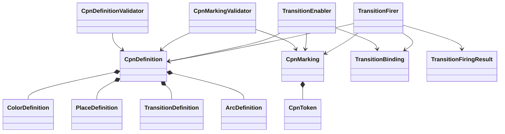

# Colored Petri net architecture

## Responsibility

`ksdft2effmass.petrinet.colored` owns the calculator-independent and scientific-domain-independent colored-Petri-net model. It defines represented net structure, immutable markings, expressions, validation, transition enablement, and deterministic firing.

It does not own `ScientificWorkflow`, `ScientificWorkflowRun`, `Simulation`, calculator execution, artifact transfer, scientific analysis, disposition, development Tasks, or application composition.

## Object model

## Contracts

`CpnDefinition` represents colors, places, transitions, arcs, input and output inscriptions, token patterns, and closed pure guards. `CpnMarking` is an immutable multiset of colored tokens by place.

A transition is enabled only when input multisets satisfy inscriptions and its pure guard accepts the immutable binding. Firing consumes and reads tokens as declared, produces output tokens deterministically, and returns a successor marking plus structured findings.

Validators inspect definitions and markings without mutating them. Enablement and firing are stateless actions over explicit represented inputs.

## Purity boundary

Guards, expressions, validators, enablement, and firing perform no:

- external I/O;
- calculator execution;
- artifact transfer;
- dynamic capability probing;
- scientific analysis or disposition;
- workflow authority checks; or
- repository mutation.

Colored token payloads are closed contract values. The package does not import scientific workflow or calculator-native types.

## Scientific workflow integration

`ksdft2effmass.workflow.scientific.ScientificWorkflow` references exact immutable `CpnDefinition` and initial `CpnMarking` identities. The scientific-workflow service resolves those references and invokes colored-Petri-net actions. This dependency points from scientific workflow to colored Petri nets; the colored-Petri-net package has no reverse dependency.

Scientific workflow token colors may represent generic workflow references, authorization records, execution-request identities, result identities, artifact availability, analysis readiness, and terminal status. Their scientific meaning belongs to the workflow definition. Their multiset, pattern, guard, enablement, and firing behavior belongs here.

## Version relationship

Architecture v1 implements the corresponding contracts under `ksdft2effmass.workflows.cpn`. Architecture v2 moves that generic ownership to `ksdft2effmass.petrinet.colored`; this is a package-boundary migration, not a claim that the v2 import path is already implemented.

## Unresolved issues

- Canonical definition, marking, expression, token, and transition-result wire formats.
- Fairness and deterministic binding selection when multiple transitions are enabled.
- Canonical snapshot versus transition-log representation.
- Stable content-identity rules for definitions and markings.
- Migration and compatibility policy from `ksdft2effmass.workflows.cpn`.
