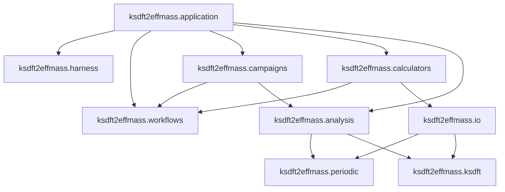

# Architecture v2 repository layout

## Package ownership

All Architecture v2 components are owned by the `ksdft2effmass` package:

```text
ksdft2effmass.harness
    development-harness contracts and composition

ksdft2effmass.workflows
    calculator-independent scientific workflow contracts

ksdft2effmass.calculators
    calculator-specific simulation objects and executors

ksdft2effmass.io
    mechanical calculator input and output translation

ksdft2effmass.periodic
    periodic geometry and structure semantics

ksdft2effmass.ksdft
    representation-neutral Kohn–Sham semantics

ksdft2effmass.analysis
    deterministic scientific analysis

ksdft2effmass.campaigns
    project-specific scientific campaign definitions

ksdft2effmass.application
    explicit application composition root
```

Submodule names may be refined while preserving these ownership and dependency boundaries.

## Dependency direction



Required directions are:

```text
ksdft2effmass.campaigns
    → ksdft2effmass.workflows
    → generic Simulation, Campaign, CPN, and artifact contracts

ksdft2effmass.calculators
    → ksdft2effmass.workflows
    → ksdft2effmass.io

ksdft2effmass.analysis
    → normalized periodic and Kohn–Sham observations
    → generic scientific-analysis contracts

ksdft2effmass.application
    → ksdft2effmass.harness
    → ksdft2effmass.workflows
    → ksdft2effmass.campaigns
    → ksdft2effmass.calculators
    → ksdft2effmass.analysis
```

Forbidden directions include:

```text
ksdft2effmass.workflows
    ✗→ ksdft2effmass.calculators

ksdft2effmass.campaigns
    ✗→ calculator-native input structures

ksdft2effmass.periodic
    ✗→ calculator packages

ksdft2effmass.ksdft
    ✗→ calculator packages

ksdft2effmass.io
    ✗→ Campaign or CampaignRun

ksdft2effmass.harness
    ✗→ scientific workflow state or scientific policy
```

## Responsibilities

- `ksdft2effmass.harness` owns development lifecycle, repository operation, compiler, validation, persistence, and projection contracts.
- `ksdft2effmass.workflows` owns calculator-independent CPN, simulation, campaign, execution-result, artifact-manifest, scientific-analysis record, and scientific-service contracts.
- `ksdft2effmass.calculators` owns executable configuration, calculator-specific typed simulation payloads, dispatch, staging, and result capture.
- `ksdft2effmass.io` owns native syntax, parsing, rendering, and mechanical translation.
- `ksdft2effmass.periodic` owns geometry, coordinate, unit, and sampling semantics.
- `ksdft2effmass.ksdft` owns representation-neutral Kohn–Sham observations and representation records.
- `ksdft2effmass.analysis` owns deterministic scientific interpretation, algorithms, tolerances, and numerical policy.
- `ksdft2effmass.campaigns` owns project-specific CPN definitions and simulation selections without duplicating CPN execution semantics.
- `ksdft2effmass.application` owns explicit configuration and composition of services, catalogs, executors, analyzers, artifact services, and repositories without owning their domain behavior.

## Extension boundary

Additional calculators enter only after a demonstrated campaign requires them. They implement the same `SimulationExecutor` protocol using calculator-specific typed payloads and mechanical I/O.

Optional adapters to external workflow ecosystems may be added at an outer integration boundary. AiiDA, Airflow, pymatgen, or another framework does not become a core dependency or workflow authority merely because an adapter exists.

## Unresolved issues

- Final name of the application composition subpackage.
- Exact internal submodules beneath harness, workflows, calculators, and analysis.
- Whether process-launch infrastructure belongs in calculators or application infrastructure.
- Location of optional external workflow and scheduler adapters.
- Which wire-contract types are public at the package root.
