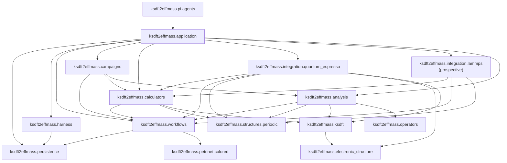

# Architecture v2 repository layout

## Architecture-document organization

Package-owned architecture follows the selected prospective namespace below
`docs/architecture/v2/ksdft2effmass/`. Directory components mirror package and
subpackage components. Package-wide diagrams and cross-cutting discussions live
on the nearest package `index.md`.

Topic pages grouped beneath a package describe package-owned architecture but do
not select same-named Python modules unless the owning architecture explicitly
does so. The bounded private `_dft`, `_dft_scf_bands`, `_bands`, and
`_band_comparison` modules selected by the
[DFT simulation CPN service decision](ksdft2effmass/workflows/dft-simulation-cpn-service-decision.md)
are explicit exceptions; other exact internal submodules and public wire exports
remain deferred.
Repository-wide principles, human-decision semantics, identity contracts,
dependency direction, live issues, and harness/workflow separation remain at
the v2 root. This documentation layout neither authorizes a source move nor changes the exact
incremental implementation status owned by the migration pages.

## Tutorial examples

Maintained computational examples use the concept-first paired-backend layout
`examples/tutorials/<tutorial-id>/{qe,abinit}/`. The tutorial identity owns the shared
learning objective; each backend directory owns only its backend-specific inputs,
scripts, instructions, and explicit implementation status. Runtime calculation trees
remain beneath either ignored backend-local `run/` directories or isolated external
run roots declared by exact preflights; neither location becomes package source or a
maintained example.

The authoritative layout, commit boundary, cross-backend comparison rules, campaign
mapping, and migration of the existing QE SCF example are defined by
[cross-backend tutorial examples](tutorial-examples.md). Example-directory presence
does not activate a campaign Task or authorize an executable.

## Package ownership

```text
ksdft2effmass.persistence
    domain-neutral immutable revision storage and stdlib SQLite realization

ksdft2effmass.harness
    development-harness contracts, domain repository, and composition

ksdft2effmass.petrinet.colored
    generic colored-Petri-net values and pure operations

ksdft2effmass.workflows
    ResultObject, Task, Workflow, gates, adapter, WorkflowRun, and scientific control

ksdft2effmass.calculators
    backend-neutral calculator vocabularies, including plane-wave DFT specifications and only demonstrated atomistic requirements, exact backend-binding references, and narrow structural ports

ksdft2effmass.integration.quantum_espresso
    QE-native contracts plus concrete serialization, staging, workspace, process, diagnostic, artifact-discovery, native-parsing, failure-mapping, and observation-adaptation Actions implementing backend-neutral ports

ksdft2effmass.integration.lammps (prospective)
    LAMMPS-native contracts and adapters after calculator-independent QoI and atomistic requirements; no LAMMPS Simulation Task or executor is implemented

ksdft2effmass.structures.periodic
    periodic crystal geometry and structure semantics

ksdft2effmass.electronic_structure
    electronic reciprocal-space sampling semantics

ksdft2effmass.periodic
    temporary compatibility imports only

ksdft2effmass.ksdft
    representation-neutral Kohn–Sham semantics

ksdft2effmass.operators
    finite represented-operator records, serialization, exact compatibility, and narrowly fixed-representation operations

ksdft2effmass.analysis
    higher-level deterministic scientific analysis, QoI meaning, parameter-study policy, and refinement algorithms

ksdft2effmass.pi.agents
    outer typed Pi request/result adaptation to explicitly composed application operations

ksdft2effmass.campaigns
    project-specific QoI-study, calculator-binding, and Workflow composition definitions

ksdft2effmass.application
    explicit application composition root
```

There is no `ksdft2effmass.contracts` package. Repository-wide identity, version,
immutable-result, and failure semantics are normative structural contracts; each
package owns the nominal runtime values, closed outcomes, stable failure codes,
validators, and serializers for its domain. Cross-domain adapters follow the existing
dependency direction and are owned by the outward consumer. Equal names, field
shapes, or digest spellings do not permit implicit type coercion.

## Dependency direction



The required direct edges are:

```text
ksdft2effmass.persistence.sqlite → ksdft2effmass.persistence.store
ksdft2effmass.harness.persistence → ksdft2effmass.persistence.store
ksdft2effmass.workflows.persistence → ksdft2effmass.persistence.store
ksdft2effmass.workflows → ksdft2effmass.petrinet.colored
ksdft2effmass.campaigns → ksdft2effmass.workflows
ksdft2effmass.campaigns → ksdft2effmass.calculators
ksdft2effmass.campaigns → ksdft2effmass.analysis
ksdft2effmass.calculators → ksdft2effmass.workflows
ksdft2effmass.calculators → ksdft2effmass.structures.periodic
ksdft2effmass.calculators → ksdft2effmass.ksdft
ksdft2effmass.integration.quantum_espresso → ksdft2effmass.calculators
ksdft2effmass.integration.quantum_espresso → ksdft2effmass.workflows
ksdft2effmass.integration.quantum_espresso → ksdft2effmass.structures.periodic
ksdft2effmass.integration.quantum_espresso → ksdft2effmass.electronic_structure
ksdft2effmass.integration.quantum_espresso → ksdft2effmass.ksdft
ksdft2effmass.integration.lammps → ksdft2effmass.calculators
ksdft2effmass.integration.lammps → ksdft2effmass.workflows
ksdft2effmass.integration.lammps → ksdft2effmass.structures.periodic
ksdft2effmass.analysis → ksdft2effmass.workflows
ksdft2effmass.analysis → ksdft2effmass.structures.periodic
ksdft2effmass.analysis → ksdft2effmass.ksdft
ksdft2effmass.ksdft → ksdft2effmass.electronic_structure
ksdft2effmass.analysis → ksdft2effmass.operators
ksdft2effmass.application → ksdft2effmass.persistence
ksdft2effmass.application → ksdft2effmass.harness
ksdft2effmass.application → ksdft2effmass.workflows
ksdft2effmass.application → ksdft2effmass.campaigns
ksdft2effmass.application → ksdft2effmass.calculators
ksdft2effmass.application → ksdft2effmass.integration.quantum_espresso
ksdft2effmass.application → ksdft2effmass.integration.lammps
ksdft2effmass.application → ksdft2effmass.analysis
ksdft2effmass.pi.agents → ksdft2effmass.application
```

Forbidden directions include:

```text
ksdft2effmass.persistence ✗→ ksdft2effmass.harness/workflows/petrinet/calculators/analysis/provenance/application
ksdft2effmass domain models ✗→ repository implementations
ksdft2effmass.petrinet.colored ✗→ ksdft2effmass.workflows
ksdft2effmass.workflows ✗→ ksdft2effmass.calculators
ksdft2effmass.workflows ✗→ ksdft2effmass.campaigns
ksdft2effmass.workflows ✗→ concrete analysis implementations
ksdft2effmass.calculators ✗→ ksdft2effmass.analysis
ksdft2effmass.calculators ✗→ ksdft2effmass.integration
ksdft2effmass.workflows ✗→ ksdft2effmass.integration
ksdft2effmass.structures.periodic ✗→ calculator or integration packages
ksdft2effmass.ksdft ✗→ calculator or integration packages
ksdft2effmass.analysis ✗→ calculator or integration packages
ksdft2effmass.operators ✗→ ksdft2effmass.analysis, calculator, integration, Workflow, or Harness runtime packages
scientific packages ✗→ ksdft2effmass.harness runtime state
ksdft2effmass.application/harness/workflows/persistence ✗→ ksdft2effmass.pi
```

Calculators continue to depend on workflow contracts, preserving the accepted `calculators → workflows` edge. The selected [plane-wave QoI and parameter-study architecture](ksdft2effmass/plane-wave-parameter-studies.md) adds `campaigns → calculators` and `campaigns → analysis`: campaigns are the outward project-specific composition owner and neither inward domain imports campaigns. Calculators and analysis remain mutually independent. The listed `integration.quantum_espresso` and prospective `integration.lammps` domain edges are permitted directions for concrete adapters, not required dependencies of every integration module: the loose `pw.x` input object and writer import none of those domains, and a future LAMMPS adapter imports only contracts it directly consumes. An adapter imports only the exact calculator, Workflow, periodic, or Kohn--Sham contracts it directly consumes. Calculators never import integrations, and application composition alone selects and injects any concrete executor. Adding `workflows → petrinet.colored` does not reverse any calculator, integration, or analysis boundary. Coding-standards conformance does not add runtime harness dependencies to inspected packages. The shared persistence package has standard-library upstream dependencies only; `persistence.sqlite` additionally uses `sqlite3`. Domain persistence modules import the shared store contract and their own domain model/serializer/validator, while `application` remains downstream.

## Responsibilities

- `persistence.store` owns only immutable `Revision`, closed `RevisionReadRequest`/`RevisionReadResult`, `Commit`, and closed `CommitResult` values plus structural `AtomicRevisionStore`; `persistence.sqlite` owns `SQLiteAtomicRevisionStore`. It stores opaque complete single-stream revisions and owns compare-and-swap, idempotency, consistent reads, atomic commit, and generic outcomes.
- `harness.persistence` and `workflows.persistence` retain their domain repository protocols, transactions, snapshots, closed load/write results, serializers, and validators. Their concrete atomic repositories compose the shared store and bind validation to exact candidate bytes and identities; neither defines a domain SQLite subclass.
- `petrinet.colored` owns only generic colors, places, transitions, arcs/inscriptions, pure guards, token values, markings, deterministic enablement/selection, and pure successor firing.
- `workflows` owns Task/Workflow composition, immutable `TaskStartGateSet`, discriminated TaskActivation, the effect-free colored-Petri-net adapter, replayable WorkflowRun, authority, `SimulationDispatchAdapter`, dispatch reconciliation, `TaskResultIngester`, explicit native-output extraction specifications, normalized sets, and analysis correlation.
- `calculators` owns backend-neutral plane-wave simulation-specification meaning and any later demonstrated calculator-independent atomistic requirements, exact backend-binding references and closed binding results, and narrow structural calculator ports. It owns no native supplement content, calculator-specific Task/Input/Output meaning, executable configuration, native process or diagnostic record, QoI interpretation, convergence decision, workspace, process invocation, parser, artifact discovery, or concrete failure mapping.
- `integration.quantum_espresso` owns QE Task/Input/Output and executable contracts, the loose `QePwInputFile` and `QePwInputFileWriter` boundary, QEXSD native parsing, diagnostic classification, and concrete staging, isolated-workspace, process, capture, artifact-discovery, failure-mapping, and observation-adaptation Actions. Upstream owners select all input groups and scientific content. Any executor satisfies a backend-neutral calculator structural port and is selected by application composition.
- The prospective `integration.lammps` package owns LAMMPS-native supplements, inputs, results, executable configuration, input writing, diagnostics, staging, workspace/process actions, native parsing, and normalization adapters. The [QoI-first ordering](ksdft2effmass/qoi-first-lammps-integration.md) requires analysis-owned QoI meaning and calculator-owned atomistic requirements before any LAMMPS-specific Simulation Task is defined. Exact public contracts and execution remain deferred.
- `campaigns` owns project-specific definitions and effect-free compilation that bind exact analysis QoIs and studies, calculator specifications, and Workflow Tasks. It owns neither QoI or calculator semantics, generic Petri-net mechanics, Workflow control, execution authority, nor scientific acceptance.
- `operators` owns metadata-complete finite represented-operator records, strict serialization, exact compatibility, fixed-representation Hermiticity, guarded signed differencing, primitive residual mechanics, and their narrow comparison composition. It owns no alignment selection, unit or energy-zero conversion, physical-equivalence decision, model fitting, continuum reduction, structured learning, scientific acceptance, or Workflow orchestration.
- `pi.agents` owns only immutable Pi-facing request/result adaptation and a closed content-identified action composition. It depends inward on application operations and owns no domain transition, authority, persistence, agent promotion, dynamic action registration, or Pi runtime lifecycle state.
- `application` supplies explicit definitions, Tasks, executors, separate development/scientific SQLite stores, and composed domain repositories without owning domain behavior.

There is no `Persistence → DatabasePersistence → SQLitePersistence` hierarchy, generic domain `Repository` base, generic CRUD model, public SQLite configuration/initializer/migrator hierarchy, read-result class, `RevisionAddress`, or domain persistence subpackage. Additions require demonstrated need and authority.

The live full public names come from `ksdft2effmass.petrinet.colored`. The former v1 abbreviated `ksdft2effmass.workflows.cpn` API is retired without aliases; versioned v1 specifications and Architecture v1 documentation remain historical records.

## Extension boundary

The repository-wide [agent architecture](agents/index.md) owns governed-agent roles, capability confinement, isolation, and self-improvement policy. A project Pi extension remains an outer runtime resource and may invoke `ksdft2effmass.pi.agents`; it is not a Python package, authority source, or domain-policy owner. The selected `pi.agents` package is an outer adapter, and no inward package imports it.

Additional calculators are introduced only for demonstrated project needs. Each adds calculator-owned project contracts and an explicitly composed concrete integration; it does not widen the generic workflow or Petri-net core. Optional external workflow-system adapters remain outer integrations and never become workflow, Petri-net, authority, or scientific-policy owners merely because an adapter exists.

## Exact-artifact boundary

Existing native input and pseudopotential artifacts remain usable with their actual identities and provenance without rendering, conversion, registration, rerun, or evidence reclassification. Shared labels or settings do not establish equivalence.

## Deferred implementation details

- Exact internal submodules beyond the bounded private DFT probe and all public wire-contract exports.
- Process-launch and optional scheduler adapter locations.
- Exact persistence wire bytes, SQLite schema/layout, connection lifetime, locking/isolation/busy behavior, backup/recovery, retention/compaction, maximum aggregate size, canonical bytes, and public failure/exception encodings.
- Exact `WorkflowRuntimeBundle` and `WorkflowRunReplayResult` wire fields; replay computation itself is workflow-owned by `WorkflowRunReplayer`, while persistence remains structural and domain-neutral.
- Any later source-move or extraction plan.
