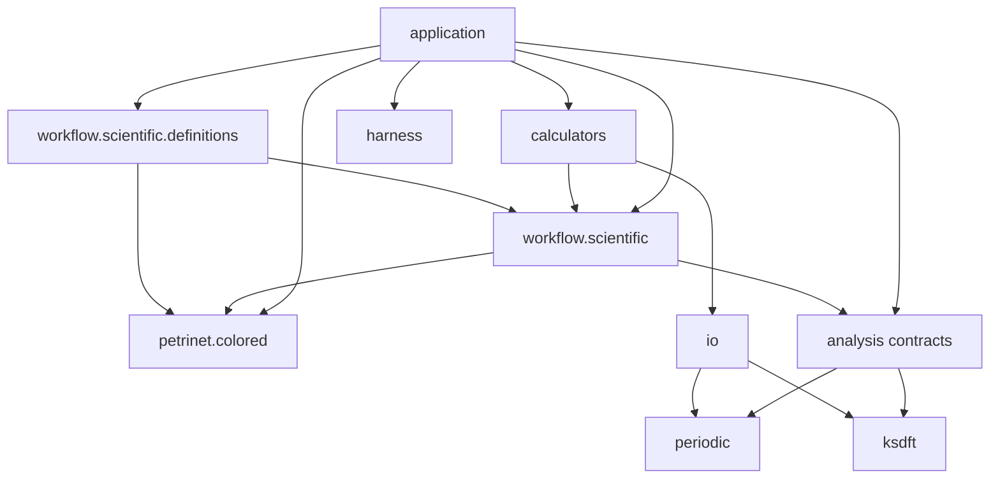

# Architecture v2 repository layout

## Package ownership

All Architecture v2 components are owned by the `ksdft2effmass` package:

```text
ksdft2effmass.harness
    development-harness contracts and composition

ksdft2effmass.workflow.scientific
    calculator-independent scientific workflow contracts and run state

ksdft2effmass.workflow.scientific.definitions
    project-specific scientific workflow definitions

ksdft2effmass.petrinet.colored
    domain-independent colored-Petri-net definitions and firing semantics

ksdft2effmass.calculators
    calculator-specific simulation objects and executors

ksdft2effmass.io
    mechanical calculator input and output translation

ksdft2effmass.periodic
    periodic geometry and structure semantics

ksdft2effmass.ksdft
    representation-neutral Kohn–Sham semantics

ksdft2effmass.analysis
    deterministic scientific analysis

ksdft2effmass.application
    explicit application composition root
```

Submodule names may be refined while preserving these ownership and dependency boundaries.

## Dependency direction



Required directions are:

```text
ksdft2effmass.workflow.scientific.definitions
    → ksdft2effmass.workflow.scientific
    → ksdft2effmass.petrinet.colored

ksdft2effmass.workflow.scientific
    → versioned colored-Petri-net references and actions
    → generic Simulation and artifact contracts

ksdft2effmass.petrinet.colored
    → closed contract values only

ksdft2effmass.calculators
    → ksdft2effmass.workflow.scientific
    → ksdft2effmass.io

ksdft2effmass.analysis
    → normalized periodic and Kohn–Sham observations
    → generic scientific-analysis contracts

ksdft2effmass.application
    → all concrete composition dependencies
```

Forbidden directions include:

```text
ksdft2effmass.petrinet.colored
    ✗→ ksdft2effmass.workflow.scientific
    ✗→ calculators, analysis, or harness

ksdft2effmass.workflow.scientific
    ✗→ calculator-native input structures
    ✗→ ownership of CpnDefinition or CpnMarking

ksdft2effmass.periodic
    ✗→ calculator packages

ksdft2effmass.ksdft
    ✗→ calculator packages

ksdft2effmass.io
    ✗→ ScientificWorkflow or ScientificWorkflowRun

ksdft2effmass.harness
    ✗→ scientific workflow state or scientific policy
```

Repository-wide conformance does not add scientific runtime dependencies on the harness. The harness may inspect source, invoke declared checks, and consume represented evidence through development adapters; scientific packages do not import the harness merely because they are evaluated by it.

The local Architecture v2 conformance target is specialized through explicit immutable policy and validator composition, not through a subclassed architecture. Stable generic mechanisms may later be extracted into `projectkoios.bootstrap` only under the migration and acceptance boundaries in [Migration from Architecture v1 to Architecture v2](../migration/v1-to-v2/index.md).

## Responsibilities

- `ksdft2effmass.harness` owns development lifecycle, repository operation, compiler, snapshot validation, repository-wide development-conformance composition, persistence, and projection contracts. Its conformance scope crosses package boundaries, but the applicable domain retains ownership of contract meaning.
- `ksdft2effmass.workflow.scientific` owns scientific-workflow definitions, run state, simulation correlation, execution-result contracts, artifact lineage, scientific service contracts, and references to colored-Petri-net state.
- `ksdft2effmass.petrinet.colored` owns colored-net definitions, markings, tokens, expressions, validation, deterministic enablement, and firing semantics.
- `ksdft2effmass.workflow.scientific.definitions` owns project-specific workflow definitions and simulation selections without duplicating colored-Petri-net semantics.
- `ksdft2effmass.calculators` owns executable configuration, calculator-specific typed simulation payloads, dispatch, staging, and result capture.
- `ksdft2effmass.io` owns native syntax, parsing, rendering, and mechanical translation.
- `ksdft2effmass.periodic` owns geometry, coordinate, unit, and sampling semantics.
- `ksdft2effmass.ksdft` owns representation-neutral Kohn–Sham observations and representation records.
- `ksdft2effmass.analysis` owns deterministic scientific interpretation, algorithms, tolerances, and numerical policy.
- `ksdft2effmass.application` owns explicit configuration and composition without owning domain behavior.

## Extension boundary

Additional calculators enter only after a demonstrated scientific workflow requires them. They implement the same `SimulationExecutor` protocol using calculator-specific typed payloads and mechanical I/O.

Optional adapters to external workflow ecosystems may be added at an outer integration boundary. An external framework does not become core workflow or Petri-net authority merely because an adapter exists.

## Unresolved issues

- Final name of the application composition subpackage.
- Exact internal submodules beneath scientific workflow, colored Petri nets, calculators, and analysis.
- Whether process-launch infrastructure belongs in calculators or application infrastructure.
- Location of optional external workflow and scheduler adapters.
- Which wire-contract types are public at package roots.
