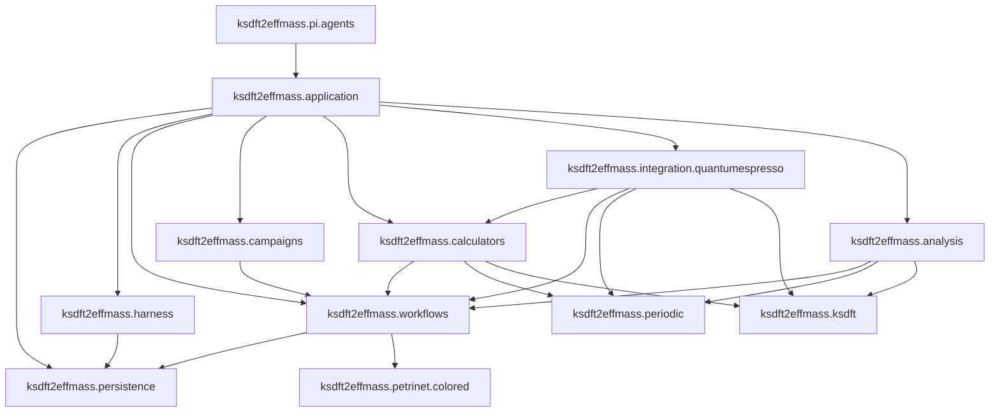

# Architecture v2 repository layout

## Architecture-document organization

Package-owned architecture follows the selected prospective namespace below
`docs/architecture/v2/ksdft2effmass/`. Directory components mirror package and
subpackage components. Package-wide diagrams and cross-cutting discussions live
on the nearest package `index.md`.

Topic pages grouped beneath a package describe package-owned architecture but do
not select same-named Python modules unless the owning architecture explicitly
does so. Exact internal submodules and public wire exports remain deferred.
Repository-wide principles, human-decision semantics, identity contracts,
dependency direction, live issues, and harness/workflow separation remain at
the v2 root. This documentation layout neither authorizes a source move nor
changes v2's prospective, unimplemented status.

## Package ownership

```text
ksdft2effmass.persistence
    domain-neutral immutable revision storage and stdlib SQLite realization

ksdft2effmass.harness
    development-harness contracts, domain repository, and composition

ksdft2effmass.petrinet.colored
    generic colored-Petri-net values and pure operations

ksdft2effmass.workflows
    ResultObject, Task, Workflow, gates, adapter, WorkflowRun, and scientific control

ksdft2effmass.calculators
    project-facing calculator-specific SimulationTasks, Simulation composites, immutable inputs/outputs, executable configuration, process records, and consumer-owned executor protocols

ksdft2effmass.integration.quantumespresso
    concrete QE serialization, staging, workspace, process, artifact-discovery, native-parsing, failure-mapping, and observation-adaptation Actions implementing calculator-owned contracts

ksdft2effmass.periodic
    periodic geometry and structure semantics

ksdft2effmass.ksdft
    representation-neutral Kohn–Sham semantics

ksdft2effmass.analysis
    deterministic scientific analysis

ksdft2effmass.pi.agents
    outer typed Pi request/result adaptation to explicitly composed application operations

ksdft2effmass.campaigns
    project-specific composition definitions

ksdft2effmass.application
    explicit application composition root
```

## Dependency direction



The required direct edges are:

```text
ksdft2effmass.persistence.sqlite → ksdft2effmass.persistence.store
ksdft2effmass.harness.persistence → ksdft2effmass.persistence.store
ksdft2effmass.workflows.persistence → ksdft2effmass.persistence.store
ksdft2effmass.workflows → ksdft2effmass.petrinet.colored
ksdft2effmass.campaigns → ksdft2effmass.workflows
ksdft2effmass.calculators → ksdft2effmass.workflows
ksdft2effmass.calculators → ksdft2effmass.periodic
ksdft2effmass.calculators → ksdft2effmass.ksdft
ksdft2effmass.integration.quantumespresso → ksdft2effmass.calculators
ksdft2effmass.integration.quantumespresso → ksdft2effmass.workflows
ksdft2effmass.integration.quantumespresso → ksdft2effmass.periodic
ksdft2effmass.integration.quantumespresso → ksdft2effmass.ksdft
ksdft2effmass.analysis → ksdft2effmass.workflows
ksdft2effmass.analysis → ksdft2effmass.periodic
ksdft2effmass.analysis → ksdft2effmass.ksdft
ksdft2effmass.application → ksdft2effmass.persistence
ksdft2effmass.application → ksdft2effmass.harness
ksdft2effmass.application → ksdft2effmass.workflows
ksdft2effmass.application → ksdft2effmass.campaigns
ksdft2effmass.application → ksdft2effmass.calculators
ksdft2effmass.application → ksdft2effmass.integration.quantumespresso
ksdft2effmass.application → ksdft2effmass.analysis
ksdft2effmass.pi.agents → ksdft2effmass.application
```

Forbidden directions include:

```text
ksdft2effmass.persistence ✗→ ksdft2effmass.harness/workflows/petrinet/calculators/analysis/provenance/application
ksdft2effmass domain models ✗→ repository implementations
ksdft2effmass.petrinet.colored ✗→ ksdft2effmass.workflows
ksdft2effmass.workflows ✗→ ksdft2effmass.calculators
ksdft2effmass.workflows ✗→ ksdft2effmass.campaigns
ksdft2effmass.workflows ✗→ concrete analysis implementations
ksdft2effmass.campaigns ✗→ ksdft2effmass.analysis
ksdft2effmass.calculators ✗→ ksdft2effmass.integration
ksdft2effmass.workflows ✗→ ksdft2effmass.integration
ksdft2effmass.periodic ✗→ calculator or integration packages
ksdft2effmass.ksdft ✗→ calculator or integration packages
ksdft2effmass.analysis ✗→ calculator or integration packages
scientific packages ✗→ ksdft2effmass.harness runtime state
ksdft2effmass.application/harness/workflows/persistence ✗→ ksdft2effmass.pi
```

Calculators continue to depend on workflow contracts, preserving the accepted `calculators → workflows` edge. `integration.quantumespresso → calculators` is the concrete adapter-to-consumer direction; integration may also import the exact workflow, periodic, and Kohn–Sham contracts it directly consumes. Calculators never import integrations, and application composition alone selects and injects the concrete implementation. Adding `workflows → petrinet.colored` does not reverse any calculator, integration, or analysis boundary. Coding-standards conformance does not add runtime harness dependencies to inspected packages. The shared persistence package has standard-library upstream dependencies only; `persistence.sqlite` additionally uses `sqlite3`. Domain persistence modules import the shared store contract and their own domain model/serializer/validator, while `application` remains downstream.

## Responsibilities

- `persistence.store` owns only immutable `Revision`, closed `RevisionReadRequest`/`RevisionReadResult`, `Commit`, and closed `CommitResult` values plus structural `AtomicRevisionStore`; `persistence.sqlite` owns `SQLiteAtomicRevisionStore`. It stores opaque complete single-stream revisions and owns compare-and-swap, idempotency, consistent reads, atomic commit, and generic outcomes.
- `harness.persistence` and `workflows.persistence` retain their domain repository protocols, transactions, snapshots, closed load/write results, serializers, and validators. Their concrete atomic repositories compose the shared store and bind validation to exact candidate bytes and identities; neither defines a domain SQLite subclass.
- `petrinet.colored` owns only generic colors, places, transitions, arcs/inscriptions, pure guards, token values, markings, deterministic enablement/selection, and pure successor firing.
- `workflows` owns Task/Workflow composition, immutable `TaskStartGateSet`, discriminated TaskActivation, the effect-free colored-Petri-net adapter, replayable WorkflowRun, authority, `SimulationDispatchAdapter`, dispatch reconciliation, `TaskResultIngester`, explicit native-output extraction specifications, normalized sets, and analysis correlation.
- `calculators` owns project-facing concrete SimulationTasks and Simulation composites, immutable input/output meaning, exact executable configuration, process request/observation records, and consumer-owned structural executor protocols. It owns no QE workspace, process invocation, native parser, artifact discovery, or concrete failure mapping.
- `integration.quantumespresso` owns the concrete anti-corruption Actions for QE serialization, staging, isolated workspace and process invocation, mechanical capture, native parsing, artifact discovery, failure mapping, and parsed-record-to-neutral adaptation. It implements calculator-owned protocols and is imported only by application composition.
- `campaigns` may supply project-specific definitions but owns neither generic Petri-net mechanics nor Workflow control.
- `pi.agents` owns only immutable Pi-facing request/result adaptation and a closed content-identified action composition. It depends inward on application operations and owns no domain transition, authority, persistence, agent promotion, dynamic action registration, or Pi runtime lifecycle state.
- `application` supplies explicit definitions, Tasks, executors, separate development/scientific SQLite stores, and composed domain repositories without owning domain behavior.

There is no `Persistence → DatabasePersistence → SQLitePersistence` hierarchy, generic domain `Repository` base, generic CRUD model, public SQLite configuration/initializer/migrator hierarchy, read-result class, `RevisionAddress`, or domain persistence subpackage. Additions require demonstrated need and authority.

The prospective full public names come from `ksdft2effmass.petrinet.colored`. The implemented v1 abbreviated public API remains under `ksdft2effmass.workflows.cpn`; no source move is authorized here.

## Extension boundary

The repository-wide [agent architecture](agents/index.md) owns governed-agent roles, capability confinement, isolation, and self-improvement policy. A project Pi extension remains an outer runtime resource and may invoke `ksdft2effmass.pi.agents`; it is not a Python package, authority source, or domain-policy owner. The selected `pi.agents` package is an outer adapter, and no inward package imports it.

Additional calculators are introduced only for demonstrated project needs. Each adds calculator-owned project contracts and an explicitly composed concrete integration; it does not widen the generic workflow or Petri-net core. Optional external workflow-system adapters remain outer integrations and never become workflow, Petri-net, authority, or scientific-policy owners merely because an adapter exists.

## Exact-artifact boundary

Existing native input and pseudopotential artifacts remain usable with their actual identities and provenance without rendering, conversion, registration, rerun, or evidence reclassification. Shared labels or settings do not establish equivalence.

## Deferred implementation details

- Exact internal submodules and public wire-contract exports.
- Process-launch and optional scheduler adapter locations.
- Exact persistence wire bytes, SQLite schema/layout, connection lifetime, locking/isolation/busy behavior, backup/recovery, retention/compaction, maximum aggregate size, canonical bytes, and public failure/exception encodings.
- Exact `WorkflowRuntimeBundle` and `WorkflowRunReplayResult` wire fields; replay computation itself is workflow-owned by `WorkflowRunReplayer`, while persistence remains structural and domain-neutral.
- Any later source-move or extraction plan.
