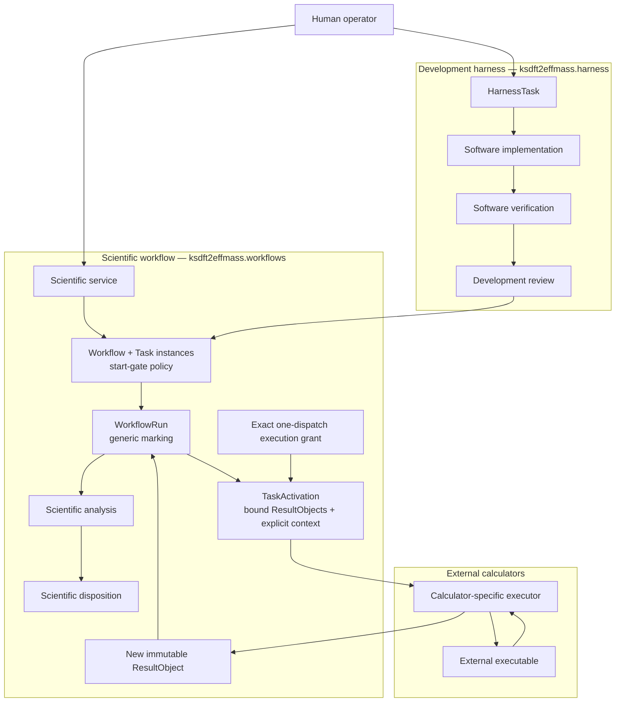
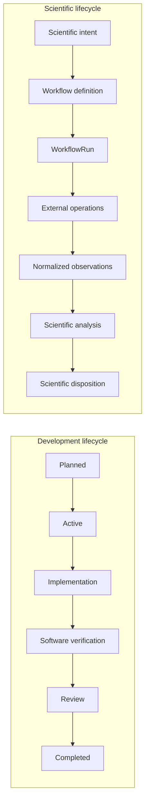

# Separation of harness and workflow

The development component is defined by the [harness architecture](ksdft2effmass/harness/index.md), and the scientific component is defined by the [workflow architecture](ksdft2effmass/workflows/index.md). This page focuses on their authority and lifecycle separation. The cross-cutting [human-decision contract](human-decisions.md) defines two domain-separated systems without a common nominal checkpoint base, shared aggregate, or shared repository.

The normative boundary is:

> The development harness governs changes to the scientific workflow. The
> scientific workflow governs Workflow and Task execution. Development Tasks,
> scientific Workflows, WorkflowRuns, TaskActivations, ResultObjects, analyses,
> and scientific dispositions have separate authorities and lifecycles.

`ScientificService` is the scientific entry point. It selects or constructs a `Workflow`, creates a replayable `WorkflowRun`, applies immutable `TaskStartGateSet` policy or direct invocation, binds ResultObjects into discriminated `TaskActivation`, and composes generic selection/firing, the effect-free Workflow adapter, `SimulationDispatchAdapter`, dispatch authorization/reconciliation, Task invocation, `TaskResultIngester`, native parsing, normalization, analysis, disposition recording, and artifact publication/reconciliation ActionObjects. Workflow control authorizes the exact unused grant and proposed immutable dispatch inputs before the preparer builds one atomic unit containing request creation, attempt creation, the request-transition successor, exact grant reservation, and dispatch obligation. The workflow service supplies that complete candidate unit; `WorkflowRunAtomicRepository` validates and binds the same candidate to its serialized bytes before opaque store commit; `SimulationDispatchAdapter` consumes the committed obligation and explicit request/context, and the executor boundary independently checks the same exact reserved grant and dispatch inputs immediately before invoking the selected calculator process effect; reconciliation returns a confirmed, rejected, or indeterminate `SimulationDispatchOutcome` envelope without inventing observations. Confirmed contains the concrete returned ResultObject; `TaskResultIngester` alone validates/correlates the envelope and admits that object into ingress, which builds one atomic successor unit containing result state, obligation disposition, and all required publication obligations or explicit no-publication disposition. After that ingress unit commits, QE normalization alone follows admitted calculator-owned `QuantumEspressoOutput` → integration-owned native artifact resolver → integration-owned `QuantumEspressoOutputParser` and/or `QexsdDocumentParser` → integration-owned `QuantumEspressoObservationAdapter` → workflow-owned `NormalizedObservationSet` → `ScientificAnalyzer`. Workflow services construct candidate successor meaning; the domain repository invokes its bound validator and serializer on the exact candidate and rejects validation or identity-binding failure without an opaque store commit. The scientific service does not mutate repository-derived `HarnessState` or protected `DevelopmentAuthorityLedger`.

Within the development lifecycle, `DevelopmentTaskSelection` is repository-derived requested/selected state, not authority or permission. Repository sources compile independently of authority. `DevelopmentAuthorityContextResolver` reconstructs and verifies the candidate-independent `DevelopmentAuthorityContext`, and `DevelopmentOperationAuthorizer` returns an affirmative result only for a matching ledger `TaskAuthorization` covering the exact selection and Task revisions, starting and candidate revisions, operation, and permitted paths. Target development operations verify that result's identity bindings without reinterpreting policy; neither a Task, selection, validation result, nor candidate decision can authorize itself.

Human decisions are explicit external inputs to both control planes and their processing is deterministic. Development uses the one `DevelopmentDecision` model inside `HarnessState`; scientific workflow uses `ScientificDecisionRequest`, `ScientificDecisionResolution`, and `ScientificDecisionRecorder` inside the `WorkflowRun` boundary. Scientific decision ingress is a request-identified no-Task transition: the recorder constructs the resolution, uses the effect-free adapter and pure firer, constructs the complete scientific-decision-origin transition/successor, and returns the resolution only after atomic commit. No Task, TaskActivation, or attempt exists for that transition. Neither decision family authorizes or mutates the other. A pending record blocks only its declared development transition/scope or affected scientific branch. Decision records grant no authority; separate development, execution, and disposition grants remain required.

The two lifecycles may reference each other's immutable identities when required, but neither stores the other's state. Their domain repositories may compose the same domain-neutral `AtomicRevisionStore` capability, but separate `SQLiteAtomicRevisionStore` instances and separate databases are the default. Shared implementation does not merge aggregates, authority, physical storage, or transaction boundaries; cross-stream atomicity and co-location require a later explicit decision. Development completion may make a scientific service available; it does not create or advance a `WorkflowRun`. Scientific completion may provide evidence for later development; it does not close a `HarnessTask`.

## Unresolved issues

- Exact immutable implementation identity referenced by a `WorkflowRun`.
- How a scientific finding creates a new development intent without activating a Task automatically.
- Cross-component access-control rules for restricted artifacts and evidence.
- Whether one application process may host both components or they require separate services.
- Shared observability vocabulary that does not merge state authority.
- Whether later demonstrated need warrants co-location or cross-stream transactions; neither is part of the initial persistence architecture.

## Reconciled authority boundaries

Repository sources are authoritative for the complete normalized `HarnessState`; lossless harness persistence stores the same aggregate through a domain-owned repository. Scientific persistence stores one complete `WorkflowRun` aggregate revision through its separate domain-owned repository. Both may compose the shared opaque single-stream store, whose initial realization uses standard-library SQLite, without sharing domain meaning. Candidate-independent protected development authority remains in a separate `DevelopmentAuthorityLedger`. One immutable `ScientificExecutionAuthorityGrant`, verified against an exact `ScientificExecutionAuthoritySnapshot`, covers one exact dispatch and cannot be delegated. Every retry or new attempt requires a new grant. Indeterminate reconciliation retains the original grant/request/attempt rather than consuming a new grant. Scientific-disposition authority is separate from execution authority, and neither implies scientific acceptance. Neither scientific authority source is inferred from development state, colored-Petri-net selection, analysis, or the other scientific grant.

This prospective documentation grants no protected-execution authority.
