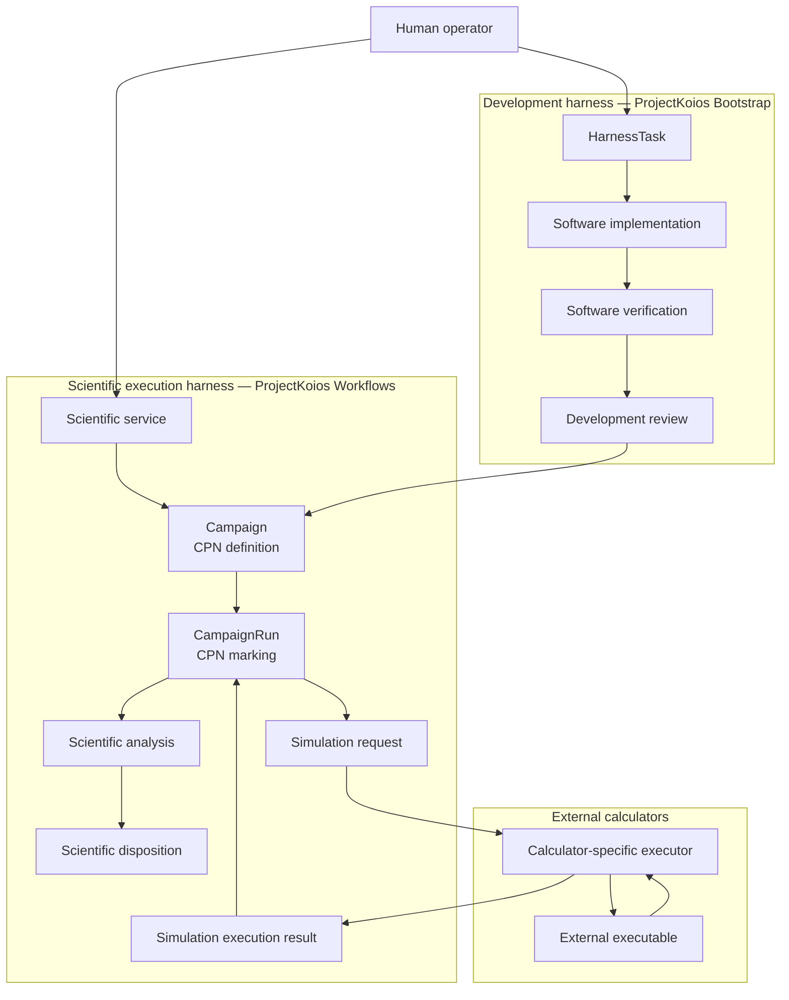
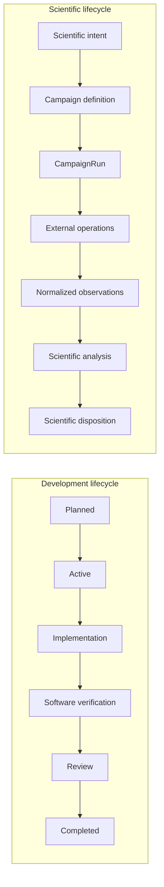

# Separation of harnesses

The normative boundary is:

> The development harness governs changes to the scientific harness. The
> scientific harness governs scientific Campaigns. Development Tasks,
> Campaigns, CampaignRuns, simulations, execution results, analyses, and
> scientific dispositions have separate authorities and lifecycles.

`ScientificService` is the authorized scientific entry point. It selects or
constructs a `Campaign`, creates a `CampaignRun`, resolves requested
`Simulation` objects, delegates bounded effects through `SimulationExecutor`,
and routes returned `SimulationExecutionResult` objects back into the CPN. It
does not mutate development state.

The two lifecycles may reference each other's immutable identities when required,
but neither stores the other's state. Development completion may make a
scientific service available; it does not create or advance a `CampaignRun`.
Scientific completion may provide evidence for later development; it does not
close a `HarnessTask`.
