# Scientific workflow control plane

## Responsibility

The workflow control plane owns Workflow selection and advancement, run-scoped Task instances, Workflow-owned `TaskStartGateSet` policy, discriminated TaskActivation, exact execution authority, result correlation, dispatch/reconciliation, analysis readiness, and separately authorized disposition. It does not activate or complete a development `HarnessTask`.

## Control flow

```mermaid
flowchart LR
    response["Explicit verbatim response"] --> recorder["ScientificDecisionRecorder"]
    decision_request["Exact predecessor/revision + request<br/>identified transition/binding inputs"] --> recorder
    recorder --> decision_map["Effect-free adapter maps supplied resolution"]
    decision_map --> decision_fire["Pure generic firing"]
    decision_fire --> decision_record["Decision-origin transition + complete successor"]
    decision_record --> decision_commit["WorkflowRunAtomicRepository<br/>validate + bind + commit candidate"]
    decision_commit --> recorded_resolution["Return recorded resolution"]
    run["WorkflowRun + predecessor marking"] --> adapter["ColoredPetriNetWorkflowAdapter"]
    adapter --> enable["ColoredPetriNetTransitionEnabler"]
    enable --> select["ColoredPetriNetBindingSelector"]
    directive["Permitted identified directive"] -.-> select
    direct["Direct activation when caller invokes zero-gate instance"] -.-> interpret["Adapter constructs direct/any_of/all_of activation"]
    select --> interpret
    interpret --> activation["TaskActivation"]
    authority["Exact unused grant + authority snapshot"] --> authorize["Workflow-control authorization"]
    activation --> authorize
    inputs["Already-bound ResultObjects + explicit operation context"] --> authorize
    authorize --> prepare["Prepare request/attempt/successor intent<br/>grant reservation + dispatch obligation"]
    prepare --> commit["WorkflowRunAtomicRepository<br/>validate + bind + commit candidate"]
    commit --> executor_check["Independent executor-boundary authorization"]
    executor_check --> task["Selected effectful Task instance"]
    task --> results["New immutable ResultObjects"]
    results --> map["Adapter maps results to generic external-output values"]
    map --> firing_input["ColoredPetriNetFiringInput"]
    firing_input --> fire["ColoredPetriNetTransitionFirer<br/>pure successor + audit facts"]
    fire --> workflow_records["Workflow transition and successor unit"]
    workflow_records --> ingress_commit["WorkflowRunAtomicRepository<br/>validate + bind result/obligation candidate"]
    ingress_commit --> reconcile["Publication, analysis, and disposition paths"]
```

The exact internal preparation sequence may preserve the accepted request-transition and obligation contracts, but the semantic owners remain fixed: the generic layer selects and fires pure values; on the task-origin path the effect-free adapter applies `any_of`/`all_of` composition or direct activation, creates TaskActivation, and maps ResultObjects into `ColoredPetriNetFiringInput`; `SimulationDispatchAdapter` owns dispatch orchestration; and workflow control authorizes Tasks and constructs complete candidate successor units. `WorkflowRunAtomicRepository` invokes its bound validator on the exact candidate, serializes that same validated candidate, verifies candidate/bytes/content/revision identity binding, and submits the opaque commit only after those checks succeed.

Human-response processing is deterministic. `ScientificDecisionRecorder` is the sole named scientific-decision ActionObject. From the exact predecessor run/revision, request, verbatim response, and request-identified transition/binding inputs, it rejects ambiguity, no match, or conflict; constructs the typed `ScientificDecisionResolution`; uses the effect-free adapter to map that supplied value and obtain pure generic firing; constructs the complete scientific-decision-origin transition and successor transaction; and submits it. No Task, TaskActivation, or attempt exists on this ingress path. Only successful atomic commit returns the recorded resolution; firing or persistence failure produces no resolution. The unresolved request itself pauses only its affected branch. See [human decisions](../human-decisions.md).

## Invariants

- `any_of` gates use stable priority, stable gate identity, canonical transition identity, and canonical binding order, with no fairness guarantee.
- `all_of` enables only when every member has a compatible binding and selects the canonical compatible tuple; no/empty gate sets provide no automatic activation, while direct invocation records no gate identities.
- A permitted identified directive is the only selection override.
- Selection and generic firing create no execution authority.
- Each effect-boundary invocation creates one identified direct, any_of, or all_of TaskActivation.
- Start-gate policy and Task input contract are distinct; already-bound inputs must satisfy both.
- One grant authorizes one exact dispatch. Retry/new execution uses new activation, operation, request, attempt, and grant identities.
- Workflow control and the executor independently check the same immutable authority and effect inputs.
- Confirmed, rejected, and indeterminate outcomes remain distinct; indeterminate contains no invented result and is not automatically redispatched.
- `TaskResultIngester` validates the confirmed dispatch envelope, admits its concrete returned ResultObject, and commits result state, dispatch disposition, and every required publication obligation or explicit no-publication disposition atomically.
- An absent, ambiguous, unmatched, or conflicting decision response creates no resolution or token and leaves only the affected branch blocked.
- Successful decision recording commits one scientific-decision-origin transition with exact request/resolution and no TaskActivation/attempt; replay consumes that same ordered record without prompting.
- Terminal marking and process success do not create scientific disposition or acceptance.

## Repository and human authority

`WorkflowRunRepository` does not inspect the complete marking to schedule work, choose a gate, invoke a Task, enable/select/fire a generic transition, reconcile effects, interpret a human response, create a decision, construct either transition origin, build candidate successor meaning, or create authority. `WorkflowRunTransactionValidator` owns candidate validation rules. `WorkflowRunAtomicRepository` owns invoking that validator, serializing the same accepted candidate, and verifying transaction/candidate/bytes/content/revision identity binding before it calls `AtomicRevisionStore`; validation or binding failure causes no store commit. The shared store alone owns opaque single-stream compare-and-swap, idempotency, and durable commit.

Protected execution and scientific disposition remain human-owned where policy requires them. Execution and disposition grants are distinct and authorize neither each other nor scientific acceptance. This documentation grants no protected execution authority.

## Unresolved issues

- Exact serialized activation, grant, obligation, and reconciliation records.
- Cancellation and operator-interruption semantics.
- Multi-run scheduling outside one deterministic Workflow selection.

This prospective control model claims no implementation, verification, scientific validation, equivalence, or human software acceptance.
