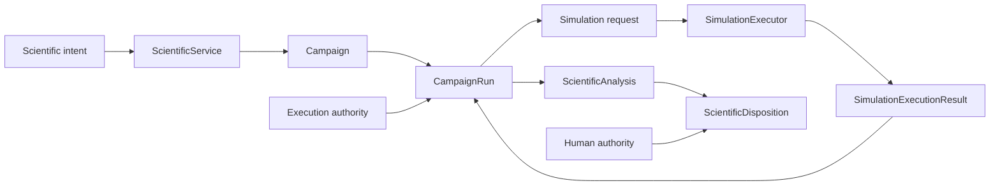

# Scientific workflow control plane

## Responsibility

The workflow control plane owns scientific operation selection and advancement:

- immutable `ScientificService` catalog;
- `Campaign` definitions;
- `CampaignRun` selection and state;
- simulation request authority;
- executor capability matching;
- result correlation;
- analysis readiness; and
- separately authorized `ScientificDisposition`.

It does not activate or complete `HarnessTask`.

## Control flow

## Dispatch invariants

- An enabled CPN transition permits deterministic firing but not automatically an external effect.
- Every external request references exact run, attempt, simulation, authority, and executor-configuration identities.
- One result correlates to one request and attempt.
- Duplicate result acceptance and duplicate attempt use fail closed.
- Capability mismatch never triggers silent fallback.
- A terminal marking does not manufacture scientific disposition.

## Service composition

One operation uses an immutable service and capability catalog. Executors, analyzers, artifact stores, and repositories are supplied explicitly by the application composition root. Runtime plugin mutation and ambient discovery are forbidden.

## Human authority

Protected execution and scientific disposition remain human-owned where policy requires them. Authority is not inferred from process success, terminal marking, analysis output, reviewer agreement, or elapsed time.

## Unresolved issues

- Exact representation and expiry rules for execution authority.
- Whether request reservation and CPN request-token firing are one atomic persistence transaction.
- Service-catalog wire format and capability-matching vocabulary.
- Cancellation and operator-interruption semantics.
- Multi-run scheduling and fairness policy, if required.
