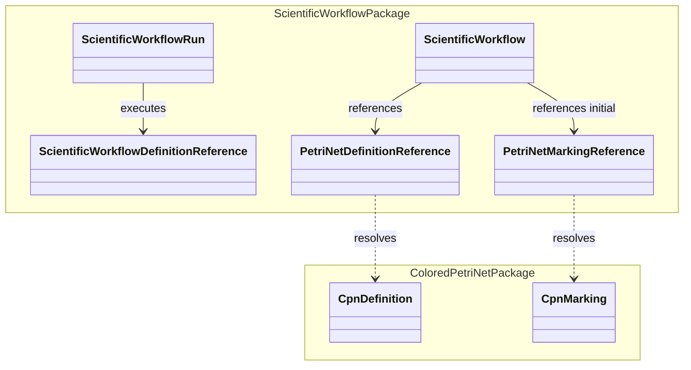

# Scientific workflow model

## ScientificWorkflow definition

A `ScientificWorkflow` is the calculator-independent definition of one scientific workflow. It belongs to `ksdft2effmass.workflow.scientific` and contains:

- scientific workflow identity and version;
- a versioned reference to a colored-Petri-net definition;
- a versioned reference to an initial colored-Petri-net marking;
- references to immutable `Simulation` objects; and
- workflow-specific correlation and terminal-state policy expressed through referenced colored-net contracts.

`ScientificWorkflow` does not own `CpnDefinition`, `CpnMarking`, token, place, transition, arc, guard, enablement, or firing types. Those belong to `ksdft2effmass.petrinet.colored`.

The referenced colored Petri net is the workflow dependency and lifecycle model. No parallel workflow DAG, shell-loop language, prerequisite engine, or hidden scheduler state is permitted.

## Reference boundary



The reference records identify exact immutable definitions, markings, schema versions, and content identities. Resolution is an application or repository action. A scientific workflow record does not embed a runtime Petri-net engine or acquire ownership of the referenced Petri-net objects.

## ScientificWorkflowRun

`ScientificWorkflowRun` is the immutable aggregate for one represented scientific workflow execution. It records the scientific workflow reference, attempts, marking references and transition history, simulation request/result correlation, failures, artifact lineage, analyses, and separately authorized dispositions.

A state transition returns a new revision. Retry creates a new attempt rather than overwriting a failed attempt. The complete aggregate is defined in [ScientificWorkflowRun object model](scientific-workflow-run.md). Persistence is independent of `HarnessTask` and `DevelopmentTaskSelection`.

## External action protocol

```text
authorized referenced CPN marking
→ resolve the CPN definition and marking
→ fire deterministic request transition through petrinet.colored
→ resolve Simulation
→ SimulationExecutor external boundary
→ SimulationExecutionResult
→ introduce a correlated result token
→ fire success or failure transition through petrinet.colored
→ successor ScientificWorkflowRun
```

The same executor contract serves direct and CPN-controlled use. Scientific workflow control may add ordering, authorization, synchronization, failure propagation, stop-on-first-required-failure, retry, recovery, and terminal-state semantics; it must not alter calculator behavior or redefine colored-Petri-net firing semantics.

## Terminal and failure semantics

Attempt, branch, and scientific workflow scopes are explicit. A failed attempt remains retained even if a separately authorized retry creates a new attempt. Required failure may inhibit further dispatch and enable scientific workflow failure. Completion requires the terminal marking declared by the scientific workflow contract, not merely an empty queue or a successful process.

## Package ownership

`ksdft2effmass.workflow.scientific` owns `ScientificWorkflow`, `ScientificWorkflowRun`, scientific workflow references, simulation correlation, and scientific workflow lifecycle policy.

`ksdft2effmass.petrinet.colored` independently owns colored-Petri-net definitions, markings, expressions, validation, deterministic enablement, and firing semantics. It imports no scientific workflow, calculator, analysis, or project-specific scientific packages.

`ksdft2effmass.workflow.scientific.definitions` owns project-specific scientific workflow definitions and may depend on both the scientific-workflow contracts and colored-Petri-net contracts.

See [Colored Petri net architecture](../../petrinet/colored/index.md) for the referenced execution model.

## Unresolved issues

- Exact reference and repository protocols for resolving immutable CPN definitions and markings.
- Whether the initial marking is referenced independently or identified by the CPN definition version.
- Scientific-workflow terminal-policy representation over generic colored markings.
- Retry and recovery policy representation at the scientific-workflow boundary.
- Public wire formats for workflow-to-Petri-net references.
