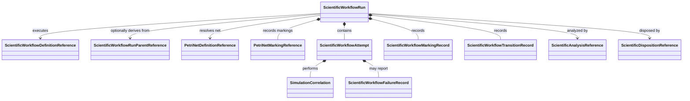

# ScientificWorkflowRun object model

## Aggregate

`ScientificWorkflowRun` is the immutable aggregate for one represented scientific workflow execution. It records attempts and state transitions without embedding runtime engines or mutable calculator clients.

## Component objects

| Object | Responsibility |
|---|---|
| `ScientificWorkflowDefinitionReference` | Exact scientific workflow identity, version, and schema version |
| `PetriNetDefinitionReference` | Exact immutable colored-Petri-net definition identity and version |
| `PetriNetMarkingReference` | Exact immutable colored-Petri-net marking identity and version |
| `ScientificWorkflowRunParentReference` | Optional parent-run and derivation relationship |
| `ScientificWorkflowAttempt` | One bounded attempt with identity, authority, and status |
| `ScientificWorkflowMarkingRecord` | Exact immutable CPN marking at one run revision |
| `ScientificWorkflowTransitionRecord` | Fired transition, binding, predecessor, successor, and findings |
| `SimulationCorrelation` | Request, simulation, executor, result, and artifact identities |
| `ScientificWorkflowFailureRecord` | Phase-specific failure associated with an attempt or transition |
| `ScientificAnalysisReference` | Reference to separately persisted deterministic analysis |
| `ScientificDispositionReference` | Reference to separately authorized disposition |

## Revision semantics

A state transition returns a new `ScientificWorkflowRun` revision. Attempts, marking references, transition records, correlations, failures, analyses, and dispositions are append-only within the represented history. Retry creates a new attempt and does not overwrite its predecessor.

Analysis and disposition are referenced rather than embedded as mutable execution fields. Execution records observations, analysis interprets them, and disposition records an authorized conclusion.

## Runtime exclusions

Persistence excludes runtime engines, arbitrary Python objects, closures, credentials, process handles, open files, scheduler clients, and calculator clients. Runtime behavior is reconstructed from versioned definitions, configuration, and implementation identities.

## Unresolved issues

- Snapshot-only versus snapshot-plus-transition-log canonical representation.
- Exact workflow reference format for colored-Petri-net definitions and markings.
- Whether a run may reference multiple dispositions for different intended uses.
- Parent-child semantics for retries, branches, and scientific workflow derivation.
- Event compaction and long-run history retention.
