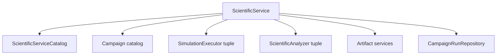

# Scientific service model

## Purpose

`ScientificService` is the application-facing ActionObject for one cohesive scientific operation family. It composes workflow contracts without owning calculator-specific implementation or scientific-analysis algorithms.

## Objects

| Object | Responsibility |
|---|---|
| `ScientificServiceIdentity` | Stable service and version identity |
| `ScientificIntent` | Explicit requested scientific operation and intended use |
| `ScientificServiceEntry` | Accepted inputs, result family, capabilities, effects, and authority needs |
| `ScientificServiceCatalog` | Immutable service entries available in one application composition |
| `ScientificServiceRequest` | Intent, authority, campaign selection, and explicit configuration references |
| `ScientificServiceResult` | Run identity, terminal represented status, analyses, and disposition references |

## Composition

All dependencies are explicit and immutable for one service operation. Catalog membership describes capability; it does not authorize effects.

## Operation

The service validates the request, resolves one campaign, initializes or loads a run, advances deterministic transitions, dispatches only authorized requests, correlates results, invokes analyzers when ready, persists revisions, and returns represented results.

It does not silently select another calculator, infer scientific disposition, mutate development state, or hide retry policy.

## Unresolved issues

- Whether the public service method is synchronous, asynchronous, or both.
- Service cancellation and resumability contract.
- Exact campaign-selection contract when multiple definitions satisfy an intent.
- Whether service results include read models or only stable references.
- Resource-ceiling negotiation between service, campaign, and executor.
