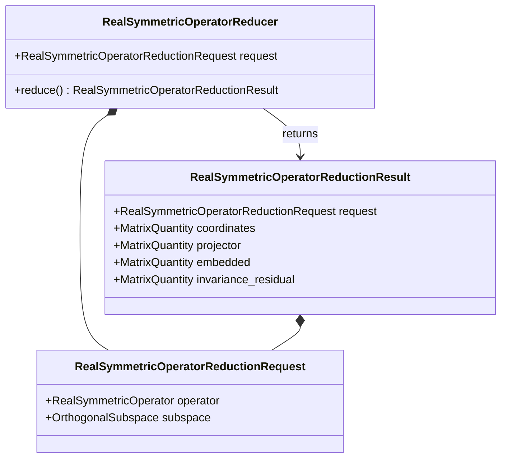
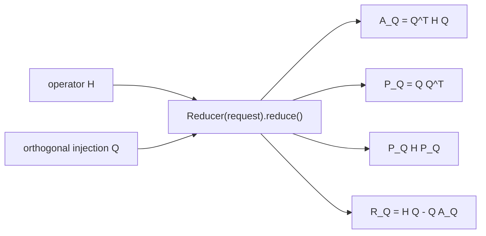

# Schematics

```mermaid
classDiagram
    class RealSymmetricOperatorReductionRequest {
        +RealSymmetricOperator operator
        +OrthogonalSubspace subspace
    }
    class RealSymmetricOperatorReducer {
        +RealSymmetricOperatorReductionRequest request
        +reduce() RealSymmetricOperatorReductionResult
    }
    class RealSymmetricOperatorReductionResult {
        +RealSymmetricOperatorReductionRequest request
        +MatrixQuantity coordinates
        +MatrixQuantity projector
        +MatrixQuantity embedded
        +MatrixQuantity invariance_residual
    }
    RealSymmetricOperatorReducer *-- RealSymmetricOperatorReductionRequest
    RealSymmetricOperatorReducer --> RealSymmetricOperatorReductionResult : returns
    RealSymmetricOperatorReductionResult *-- RealSymmetricOperatorReductionRequest
```

```mermaid
flowchart LR
    H["operator H"] --> reducer["Reducer(request).reduce()"]
    Q["orthogonal injection Q"] --> reducer
    reducer --> A["A_Q = Q^T H Q"]
    reducer --> P["P_Q = Q Q^T"]
    reducer --> E["P_Q H P_Q"]
    reducer --> R["R_Q = H Q - Q A_Q"]
```
