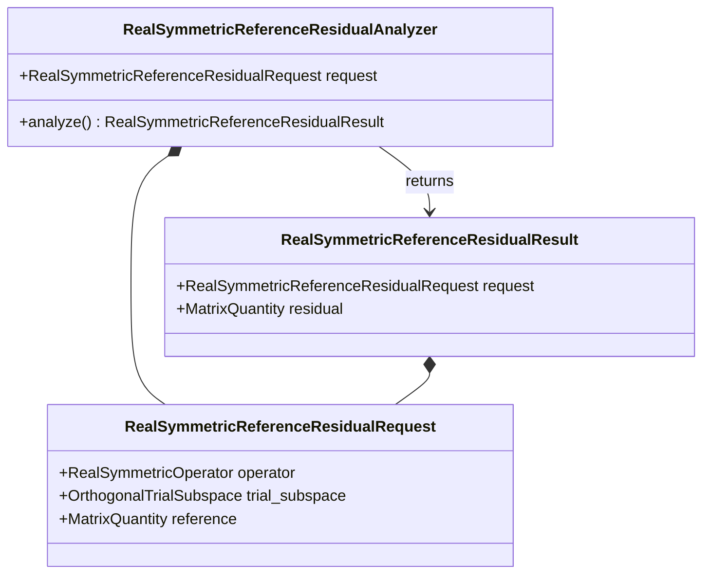
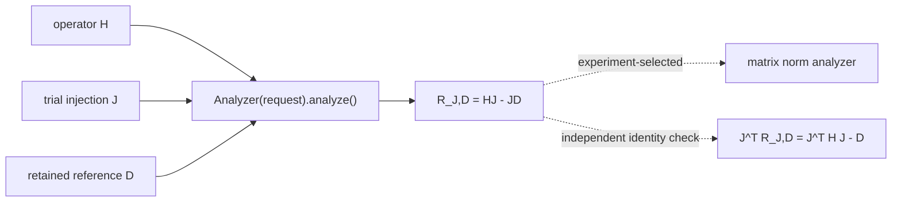

# Schematics

```mermaid
classDiagram
    class RealSymmetricReferenceResidualRequest {
        +RealSymmetricOperator operator
        +OrthogonalTrialSubspace trial_subspace
        +MatrixQuantity reference
    }
    class RealSymmetricReferenceResidualAnalyzer {
        +RealSymmetricReferenceResidualRequest request
        +analyze() RealSymmetricReferenceResidualResult
    }
    class RealSymmetricReferenceResidualResult {
        +RealSymmetricReferenceResidualRequest request
        +MatrixQuantity residual
    }
    RealSymmetricReferenceResidualAnalyzer *-- RealSymmetricReferenceResidualRequest
    RealSymmetricReferenceResidualAnalyzer --> RealSymmetricReferenceResidualResult : returns
    RealSymmetricReferenceResidualResult *-- RealSymmetricReferenceResidualRequest
```

```mermaid
flowchart LR
    H["operator H"] --> analyzer["Analyzer(request).analyze()"]
    J["trial injection J"] --> analyzer
    D["retained reference D"] --> analyzer
    analyzer --> R["R_J,D = HJ - JD"]
    R -. "experiment-selected" .-> norm["matrix norm analyzer"]
    R -. "independent identity check" .-> pullback["J^T R_J,D = J^T H J - D"]
```
