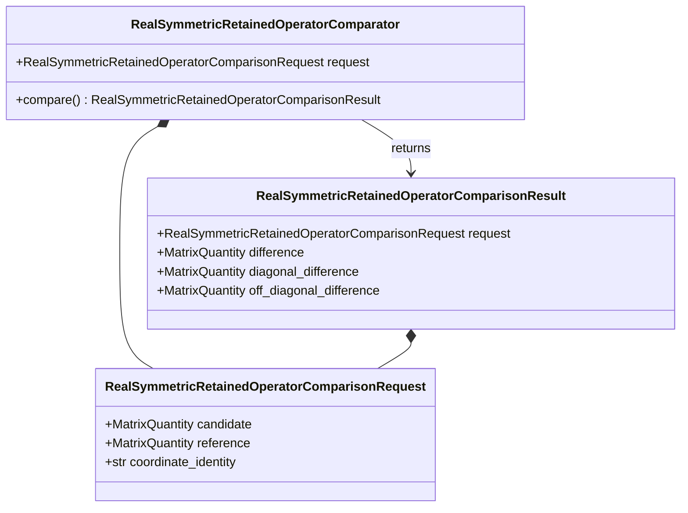
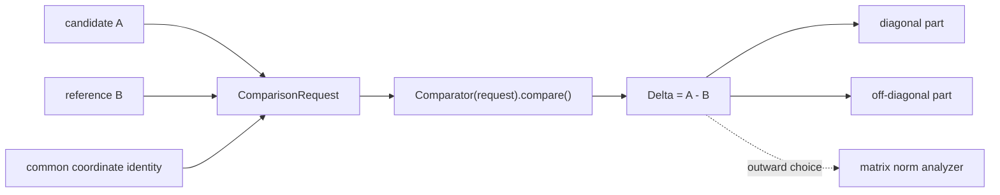

# Schematics

```mermaid
classDiagram
    class RealSymmetricRetainedOperatorComparisonRequest {
        +MatrixQuantity candidate
        +MatrixQuantity reference
        +str coordinate_identity
    }
    class RealSymmetricRetainedOperatorComparator {
        +RealSymmetricRetainedOperatorComparisonRequest request
        +compare() RealSymmetricRetainedOperatorComparisonResult
    }
    class RealSymmetricRetainedOperatorComparisonResult {
        +RealSymmetricRetainedOperatorComparisonRequest request
        +MatrixQuantity difference
        +MatrixQuantity diagonal_difference
        +MatrixQuantity off_diagonal_difference
    }
    RealSymmetricRetainedOperatorComparator *-- RealSymmetricRetainedOperatorComparisonRequest
    RealSymmetricRetainedOperatorComparator --> RealSymmetricRetainedOperatorComparisonResult : returns
    RealSymmetricRetainedOperatorComparisonResult *-- RealSymmetricRetainedOperatorComparisonRequest
```

```mermaid
flowchart LR
    candidate["candidate A"] --> request["ComparisonRequest"]
    reference["reference B"] --> request
    identity["common coordinate identity"] --> request
    request --> comparator["Comparator(request).compare()"]
    comparator --> difference["Delta = A - B"]
    difference --> diagonal["diagonal part"]
    difference --> offdiag["off-diagonal part"]
    difference -. "outward choice" .-> norms["matrix norm analyzer"]
```
