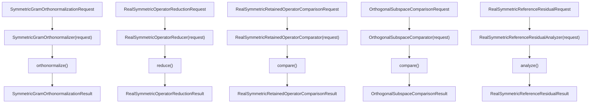
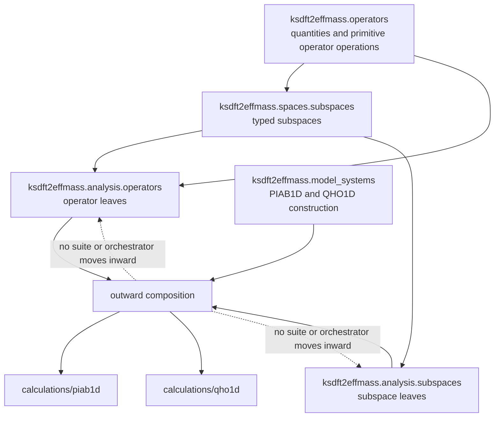

# `ksdft2effmass.analysis.operators` schematics

## Request-bound action signatures

```mermaid
flowchart TB
    gramRequest["SymmetricGramOrthonormalizationRequest"] --> gramAction["SymmetricGramOrthonormalizer(request)"]
    gramAction --> gramVerb["orthonormalize()"]
    gramVerb --> gramResult["SymmetricGramOrthonormalizationResult"]

    reductionRequest["RealSymmetricOperatorReductionRequest"] --> reducer["RealSymmetricOperatorReducer(request)"]
    reducer --> reduceVerb["reduce()"]
    reduceVerb --> reductionResult["RealSymmetricOperatorReductionResult"]

    comparisonRequest["RealSymmetricRetainedOperatorComparisonRequest"] --> comparator["RealSymmetricRetainedOperatorComparator(request)"]
    comparator --> compareVerb["compare()"]
    compareVerb --> comparisonResult["RealSymmetricRetainedOperatorComparisonResult"]

    subspaceRequest["OrthogonalSubspaceComparisonRequest"] --> subspaceComparator["OrthogonalSubspaceComparator(request)"]
    subspaceComparator --> subspaceVerb["compare()"]
    subspaceVerb --> subspaceResult["OrthogonalSubspaceComparisonResult"]

    residualRequest["RealSymmetricReferenceResidualRequest"] --> residualAnalyzer["RealSymmetricReferenceResidualAnalyzer(request)"]
    residualAnalyzer --> analyzeVerb["analyze()"]
    analyzeVerb --> residualResult["RealSymmetricReferenceResidualResult"]
```

## Experiment-side composition without a library orchestrator

```mermaid
flowchart LR
    samples["model-specific sampled states S"] --> gramRequest["Gram request"]
    gramRequest --> gram["Orthonormalizer(...).orthonormalize()"]
    gram --> J["trial subspace J"]

    H["finite Hamiltonian H"] --> eigensolver["existing eigensolver"]
    eigensolver --> U["spectral subspace U"]

    H --> trialRequest["ReductionRequest(H,J)"]
    J --> trialRequest
    trialRequest --> trialReduction["Reducer(request).reduce()"]
    H --> spectralRequest["ReductionRequest(H,U)"]
    U --> spectralRequest
    spectralRequest --> spectralReduction["Reducer(request).reduce()"]

    trialReduction --> trialCoordinates["A_J"]
    spectralReduction --> spectralCoordinates["A_U"]
    D["analytical reference D"] --> trialCompareRequest["ComparisonRequest(A_J,D)"]
    D --> spectralCompareRequest["ComparisonRequest(A_U,D)"]
    trialCoordinates --> trialCompareRequest
    spectralCoordinates --> spectralCompareRequest
    trialCompareRequest --> trialCompare["Comparator(request).compare()"]
    spectralCompareRequest --> spectralCompare["Comparator(request).compare()"]

    J --> subspaceRequest2["SubspaceComparisonRequest(J,U)"]
    U --> subspaceRequest2
    subspaceRequest2 --> subspaceCompare["SubspaceComparator(request).compare()"]

    H --> residualRequest2["ReferenceResidualRequest(H,J,D)"]
    J --> residualRequest2
    D --> residualRequest2
    residualRequest2 --> referenceResidual["ResidualAnalyzer(request).analyze()"]

    trialCompare --> script["experiment/calculation script"]
    spectralCompare --> script
    subspaceCompare --> script
    referenceResidual --> script
    trialReduction --> script
    spectralReduction --> script

    script --> norms["explicit existing matrix-norm actions"]
    script --> local["local aggregation / verification / plots"]
```

## Ownership boundary

```mermaid
flowchart TB
    operators["ksdft2effmass.operators\nquantities and primitive operator operations"] --> spaces["ksdft2effmass.spaces.subspaces\ntyped subspaces"]
    operators --> operatorAnalysis["ksdft2effmass.analysis.operators\noperator leaves"]
    spaces --> operatorAnalysis
    spaces --> subspaceAnalysis["ksdft2effmass.analysis.subspaces\nsubspace leaves"]
    models["ksdft2effmass.model_systems\nPIAB1D and QHO1D construction"] --> scripts["outward composition"]
    operatorAnalysis --> scripts
    subspaceAnalysis --> scripts
    scripts --> piab["calculations/piab1d"]
    scripts --> qho["calculations/qho1d"]

    scripts -. "no suite or orchestrator moves inward" .-> operatorAnalysis
    scripts -. "no suite or orchestrator moves inward" .-> subspaceAnalysis
```
