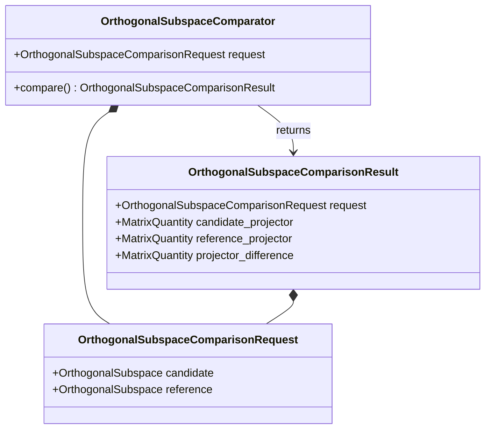
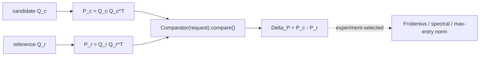

# Schematics

```mermaid
classDiagram
    class OrthogonalSubspaceComparisonRequest {
        +OrthogonalSubspace candidate
        +OrthogonalSubspace reference
    }
    class OrthogonalSubspaceComparator {
        +OrthogonalSubspaceComparisonRequest request
        +compare() OrthogonalSubspaceComparisonResult
    }
    class OrthogonalSubspaceComparisonResult {
        +OrthogonalSubspaceComparisonRequest request
        +MatrixQuantity candidate_projector
        +MatrixQuantity reference_projector
        +MatrixQuantity projector_difference
    }
    OrthogonalSubspaceComparator *-- OrthogonalSubspaceComparisonRequest
    OrthogonalSubspaceComparator --> OrthogonalSubspaceComparisonResult : returns
    OrthogonalSubspaceComparisonResult *-- OrthogonalSubspaceComparisonRequest
```

```mermaid
flowchart LR
    candidate["candidate Q_c"] --> Pc["P_c = Q_c Q_c^T"]
    reference["reference Q_r"] --> Pr["P_r = Q_r Q_r^T"]
    Pc --> comparator["Comparator(request).compare()"]
    Pr --> comparator
    comparator --> delta["Delta_P = P_c - P_r"]
    delta -. "experiment-selected" .-> norm["Frobenius / spectral / max-entry norm"]
```
