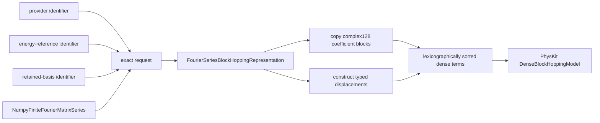

# `FourierSeriesBlockHoppingRepresentation` schematic

```mermaid
flowchart LR
    I[provider identifier] --> R[exact request]
    E[energy-reference identifier] --> R
    B[retained-basis identifier] --> R
    S[NumpyFiniteFourierMatrixSeries] --> R
    R --> O[FourierSeriesBlockHoppingRepresentation]
    O --> C[copy complex128 coefficient blocks]
    O --> D[construct typed displacements]
    C --> T[lexicographically sorted dense terms]
    D --> T
    T --> P[PhysKit DenseBlockHoppingModel]
```

The provider result may later be composed into a KSD scientific model, but the operation
does not perform that admission itself.
