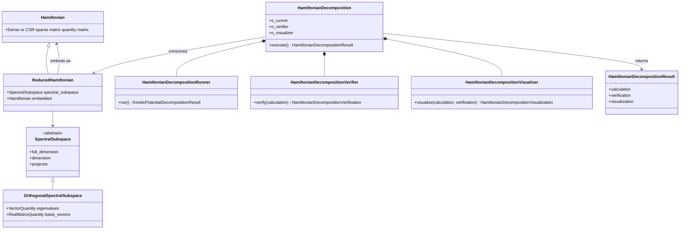
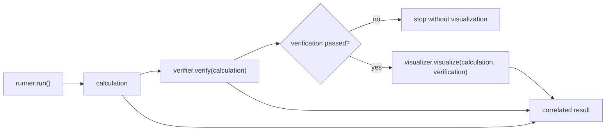

# Schematics

```mermaid
classDiagram
    class Hamiltonian {
        +Dense or CSR-sparse matrix quantity matrix
    }
    class SpectralSubspace {
        <<abstract>>
        +full_dimension
        +dimension
        +projector
    }
    class OrthogonalSpectralSubspace {
        +VectorQuantity eigenvalues
        +RealMatrixQuantity basis_vectors
    }
    class ReducedHamiltonian {
        +SpectralSubspace spectral_subspace
        +Hamiltonian embedded
    }
    Hamiltonian <|-- ReducedHamiltonian
    SpectralSubspace <|-- OrthogonalSpectralSubspace
    ReducedHamiltonian --> SpectralSubspace
    ReducedHamiltonian --> Hamiltonian : embeds as
    class HamiltonianDecomposition {
        +o_runner
        +o_verifier
        +o_visualizer
        +execute() HamiltonianDecompositionResult
    }
    class HamiltonianDecompositionRunner {
        +run() KineticPotentialDecompositionResult
    }
    class HamiltonianDecompositionVerifier {
        +verify(calculation) HamiltonianDecompositionVerification
    }
    class HamiltonianDecompositionVisualizer {
        +visualize(calculation, verification) HamiltonianDecompositionVisualization
    }
    class HamiltonianDecompositionResult {
        +calculation
        +verification
        +visualization
    }
    HamiltonianDecomposition --> ReducedHamiltonian : consumes
    HamiltonianDecomposition *-- HamiltonianDecompositionRunner
    HamiltonianDecomposition *-- HamiltonianDecompositionVerifier
    HamiltonianDecomposition *-- HamiltonianDecompositionVisualizer
    HamiltonianDecomposition --> HamiltonianDecompositionResult : returns
```

```mermaid
flowchart LR
    R["runner.run()"] --> C["calculation"]
    C --> V["verifier.verify(calculation)"]
    V --> Q{"verification passed?"}
    Q -- no --> F["stop without visualization"]
    Q -- yes --> Z["visualizer.visualize(calculation, verification)"]
    C --> A["correlated result"]
    V --> A
    Z --> A
```

The diagrams show concrete composition, not inheritance. PIAB1D supplies inputs to this
same composition; it does not introduce specialized stage classes.
