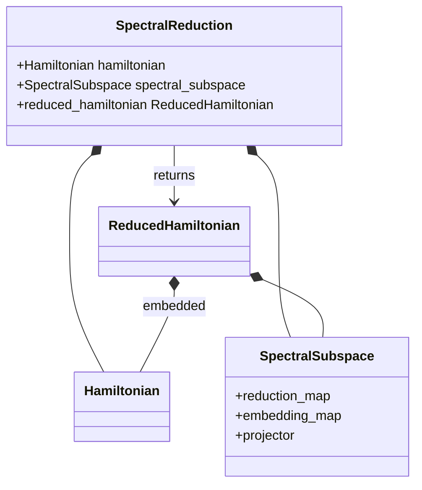
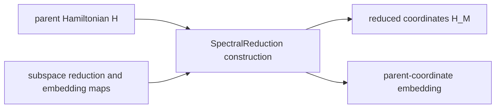

# Schematics

```mermaid
classDiagram
    class Hamiltonian
    class SpectralSubspace {
        +reduction_map
        +embedding_map
        +projector
    }
    class SpectralReduction {
        +Hamiltonian hamiltonian
        +SpectralSubspace spectral_subspace
        +reduced_hamiltonian ReducedHamiltonian
    }
    class ReducedHamiltonian
    SpectralReduction *-- Hamiltonian
    SpectralReduction *-- SpectralSubspace
    SpectralReduction --> ReducedHamiltonian : returns
    ReducedHamiltonian *-- SpectralSubspace
    ReducedHamiltonian *-- Hamiltonian : embedded
```

```mermaid
flowchart LR
    H["parent Hamiltonian H"] --> R["SpectralReduction construction"]
    S["subspace reduction and embedding maps"] --> R
    R --> HM["reduced coordinates H_M"]
    R --> HE["parent-coordinate embedding"]
```
