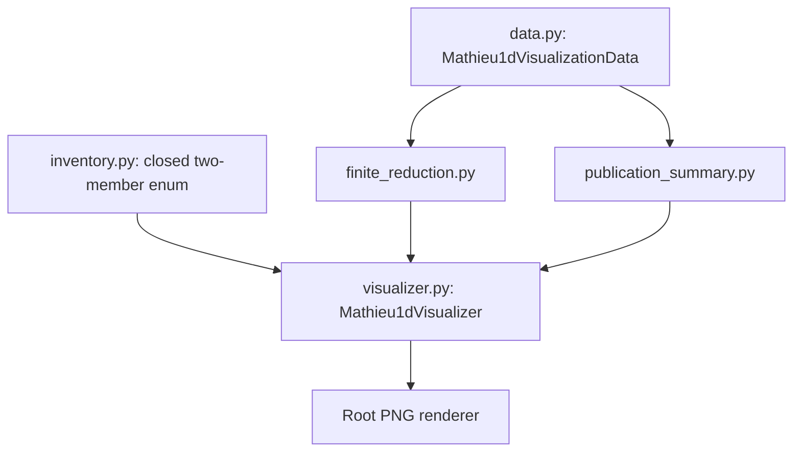
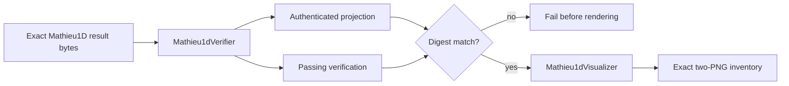

# Schematics

## Package composition

```mermaid
flowchart TB
    D[data.py: Mathieu1dVisualizationData]
    E[inventory.py: closed two-member enum]
    F[finite_reduction.py]
    P[publication_summary.py]
    V[visualizer.py: Mathieu1dVisualizer]
    R[Root PNG renderer]

    D --> F
    D --> P
    E --> V
    F --> V
    P --> V
    V --> R
```

## Authenticated lifecycle

```mermaid
flowchart LR
    B[Exact Mathieu1D result bytes] --> Q[Mathieu1dVerifier]
    Q --> D[Authenticated projection]
    Q --> V[Passing verification]
    D --> A{Digest match?}
    V --> A
    A -- no --> X[Fail before rendering]
    A -- yes --> Z[Mathieu1dVisualizer]
    Z --> P[Exact two-PNG inventory]
```
