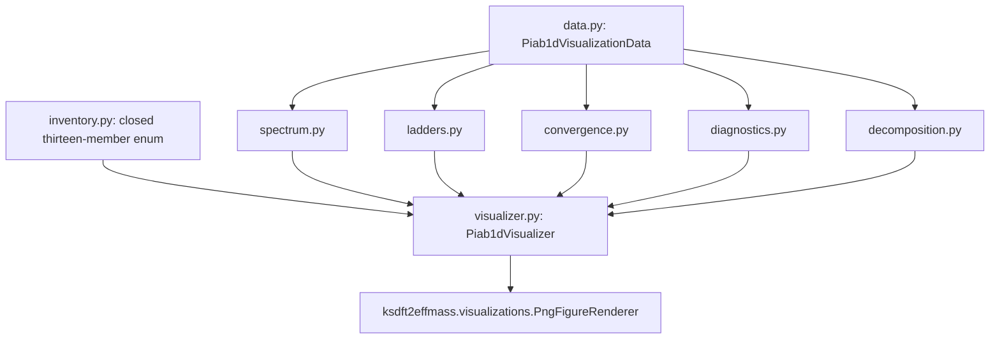
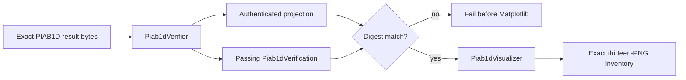

# Schematics

## Package composition

```mermaid
flowchart TB
    D[data.py: Piab1dVisualizationData]
    E[inventory.py: closed thirteen-member enum]
    S[spectrum.py]
    L[ladders.py]
    C[convergence.py]
    G[diagnostics.py]
    K[decomposition.py]
    V[visualizer.py: Piab1dVisualizer]
    R[ksdft2effmass.visualizations.PngFigureRenderer]

    D --> S
    D --> L
    D --> C
    D --> G
    D --> K
    E --> V
    S --> V
    L --> V
    C --> V
    G --> V
    K --> V
    V --> R
```

## Authentication boundary

```mermaid
flowchart LR
    B[Exact PIAB1D result bytes] --> Q[Piab1dVerifier]
    Q --> D[Authenticated projection]
    Q --> V[Passing Piab1dVerification]
    D --> A{Digest match?}
    V --> A
    A -- no --> F[Fail before Matplotlib]
    A -- yes --> Z[Piab1dVisualizer]
    Z --> P[Exact thirteen-PNG inventory]
```
