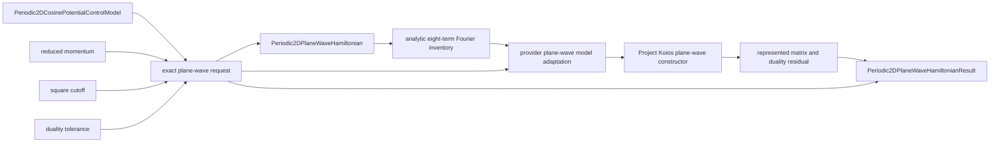

# `Periodic2DPlaneWaveHamiltonian` schematic

```mermaid
flowchart LR
    M[Periodic2DCosinePotentialControlModel] --> R[exact plane-wave request]
    K[reduced momentum] --> R
    C[square cutoff] --> R
    T[duality tolerance] --> R
    R --> H[Periodic2DPlaneWaveHamiltonian]
    H --> F[analytic eight-term Fourier inventory]
    F --> A[provider plane-wave model adaptation]
    R --> A
    A --> P[Project Koios plane-wave constructor]
    P --> X[represented matrix and duality residual]
    X --> O[Periodic2DPlaneWaveHamiltonianResult]
    R --> O
```

The provider model is composed representation input. It does not enter the KSD nominal
scientific-model inheritance hierarchy.
