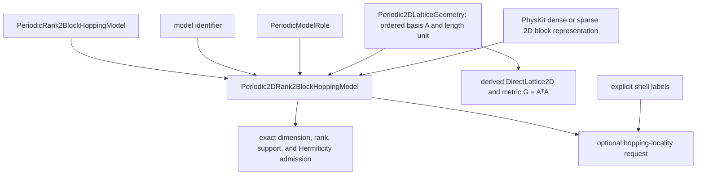

# `Periodic2DRank2BlockHoppingModel` schematic

```mermaid
flowchart TD
    P[PeriodicRank2BlockHoppingModel] --> M[Periodic2DRank2BlockHoppingModel]
    I[model identifier] --> M
    R[PeriodicModelRole] --> M
    G[Periodic2DLatticeGeometry: ordered basis A and length unit] --> M
    G --> D[derived DirectLattice2D and metric G = AᵀA]
    H[PhysKit dense or sparse 2D block representation] --> M
    M --> A[exact dimension, rank, support, and Hermiticity admission]
    M --> L[optional hopping-locality request]
    S[explicit shell labels] --> L
```

The locality request consumes the model as a peer operation. It is not inherited by or
stored inside the model.
